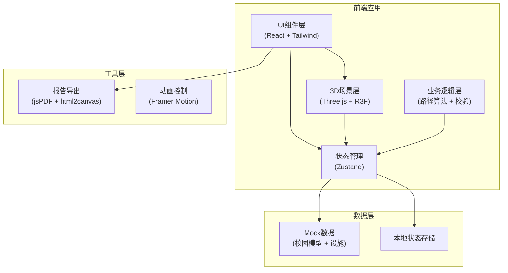
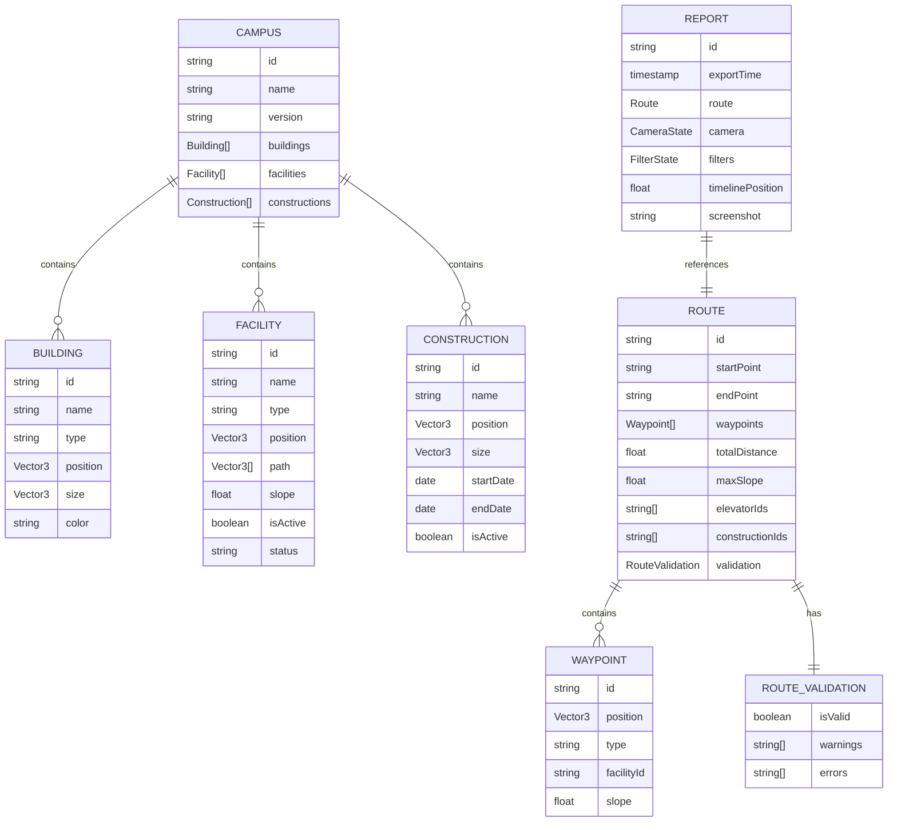

## 1. 架构设计



## 2. 技术描述

- **前端框架**：React@18 + TypeScript
- **构建工具**：Vite@5
- **样式方案**：TailwindCSS@3
- **状态管理**：Zustand
- **3D引擎**：Three.js + @react-three/fiber + @react-three/drei
- **3D后处理**：@react-three/postprocessing
- **动画库**：framer-motion
- **报告导出**：jspdf + html2canvas
- **图标库**：lucide-react

## 3. 路由定义

| 路由 | 用途 |
|------|------|
| / | 主场景页面 - 3D校园无障碍路线规划 |

## 4. 数据模型

### 4.1 数据模型定义



### 4.2 TypeScript 类型定义

```typescript
// 基础类型
interface Vector3 {
  x: number;
  y: number;
  z: number;
}

interface CameraState {
  position: Vector3;
  target: Vector3;
  fov: number;
}

interface FilterState {
  maxSlope: number;
  avoidConstruction: boolean;
  preferElevator: boolean;
  showRamps: boolean;
  showElevators: boolean;
  showConstructions: boolean;
}

// 设施类型
type FacilityType = 'ramp' | 'elevator' | 'doorway' | 'path';
type FacilityStatus = 'active' | 'maintenance' | 'disabled';

interface Facility {
  id: string;
  name: string;
  type: FacilityType;
  position: Vector3;
  path: Vector3[];
  slope: number;
  status: FacilityStatus;
  floor?: number;
}

// 施工信息
interface Construction {
  id: string;
  name: string;
  position: Vector3;
  size: Vector3;
  startDate: string;
  endDate: string;
  isActive: boolean;
}

// 建筑
interface Building {
  id: string;
  name: string;
  type: 'dorm' | 'teaching' | 'canteen' | 'library' | 'other';
  position: Vector3;
  size: Vector3;
  color: string;
}

// 路径点
interface Waypoint {
  id: string;
  position: Vector3;
  type: 'normal' | 'ramp' | 'elevator' | 'entrance';
  facilityId?: string;
  slope: number;
  instruction?: string;
}

// 路径校验
interface RouteValidation {
  isValid: boolean;
  warnings: string[];
  errors: string[];
  maxSlope: number;
  elevatorCount: number;
  constructionBlocks: string[];
}

// 路线
interface Route {
  id: string;
  startPoint: string;
  endPoint: string;
  waypoints: Waypoint[];
  totalDistance: number;
  estimatedTime: number;
  validation: RouteValidation;
}

// 报告
interface RouteReport {
  id: string;
  exportTime: string;
  route: Route;
  cameraState: CameraState;
  filters: FilterState;
  timelinePosition: number;
  screenshot?: string;
}

// 校园场景
interface CampusData {
  id: string;
  name: string;
  version: string;
  buildings: Building[];
  facilities: Facility[];
  constructions: Construction[];
  startPoints: { id: string; name: string; position: Vector3 }[];
  endPoints: { id: string; name: string; position: Vector3 }[];
}

// 应用状态
interface AppState {
  campusData: CampusData | null;
  currentRoute: Route | null;
  selectedStartPoint: string | null;
  selectedEndPoint: string | null;
  filters: FilterState;
  cameraState: CameraState;
  timelinePosition: number;
  isPlaying: boolean;
  isLoading: boolean;
}
```

## 5. 核心算法

### 5.1 路径规划算法
- 使用A*算法进行无障碍路径搜索
- 权重因子：坡度(30%)、距离(40%)、电梯偏好(20%)、施工避让(10%)
- 坡度阈值：默认5%（可配置），超过则路径不可用

### 5.2 坡度校验算法
- 计算两点间高度差 / 水平距离
- 超过阈值时标记为警告/错误
- 累计连续坡度段长度

### 5.3 碰撞检测
- 路线与施工围挡包围盒检测
- 电梯可用性状态检测
- 支持动态更新检测结果

## 6. 项目结构

```
src/
├── components/
│   ├── ui/                    # 基础UI组件
│   │   ├── Button.tsx
│   │   ├── Slider.tsx
│   │   ├── Toggle.tsx
│   │   └── Panel.tsx
│   ├── control/               # 控制面板组件
│   │   ├── ControlPanel.tsx
│   │   ├── PointSelector.tsx
│   │   ├── FilterPanel.tsx
│   │   └── Timeline.tsx
│   ├── info/                  # 信息面板组件
│   │   ├── InfoPanel.tsx
│   │   ├── RouteInfo.tsx
│   │   ├── ValidationInfo.tsx
│   │   └── ExportReport.tsx
│   └── scene/                 # 3D场景组件
│       ├── CampusScene.tsx
│       ├── Building.tsx
│       ├── Facility.tsx
│       ├── RouteLine.tsx
│       └── WaypointMarker.tsx
├── hooks/
│   ├── useRoutePlanning.ts    # 路径规划Hook
│   ├── useValidation.ts       # 校验Hook
│   ├── useCameraControl.ts    # 相机控制Hook
│   └── useReportExport.ts     # 报告导出Hook
├── store/
│   └── useAppStore.ts         # Zustand状态管理
├── utils/
│   ├── pathfinding.ts         # 路径算法
│   ├── validation.ts          # 校验逻辑
│   ├── geometry.ts            # 几何计算
│   └── export.ts              # 导出工具
├── data/
│   └── mockCampus.ts          # 模拟校园数据
├── types/
│   └── index.ts               # 类型定义
├── App.tsx
├── main.tsx
└── index.css
```
