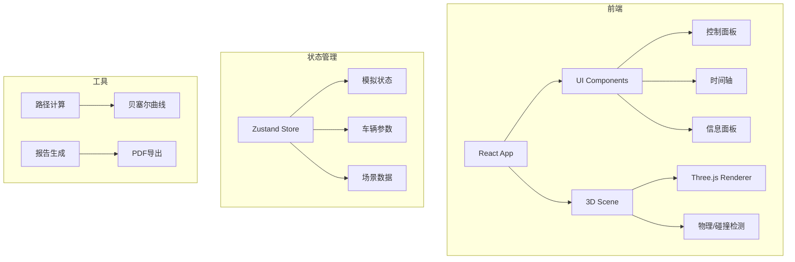

# 装卸月台转弯模拟 - 技术架构文档

## 1. 架构设计



## 2. 技术栈

- **前端框架**：React 18 + TypeScript
- **构建工具**：Vite
- **样式方案**：TailwindCSS 3
- **3D渲染**：Three.js + @react-three/fiber + @react-three/drei
- **状态管理**：Zustand
- **图标库**：Lucide React
- **PDF导出**：html2canvas + jsPDF

## 3. 目录结构

```
src/
├── components/
│   ├── ControlPanel/      # 左侧控制面板
│   ├── TopToolbar/        # 顶部工具栏
│   ├── Timeline/          # 底部时间轴
│   ├── InfoPanel/         # 右侧信息面板
│   └── Scene3D/           # 3D场景组件
├── store/
│   └── simulationStore.ts # 模拟状态管理
├── utils/
│   ├── pathCalculator.ts  # 路径计算算法
│   ├── collision.ts       # 碰撞检测
│   └── reportGenerator.ts # 报告生成
├── data/
│   └── samples.ts         # 预置样例数据
├── types/
│   └── index.ts           # 类型定义
└── App.tsx
```

## 4. 核心数据模型

### 4.1 车辆参数

```typescript
interface VehicleParams {
  id: string;
  name: string;
  length: number;      // 车长 (米)
  width: number;       // 车宽 (米)
  wheelbase: number;   // 轴距 (米)
  turningRadius: number; // 转弯半径 (米)
  height: number;      // 车高 (米)
}
```

### 4.2 场景数据

```typescript
interface SceneData {
  platform: {
    width: number;     // 月台宽度
    depth: number;     // 月台深度
    height: number;    // 月台高度
  };
  loadingDocks: {
    id: string;
    position: { x: number; y: number; z: number };
    width: number;
  }[];
  obstacles: {
    id: string;
    type: 'pillar' | 'wall' | 'other';
    position: { x: number; y: number; z: number };
    size: { x: number; y: number; z: number };
  }[];
  boundaries: {
    minX: number;
    maxX: number;
    minZ: number;
    maxZ: number;
  };
}
```

### 4.3 模拟状态

```typescript
interface SimulationState {
  status: 'idle' | 'calculating' | 'playing' | 'paused' | 'finished';
  progress: number;        // 0-1
  currentPath: PathPoint[];
  collisionPoints: CollisionPoint[];
  isCollision: boolean;
  cameraView: 'top' | 'side' | 'driver' | 'free';
  speed: number;           // 播放速度
}
```

## 5. 核心算法

### 5.1 路径计算
- 使用贝塞尔曲线生成倒车路径
- 基于阿克曼转向几何计算转弯轨迹
- 考虑最小转弯半径约束

### 5.2 碰撞检测
- 车辆扫掠区域计算
- AABB包围盒碰撞检测
- 边界越界检测

## 6. 预置样例

| 样例名称 | 车辆类型 | 场景类型 | 预期结果 |
|-----------|----------|----------|----------|
| 标准货车入库 | 9.6米货车 | 标准月台 | 正常入库 |
| 超长货车转弯 | 17.5米挂车 | 狭窄场地 | 碰撞警告 |
| 小型货车灵活入库 | 4.2米厢货 | 复杂障碍物 | 正常入库 |
| 空场地测试 | 任意车辆 | 空场地 | 无约束测试 |
