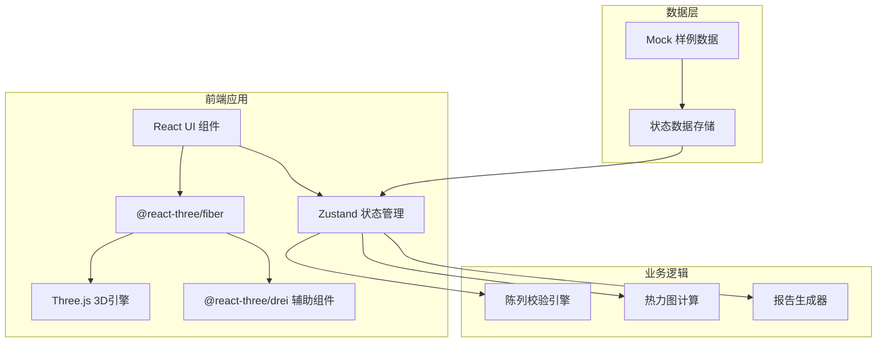
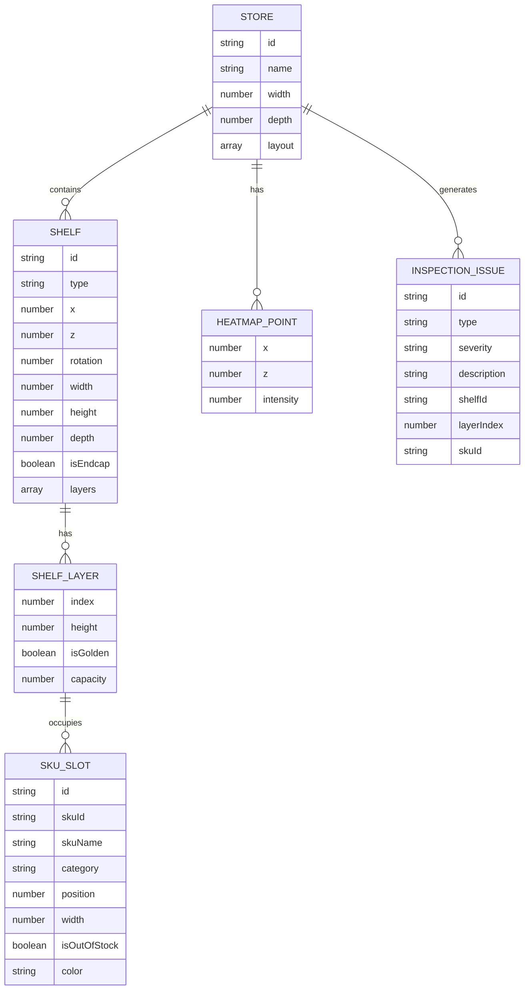

## 1. 架构设计



## 2. 技术描述

- 前端框架：React@18 + TypeScript
- 构建工具：Vite@5
- 3D引擎：Three.js@0.160 + @react-three/fiber@8 + @react-three/drei@9
- 样式方案：TailwindCSS@3 + CSS Modules
- 状态管理：Zustand@4
- UI组件：Lucide React 图标库
- 报告导出：jsPDF + html2canvas
- 数据：内置Mock数据，无需后端服务

## 3. 路由定义

| 路由 | 用途 |
|------|------|
| / | 主操作页面，包含完整3D场景和控制面板 |

## 4. 数据模型

### 4.1 核心数据结构



### 4.2 TypeScript 类型定义

```typescript
// 门店
interface Store {
  id: string;
  name: string;
  width: number;
  depth: number;
  shelves: Shelf[];
  heatmapData: HeatmapPoint[];
}

// 货架
interface Shelf {
  id: string;
  type: 'normal' | 'endcap';
  x: number;
  z: number;
  rotation: number;
  width: number;
  height: number;
  depth: number;
  layers: ShelfLayer[];
  isEndcap: boolean;
}

// 层板
interface ShelfLayer {
  index: number;
  height: number;
  isGolden: boolean;
  capacity: number;
  slots: SkuSlot[];
}

// SKU槽位
interface SkuSlot {
  id: string;
  skuId: string;
  skuName: string;
  category: string;
  position: number;
  width: number;
  isOutOfStock: boolean;
  color: string;
}

// 热力点
interface HeatmapPoint {
  x: number;
  z: number;
  intensity: number;
}

// 检查问题
interface InspectionIssue {
  id: string;
  type: 'duplicate_sku' | 'golden_layer_violation' | 'endcap_blocked' | 'out_of_stock';
  severity: 'high' | 'medium' | 'low';
  description: string;
  shelfId: string;
  layerIndex?: number;
  skuId?: string;
}

// 应用状态
interface AppState {
  store: Store | null;
  selectedShelfId: string | null;
  selectedSkuId: string | null;
  issues: InspectionIssue[];
  currentTime: number;
  isPlaying: boolean;
  showHeatmap: boolean;
  showGoldenLayer: boolean;
  filterCategory: string | null;
  history: HistorySnapshot[];
}
```

## 5. 核心功能实现

### 5.1 3D场景组件结构
- `Scene.tsx` - 主场景容器
- `Shelf3D.tsx` - 货架3D组件
- `Sku3D.tsx` - SKU商品3D组件
- `Heatmap3D.tsx` - 热力图组件
- `FloorPlane.tsx` - 地面网格

### 5.2 交互控制
- 使用 `OrbitControls` 实现场景旋转/缩放/平移
- 自定义拖拽系统实现SKU位置调整
- Raycaster 实现物体拾取和选择

### 5.3 校验引擎
- SKU重复占位检测：遍历所有层板，检查同一SKU是否出现在相邻位置
- 黄金层校验：确认黄金层（85-120cm高度）商品配置符合规范
- 端架遮挡检测：检查端架前方是否有遮挡物
- 缺货检测：标记缺货洞位置

### 5.4 报告导出
- 使用 jsPDF 生成PDF文档
- html2canvas 捕获3D场景截图
- 包含问题汇总、统计数据、整改建议
