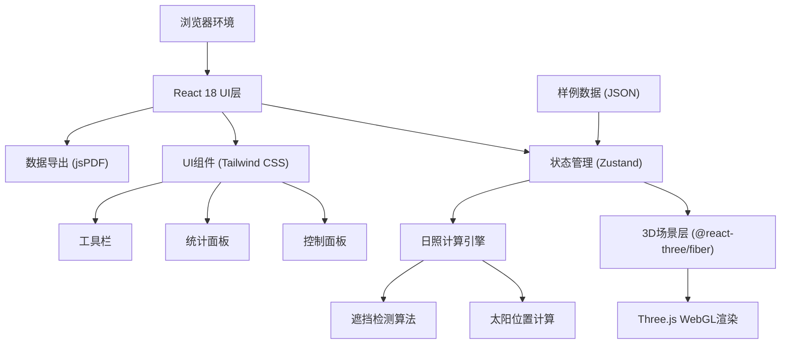

# 公寓日照投诉复盘系统 技术架构文档

## 1. 架构设计



## 2. 技术描述

- **前端框架**：React@18 + TypeScript@5
- **构建工具**：Vite@5
- **样式方案**：Tailwind CSS@3
- **3D渲染**：three@0.160 + @react-three/fiber@8 + @react-three/drei@9 + @react-three/postprocessing@2
- **状态管理**：Zustand@4 (轻量型状态管理)
- **图表可视化**：recharts@2
- **PDF导出**：jspdf@2 + html2canvas@1
- **图标库**：lucide-react@0.300
- **后端**：无（纯前端应用）
- **数据存储**：本地JSON样例数据

## 3. 目录结构

```
src/
├── components/
│   ├── ui/                 # 基础UI组件
│   │   ├── Button.tsx
│   │   ├── Slider.tsx
│   │   ├── Select.tsx
│   │   └── Panel.tsx
│   ├── layout/             # 布局组件
│   │   ├── TopToolbar.tsx
│   │   ├── LeftControlPanel.tsx
│   │   └── RightStatsPanel.tsx
│   ├── three/              # 3D场景组件
│   │   ├── Scene.tsx
│   │   ├── Building.tsx
│   │   ├── Window.tsx
│   │   ├── Sun.tsx
│   │   └── Ground.tsx
│   └── reports/            # 报告相关组件
│       └── ReportExport.tsx
├── store/                  # 状态管理
│   └── useAppStore.ts
├── hooks/                  # 自定义Hooks
│   ├── useSunPosition.ts
│   ├── useShadowDetection.ts
│   └── useViewport.ts
├── utils/                  # 工具函数
│   ├── sunCalculation.ts
│   ├── geometry.ts
│   └── export.ts
├── data/                   # 样例数据
│   └── sampleComplex.json
├── types/                  # TypeScript类型定义
│   └── index.ts
├── App.tsx
├── main.tsx
└── index.css
```

## 4. 核心数据模型

### 4.1 类型定义

```typescript
// 楼栋数据
interface Building {
  id: string;
  name: string;
  position: [number, number, number]; // [x, y, z]
  dimensions: { width: number; height: number; depth: number };
  floors: number;
  color: string;
}

// 窗户数据
interface WindowUnit {
  id: string;
  buildingId: string;
  floor: number;
  unitNumber: string;
  position: [number, number, number];
  size: { width: number; height: number };
  orientation: 'north' | 'south' | 'east' | 'west';
  isSelected: boolean;
}

// 太阳位置
interface SunPosition {
  azimuth: number;    // 方位角 (度)
  altitude: number;   // 高度角 (度)
  position: [number, number, number]; // 3D空间位置
}

// 遮挡记录
interface ShadowRecord {
  windowId: string;
  buildingId: string;
  startTime: number;  // 分钟 (0-1440)
  endTime: number;
  duration: number;   // 分钟
}

// 应用状态
interface AppState {
  // 场景数据
  buildings: Building[];
  windows: WindowUnit[];
  
  // 时间控制
  currentDate: Date;
  currentTime: number;  // 分钟 (0-1440)
  isPlaying: boolean;
  playSpeed: number;
  
  // 选择状态
  selectedWindows: string[];
  selectedBuildings: string[];
  highlightedBuilding: string | null;
  
  // 统计数据
  shadowRecords: ShadowRecord[];
  
  // 视角设置
  cameraPosition: [number, number, number];
  cameraTarget: [number, number, number];
  
  // Actions
  setDate: (date: Date) => void;
  setTime: (time: number) => void;
  togglePlay: () => void;
  selectWindow: (id: string) => void;
  resetState: () => void;
  loadSampleData: () => void;
  exportReport: () => void;
}
```

## 5. 核心算法

### 5.1 太阳位置计算

基于日期和时间，使用经典太阳位置算法：

```typescript
function calculateSunPosition(date: Date, latitude: number, longitude: number): SunPosition {
  // 1. 计算儒略日
  // 2. 计算太阳黄经
  // 3. 计算太阳赤纬和时角
  // 4. 转换为方位角和高度角
  // 5. 转换为3D场景坐标
}
```

### 5.2 遮挡检测算法

```typescript
function detectShadow(
  windowPos: Vector3,
  sunDir: Vector3,
  buildings: Building[]
): ShadowRecord | null {
  // 1. 从窗户向太阳方向发射射线
  // 2. 检测射线与各楼栋的交点
  // 3. 计算遮挡开始/结束时间
  // 4. 返回遮挡记录
}
```

## 6. 性能优化策略

1. **3D渲染优化**
   - 使用实例化渲染 (InstancedMesh) 绘制大量窗户
   - 视锥体剔除 (Frustum Culling)
   - LOD (Level of Detail) 远处楼栋降低精度

2. **计算优化**
   - 遮挡计算使用 Web Worker 离线处理
   - 缓存计算结果，仅在日期/楼栋变更时重新计算
   - 时间轴 scrub 采用插值预计算

3. **响应式优化**
   - 窄屏下降低3D渲染分辨率
   - 减少后处理效果强度
   - 按需加载面板内容
