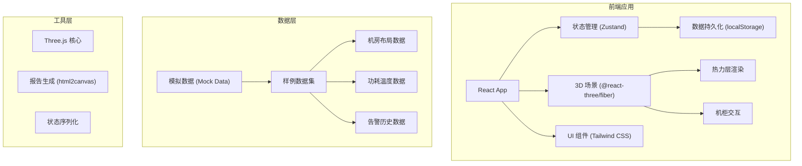
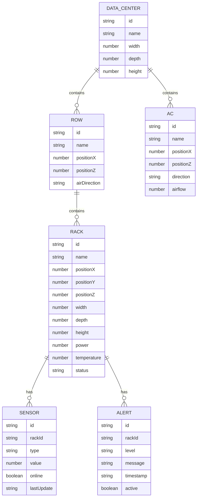

## 1. 架构设计



## 2. 技术描述
- **前端框架**: React@18 + TypeScript
- **构建工具**: Vite@5
- **3D 渲染**: Three.js + @react-three/fiber + @react-three/drei
- **状态管理**: Zustand (支持持久化)
- **样式方案**: Tailwind CSS@3
- **图标库**: Lucide React
- **报告导出**: html2canvas + jsPDF
- **数据格式**: 内置 Mock 数据，支持 JSON 导入

## 3. 路由定义
| 路由 | 用途 |
|------|------|
| / | 主页面 - 3D 机房热区可视化 |

## 4. 数据模型

### 4.1 数据模型定义



### 4.2 核心接口定义

```typescript
// 机房布局
interface DataCenter {
  id: string;
  name: string;
  dimensions: { width: number; depth: number; height: number };
  rows: Row[];
  acUnits: ACUnit[];
}

// 机柜排
interface Row {
  id: string;
  name: string;
  position: { x: number; z: number };
  airDirection: 'front-to-back' | 'back-to-front' | 'left-to-right';
  racks: Rack[];
}

// 机柜
interface Rack {
  id: string;
  name: string;
  position: { x: number; y: number; z: number };
  dimensions: { width: number; depth: number; height: number };
  power: number;
  temperature: number;
  status: 'normal' | 'warning' | 'critical' | 'offline';
  sensors: Sensor[];
}

// 传感器
interface Sensor {
  id: string;
  type: 'temperature' | 'power' | 'humidity';
  value: number;
  online: boolean;
  lastUpdate: string;
}

// 告警
interface Alert {
  id: string;
  rackId: string;
  level: 'info' | 'warning' | 'critical';
  message: string;
  timestamp: string;
  active: boolean;
}

// 时间序列数据
interface TimeSeriesData {
  timestamp: string;
  racks: {
    id: string;
    power: number;
    temperature: number;
    status: string;
  }[];
  alerts: Alert[];
}

// 应用状态
interface AppState {
  dataCenter: DataCenter | null;
  timeSeriesData: TimeSeriesData[];
  currentTimeIndex: number;
  isPlaying: boolean;
  alertFilters: string[];
  selectedRackId: string | null;
  cameraView: string;
  showHeatLayer: boolean;
  showLabels: boolean;
}
```
