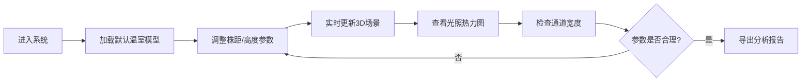

## 1. 产品概述

温室冠层间距模拟系统是一款为温室技术员设计的3D可视化工具，用于直观分析不同株距对采光和机器人通行的影响。通过交互式3D场景，用户可以实时调整参数并立即看到结果，替代传统抽象的二维表格。

## 2. 核心功能

### 2.1 用户角色

| 角色 | 使用方式 | 核心权限 |
|------|----------|----------|
| 温室技术员 | 浏览器直接使用 | 参数调整、场景操作、报告导出 |

### 2.2 功能模块

1. **3D温室场景**: 温室结构、植株模型、机器人通道的实时渲染
2. **参数控制面板**: 株距、植株高度、光照参数的交互式调整
3. **通道校验系统**: 机器人通道宽度检测与警告提示
4. **光照热力图**: 可视化展示冠层遮挡情况和光照分布
5. **报告导出**: 生成包含当前视角、筛选条件和时间轴位置的完整分析报告

### 2.3 页面详情

| 页面名称 | 模块名称 | 功能描述 |
|---------|----------|----------|
| 主页面 | 3D场景视图 | 可旋转、缩放、平移的温室3D模型 |
| 主页面 | 左侧控制面板 | 植株参数、株距调整、通道设置 |
| 主页面 | 顶部工具栏 | 视角切换、时间轴、样例导入、重置按钮 |
| 主页面 | 右侧信息面板 | 光照分析、通道校验结果、实时数据 |
| 主页面 | 导出功能 | 生成PDF/JSON格式的间距分析报告 |

## 3. 核心流程

## 4. 用户界面设计

### 4.1 设计风格
- **主色调**: 深绿色(#166534)代表农业/温室，蓝色(#2563eb)代表科技感
- **辅助色**: 橙红色(#ea580c)用于警告提示，绿色(#22c55e)表示通过
- **按钮风格**: 圆角设计，带微妙阴影和hover效果
- **字体**: 使用现代无衬线字体，标题清晰，数据易读
- **布局**: 三栏式布局，中间大区域为3D场景，左右为控制面板
- **图标**: 使用Lucide图标库，风格统一简洁

### 4.2 页面设计概述

| 页面名称 | 模块名称 | UI元素 |
|---------|----------|--------|
| 主页面 | 3D场景视图 | Three.js渲染画布、轨道控制器、光照效果 |
| 主页面 | 参数面板 | 滑块控件、数字输入框、颜色编码的状态指示 |
| 主页面 | 工具栏 | 图标按钮组、时间轴滑块、下拉菜单 |
| 主页面 | 信息面板 | 热力图图例、校验结果卡片、数据表格 |

### 4.3 响应性
- 桌面端：三栏布局，3D场景占据主要空间
- 平板端：面板可折叠，场景自适应
- 触控优化：支持手势缩放旋转，按钮足够大便于触控

### 4.4 3D场景指导
- **环境**: 明亮的温室环境，使用HDRI模拟自然光
- **光照**: 方向光模拟太阳，配合环境光提供基础照明
- **相机**: 透视相机，默认45度视角，支持轨道控制
- **交互**: 鼠标拖拽旋转、滚轮缩放、右键平移
- **动画**: 参数变化时平滑过渡，热力图渐变色动画
- **后处理**: 抗锯齿、柔和阴影，提升视觉质量
- **性能**: 实例化渲染处理大量植株，保持60fps帧率
