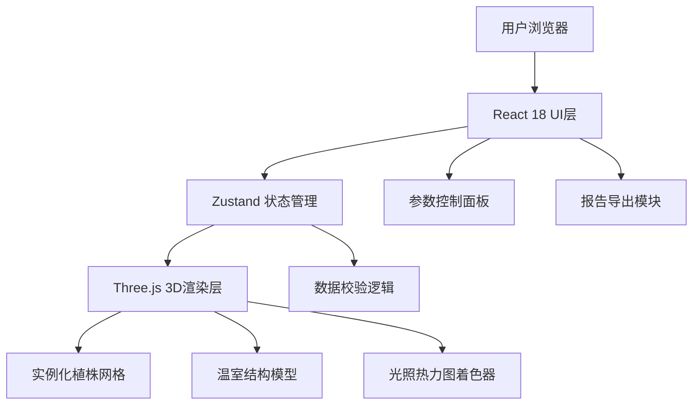

## 1. 架构设计



## 2. 技术描述

- **前端框架**: React@18 + TypeScript + Vite
- **3D引擎**: three@0.160 + @react-three/fiber@8 + @react-three/drei@9
- **状态管理**: zustand@4
- **样式方案**: tailwindcss@3
- **UI组件**: lucide-react图标库
- **报告导出**: jsPDF (PDF) + 原生JSON导出

## 3. 路由定义

| 路由 | 用途 |
|-----|------|
| / | 温室模拟主页面 |

## 4. 数据模型

### 4.1 核心状态类型

```typescript
// 温室参数
interface GreenhouseParams {
  width: number;           // 温室宽度 (米)
  length: number;          // 温室长度 (米)
  height: number;          // 温室高度 (米)
}

// 植株参数
interface PlantParams {
  rowSpacing: number;      // 行距 (厘米)
  plantSpacing: number;    // 株距 (厘米)
  plantHeight: number;     // 植株高度 (厘米)
  canopyDiameter: number;  // 冠层直径 (厘米)
  rowsCount: number;       // 行数
  plantsPerRow: number;    // 每行株数
}

// 机器人通道
interface RobotPath {
  enabled: boolean;
  width: number;           // 通道宽度 (厘米)
  position: number;        // 位置：在第几行之间
}

// 光照参数
interface LightParams {
  sunAngle: number;        // 太阳角度 (度)
  sunIntensity: number;    // 光照强度
  timeOfDay: number;       // 时间轴：0-24小时
}

// 相机视角
interface CameraState {
  position: [number, number, number];
  target: [number, number, number];
}

// 完整应用状态
interface SimulationState {
  greenhouse: GreenhouseParams;
  plants: PlantParams;
  robotPath: RobotPath;
  light: LightParams;
  camera: CameraState;
  validation: ValidationResult;
  heatmapData: number[][];
}

// 校验结果
interface ValidationResult {
  pathWidthOk: boolean;
  minPathWidth: number;
  canopyOverlap: boolean;
  lightCoverage: number;   // 0-100%
  warnings: string[];
}

// 导出报告
interface ExportReport {
  timestamp: string;
  params: SimulationState;
  camera: CameraState;
  validation: ValidationResult;
  heatmapSummary: {
    avg: number;
    min: number;
    max: number;
  };
}
```

## 5. 项目结构

```
src/
├── components/
│   ├── Canvas3D/         # 3D场景组件
│   │   ├── Greenhouse.tsx
│   │   ├── Plants.tsx
│   │   ├── RobotPath.tsx
│   │   └── Heatmap.tsx
│   ├── ControlPanel/     # 参数控制面板
│   │   ├── PlantControls.tsx
│   │   ├── LightControls.tsx
│   │   └── RobotControls.tsx
│   ├── Toolbar/          # 顶部工具栏
│   │   ├── ViewSelector.tsx
│   │   ├── Timeline.tsx
│   │   └── SampleLoader.tsx
│   ├── InfoPanel/        # 信息面板
│   │   ├── ValidationCard.tsx
│   │   ├── HeatmapLegend.tsx
│   │   └── DataTable.tsx
│   └── Export/           # 导出功能
│       └── ReportExport.tsx
├── store/
│   └── useSimulationStore.ts  # Zustand状态管理
├── utils/
│   ├── validation.ts     # 校验逻辑
│   ├── heatmap.ts        # 热力图计算
│   └── export.ts         # 报告生成
├── types/
│   └── index.ts          # 类型定义
├── data/
│   └── samples.ts        # 样例数据
├── App.tsx
├── main.tsx
└── index.css
```

## 6. 核心算法

### 6.1 通道宽度校验
```
通道实际宽度 = 行距 × 2 - 冠层直径
若 实际宽度 < 最小要求宽度 → 警告
```

### 6.2 冠层遮挡检测
```
相邻植株间距 < 冠层直径 → 存在遮挡
```

### 6.3 光照热力图计算
```
对于每个网格点：
  光照值 = 基础光照 × cos(太阳角度)
  对每株植物：
    若点在冠层阴影区域 → 光照值 × 衰减系数
  结果归一化到 0-1 范围
```
