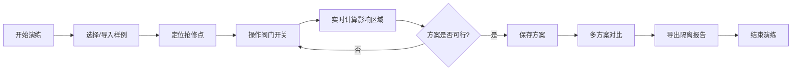

## 1. 产品概述

管网阀门隔离演练系统是一款基于WebGL的交互式管网仿真工具，专为水务调度员设计，用于在抢修前模拟阀门关闭操作，预测影响用户范围，验证隔离方案的有效性。通过可视化交互操作，帮助调度员快速制定最优抢修方案，减少停水影响。

## 2. 核心功能

### 2.1 用户角色
| 角色 | 注册方式 | 核心权限 |
|------|----------|----------|
| 调度员 | 无需注册 | 管网浏览、阀门操作、方案对比、报告导出 |

### 2.2 功能模块
1. **主场景页**：WebGL管网可视化、阀门交互、影响区域高亮
2. **控制面板**：样例导入、阀门筛选、时间轴控制、状态重置
3. **方案对比面板**：多方案并列对比、差异可视化
4. **报告导出**：PDF/JSON格式报告生成

### 2.3 页面详情
| 页面名称 | 模块名称 | 功能描述 |
|----------|----------|----------|
| 主场景页 | WebGL管网渲染 | 3D/2D管网节点、阀门、用户片区、压力方向、抢修点渲染 |
| 主场景页 | 阀门交互 | 点击开关阀门、拖拽定位、失效模拟 |
| 主场景页 | 影响分析 | 实时计算受影响区域、用户统计、去重处理 |
| 控制面板 | 样例管理 | 内置样例加载（正常/冲突/空结果）、自定义导入 |
| 控制面板 | 时间轴控制 | 操作回放、视角切换、步骤导航 |
| 控制面板 | 状态管理 | 一键重置、状态保存/加载 |
| 方案对比面板 | 多方案对比 | 方案列表、并列视图、差异标记 |
| 报告导出 | 报告生成 | 可视化结果与报告数据一致、支持多格式导出 |

## 3. 核心流程

## 4. 用户界面设计

### 4.1 设计风格
- **主色调**：深蓝色系（#0A1628）作为背景，代表水务行业专业性
- **强调色**：青色（#00D4FF）用于高亮、选中状态
- **警示色**：红色（#FF4757）用于抢修点、阀门失效
- **成功色**：绿色（#2ED573）用于正常阀门、已隔离区域
- **按钮风格**：半透明玻璃态、圆角8px、hover有发光效果
- **字体**：Inter 作为主要字体，等宽字体用于数据展示
- **布局风格**：左侧控制面板 + 右侧3D场景 + 底部时间轴的三栏布局
- **图标风格**：线性图标，与lucide-react保持一致

### 4.2 页面设计概述
| 页面名称 | 模块名称 | UI元素 |
|----------|----------|--------|
| 主场景页 | WebGL场景 | 深色背景、管线发光效果、节点粒子效果、动态压力流向动画 |
| 主场景页 | 阀门交互 | 悬停放大、点击切换状态、失效闪烁动画 |
| 控制面板 | 侧边栏 | 毛玻璃效果、可折叠面板、平滑过渡动画 |
| 控制面板 | 时间轴 | 线性进度条、步骤节点、拖拽滑块 |
| 方案对比 | 对比面板 | 分割视图、同步缩放、差异高亮 |
| 报告导出 | 预览弹窗 | 报告模板、实时预览、格式选择 |

### 4.3 响应性
- 桌面端优先设计（1920×1080）
- 侧边栏可折叠适配不同屏幕
- 触控设备支持手势缩放旋转
- 键盘快捷键支持（R重置、空格暂停）

### 4.4 3D场景指导
- **环境**：深色科技感背景， subtle grid 地面
- **光照**：主光源 + 环境光 + 管线自发光
- **相机**：透视相机，支持轨道控制、鸟瞰/平视视角切换
- **构图**：管网居中，抢修点为视觉焦点
- **交互**：点击选中、hover高亮、滚轮缩放、右键旋转
- **后处理**：辉光效果、轻微泛光、抗锯齿
- **性能**：管线使用实例化渲染，目标帧率60fps
