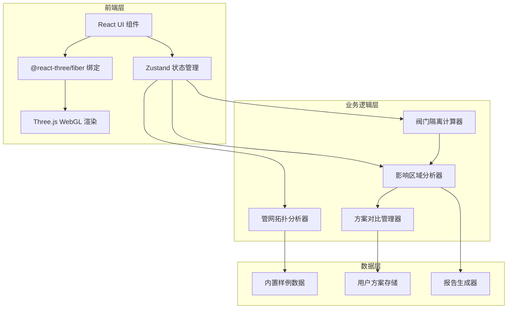
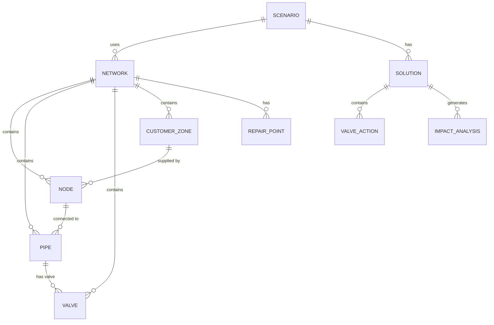

## 1. 架构设计



## 2. 技术描述

- **前端框架**: React@18 + TypeScript
- **构建工具**: Vite@6
- **样式方案**: TailwindCSS@3 + CSS Modules
- **状态管理**: Zustand@5
- **3D渲染**: Three.js + @react-three/fiber + @react-three/drei
- **后处理效果**: @react-three/postprocessing
- **图标库**: lucide-react
- **报告导出**: jsPDF (PDF) + 原生JSON导出
- **工具函数**: clsx + tailwind-merge

## 3. 路由定义

| 路由 | 用途 |
|------|------|
| / | 主演练场景页 |

## 4. 数据模型

### 4.1 数据模型定义



### 4.2 TypeScript 类型定义

```typescript
// 管网节点
interface Node {
  id: string;
  x: number;
  y: number;
  z: number;
  type: 'junction' | 'source' | 'reservoir';
  pressure: number;
}

// 管线
interface Pipe {
  id: string;
  fromNode: string;
  toNode: string;
  diameter: number;
  length: number;
  flowDirection: 'forward' | 'reverse' | 'none';
}

// 阀门
interface Valve {
  id: string;
  pipeId: string;
  position: number;
  status: 'open' | 'closed' | 'failed';
  type: 'gate' | 'butterfly' | 'ball';
}

// 用户片区
interface CustomerZone {
  id: string;
  name: string;
  nodeIds: string[];
  customerCount: number;
  type: 'residential' | 'commercial' | 'industrial';
}

// 抢修点
interface RepairPoint {
  id: string;
  pipeId: string;
  position: number;
  description: string;
  priority: 'high' | 'medium' | 'low';
}

// 管网数据
interface Network {
  nodes: Node[];
  pipes: Pipe[];
  valves: Valve[];
  customerZones: CustomerZone[];
  repairPoints: RepairPoint[];
}

// 操作记录
interface ValveAction {
  valveId: string;
  fromStatus: 'open' | 'closed';
  toStatus: 'open' | 'closed';
  timestamp: number;
}

// 影响分析结果
interface ImpactAnalysis {
  affectedZoneIds: string[];
  affectedCustomerCount: number;
  isolatedPipes: string[];
  isolatedNodes: string[];
  hasConflict: boolean;
  conflictDetails: string[];
}

// 方案
interface Solution {
  id: string;
  name: string;
  createdAt: number;
  valveActions: ValveAction[];
  impactAnalysis: ImpactAnalysis;
  networkState: Network;
}

// 演练场景
interface Scenario {
  id: string;
  name: string;
  type: 'normal' | 'conflict' | 'empty';
  description: string;
  initialNetwork: Network;
}
```

## 5. 核心模块结构

```
src/
├── components/
│   ├── NetworkScene/          # 3D场景组件
│   │   ├── NetworkCanvas.tsx  # R3F画布
│   │   ├── PipeRenderer.tsx   # 管线渲染
│   │   ├── ValveRenderer.tsx  # 阀门渲染
│   │   ├── ZoneRenderer.tsx   # 用户片区渲染
│   │   └── RepairPoint.tsx    # 抢修点渲染
│   ├── ControlPanel/          # 控制面板
│   │   ├── ScenarioSelector.tsx
│   │   ├── Timeline.tsx
│   │   ├── ViewControls.tsx
│   │   └── StatusBar.tsx
│   ├── SolutionPanel/         # 方案对比面板
│   │   ├── SolutionList.tsx
│   │   ├── SolutionCompare.tsx
│   │   └── ReportExport.tsx
│   └── common/                # 通用组件
├── store/                     # Zustand状态管理
│   ├── useNetworkStore.ts
│   ├── useSolutionStore.ts
│   └── useUIPreferenceStore.ts
├── hooks/                     # 自定义Hooks
│   ├── useValveInteraction.ts
│   ├── useImpactAnalysis.ts
│   └── useTimeline.ts
├── utils/                     # 工具函数
│   ├── networkAnalyzer.ts     # 拓扑分析
│   ├── valveIsolation.ts      # 隔离计算
│   └── reportGenerator.ts     # 报告生成
├── data/                      # 内置样例数据
│   ├── scenarios/
│   │   ├── normal.json
│   │   ├── conflict.json
│   │   └── empty.json
│   └── templates/
├── types/                     # TypeScript类型定义
│   └── index.ts
└── pages/
    └── Home.tsx               # 主页面
```

## 6. 关键算法说明

### 6.1 管网拓扑分析
- 使用邻接表表示管网连接关系
- BFS/DFS算法进行连通性分析
- 支持环网检测和方向验证

### 6.2 阀门隔离计算
- 基于割集理论的隔离区域识别
- 处理阀门失效的边界情况
- 去重统计受影响用户片区

### 6.3 冲突检测
- 检测隔离区域是否包含水源
- 验证阀门操作顺序的合理性
- 识别重复影响的用户区域
