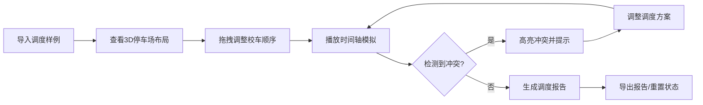

## 1. 产品概述

校车停车场发车调度可视化系统，帮助调度员在浏览器中模拟车位顺序、学生上车流程和发车时间，解决早高峰发车拥堵问题。通过3D可视化直观展示车位阻塞、发车顺序冲突、通道占用等常见问题，支持操作复盘和调度报告导出。

- 核心目标：降低调度错误率，优化发车效率，提升调度员决策能力
- 目标用户：校车公司调度员、运营管理人员

## 2. 核心功能

### 2.1 功能模块

1. **3D停车场可视化**：交互式停车场场景，包含车位、通道、校车模型
2. **调度控制面板**：样例导入、拖拽调度、筛选功能、状态重置
3. **时间轴系统**：时间播放控制、关键帧标记、冲突时间点高亮
4. **视角切换系统**：2D/3D切换、预设视角、自由视角控制
5. **学生队列模拟**：上车流程动画、人数统计、通道占用可视化
6. **冲突检测系统**：实时检测车位阻塞、发车冲突、通道占用
7. **调度报告模块**：报告生成、数据导出、冲突详情展示

### 2.2 页面详情

| 页面名称 | 模块名称 | 功能描述 |
|-----------|-------------|---------------------|
| 主调度台 | 3D场景区 | Three.js渲染停车场、校车、学生队列动画 |
| 主调度台 | 左侧控制面板 | 样例导入、校车列表、筛选器、调度操作 |
| 主调度台 | 底部时间轴 | 时间滑块、播放控制、冲突标记、关键帧导航 |
| 主调度台 | 右侧信息面板 | 当前状态、冲突提示、统计数据 |
| 报告弹窗 | 报告详情 | 调度结果、冲突记录、优化建议、导出按钮 |

## 3. 核心流程

## 4. 用户界面设计

### 4.1 设计风格
- **主色调**：工业蓝 (#165DFF) 作为主色，代表专业和可靠性
- **辅助色**：警示橙 (#FF7D00) 用于冲突提示，成功绿 (#00B42A) 用于正常状态
- **中性色**：深灰背景 (#1D2129)，浅灰文字 (#C9CDD4)，确保3D场景对比度
- **按钮风格**：直角微圆角 (4px)，边框清晰，悬停有微妙光影变化
- **字体**：JetBrains Mono 作为数字显示，Noto Sans SC 作为中文界面
- **布局风格**：面板式布局，左侧控制、中间3D场景、右侧信息、底部时间轴
- **图标风格**：线性图标，保持工业感和清晰度

### 4.2 页面设计概览

| 页面名称 | 模块名称 | UI 元素 |
|-----------|-------------|-------------|
| 主调度台 | 3D场景区 | 暗色环境光、网格地面、金属质感校车模型、动态学生队列粒子 |
| 主调度台 | 控制面板 | 半透明深色面板、清晰的分组标题、拖拽高亮效果 |
| 主调度台 | 时间轴 | 渐变进度条、冲突点红色标记、播放按钮带脉冲动画 |
| 主调度台 | 信息面板 | 卡片式状态展示、冲突列表展开动画、数字跳动效果 |
| 报告弹窗 | 报告详情 | 分层卡片、数据图表、可折叠详情、打印优化布局 |

### 4.3 响应式设计
- **桌面端 (≥1200px)**：四栏布局完整展示，3D场景占据主要空间
- **平板端 (768-1199px)**：左右面板可折叠收起，时间轴高度自适应
- **窄屏/移动端 (<768px)**：垂直堆叠布局，先控制面板，再3D场景，最后信息面板；支持触摸手势旋转视角

### 4.4 3D场景设计
- **环境**：暗色工业风格停车场，带轻微雾效，网格地面辅助空间感知
- **光照**：主方向光 + 环境光，校车使用边缘光增强轮廓识别
- **摄像机**：默认45度俯视角，支持轨道控制器，预设顶视/前视/侧视快速切换
- **动画**：校车移动使用缓动曲线，学生队列使用粒子系统模拟人流
- **后处理**：轻微Bloom效果增强科技感，冲突时屏幕边缘红色闪烁提示
- **性能**：校车模型使用低多边形，学生队列使用实例化渲染优化
