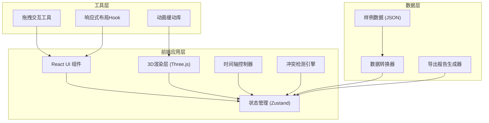

## 1. 架构设计



## 2. 技术描述

- **前端框架**: React@18 + TypeScript
- **构建工具**: Vite@5
- **样式方案**: TailwindCSS@3
- **3D引擎**: Three.js@0.160
- **状态管理**: Zustand@4 (轻量级，适合实时模拟)
- **动画库**: gsap@3 (复杂时间轴动画)
- **图标**: lucide-react (线性图标，符合工业风格)

## 3. 目录结构

```
src/
├── components/
│   ├── ControlPanel/      # 左侧控制面板
│   ├── InfoPanel/         # 右侧信息面板
│   ├── Timeline/          # 底部时间轴
│   ├── Scene3D/           # 3D场景容器
│   └── ReportModal/       # 报告弹窗
├── store/
│   └── useScheduleStore.ts # 调度状态管理
├── engine/
│   ├── ConflictDetector.ts # 冲突检测引擎
│   ├── TimelineEngine.ts   # 时间轴控制器
│   └── AnimationSystem.ts  # 动画系统
├── types/
│   └── index.ts           # TypeScript类型定义
├── data/
│   └── samples.ts         # 样例数据
└── utils/
    └── exportReport.ts    # 报告导出工具
```

## 4. 核心类型定义

```typescript
// 校车
interface Bus {
  id: string;
  number: string;
  route: string;
  capacity: number;
  currentStudents: number;
  parkingSpotId: string | null;
  departureTime: number; // 秒数，从0开始
  status: 'parked' | 'boarding' | 'departing' | 'departed';
  color: string;
}

// 车位
interface ParkingSpot {
  id: string;
  position: { x: number; z: number };
  size: { width: number; length: number };
  occupiedBy: string | null;
  isExitPath: boolean;
}

// 学生队列
interface StudentQueue {
  id: string;
  busId: string;
  position: { x: number; z: number };
  totalStudents: number;
  currentIndex: number;
  boardingRate: number; // 每秒上车人数
}

// 冲突
interface Conflict {
  id: string;
  type: 'spot_blocked' | 'departure_conflict' | 'lane_occupied';
  time: number;
  severity: 'warning' | 'critical';
  involvedBuses: string[];
  description: string;
  resolved: boolean;
}

// 调度状态
interface ScheduleState {
  buses: Bus[];
  parkingSpots: ParkingSpot[];
  queues: StudentQueue[];
  conflicts: Conflict[];
  currentTime: number;
  isPlaying: boolean;
  playSpeed: number;
  viewMode: '3d' | '2d';
  selectedBusId: string | null;
}
```

## 5. 冲突检测规则

### 5.1 车位阻塞检测
```typescript
// 当后面的校车发车时间早于前面的校车时，判定为阻塞
if (behindBus.departureTime < frontBus.departureTime + 30) {
  return { type: 'spot_blocked', severity: 'critical' };
}
```

### 5.2 发车顺序冲突
```typescript
// 同一通道内，两辆校车发车间隔小于15秒
if (Math.abs(busA.departureTime - busB.departureTime) < 15 && 
    busA.exitLane === busB.exitLane) {
  return { type: 'departure_conflict', severity: 'warning' };
}
```

### 5.3 通道占用检测
```typescript
// 学生队列与发车通道重叠
if (queue.position.intersects(bus.exitPath)) {
  return { type: 'lane_occupied', severity: 'warning' };
}
```

## 6. 性能优化策略

1. **3D渲染优化**:
   - 使用 InstancedMesh 渲染学生队列
   - 校车模型使用低多边形 (≤500面)
   - 视锥体剔除不可见物体

2. **时间轴性能**:
   - requestAnimationFrame 驱动动画循环
   - 冲突检测使用时间窗口，避免全量扫描
   - 状态变更使用不可变更新，减少重渲染

3. **响应式优化**:
   - 使用 ResizeObserver 监听容器尺寸
   - 移动设备降低渲染分辨率
   - 触摸设备简化3D控制器灵敏度
