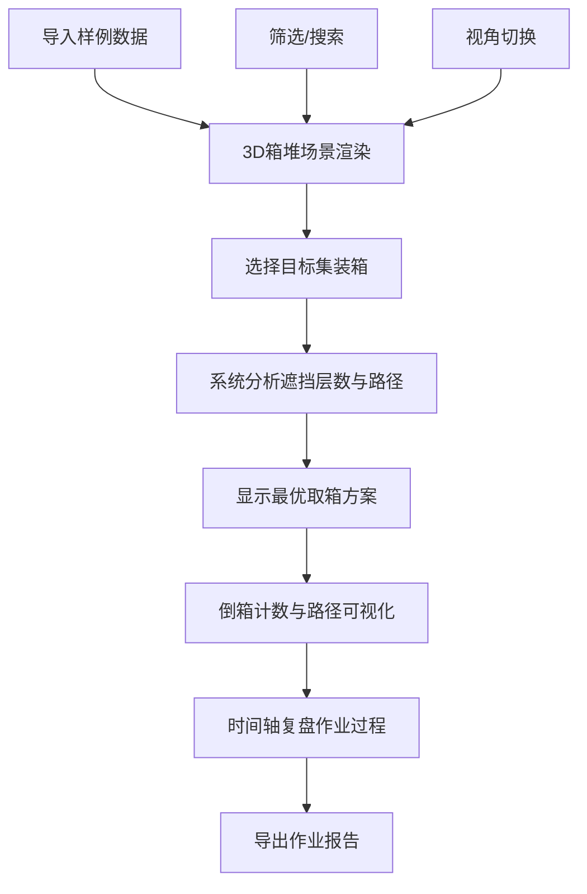

## 1. 产品概述
港口集装箱堆场可达性分析系统，为堆场计划员提供3D交互式场景，直观分析集装箱被压层数、最优取箱路径和倒箱作业规划。解决目标箱遮挡、层数统计错误、吊机轨道限制等常见作业问题，提升堆场作业效率，减少无效倒箱。

- 核心用户：港口堆场计划员、龙门吊操作员、作业调度人员
- 核心价值：可视化决策支持，降低倒箱成本，提升作业准确率

## 2. 核心功能

### 2.1 用户角色
| 角色 | 注册方式 | 核心权限 |
|------|----------|----------|
| 堆场计划员 | 系统内置 | 3D场景操作、取箱路径分析、报告导出、状态管理 |

### 2.2 功能模块
1. **3D箱堆可视化主界面**：WebGL交互式场景、箱区/集装箱/吊机轨道渲染
2. **取箱分析模块**：目标箱选择、遮挡层数计算、最优取箱路径、倒箱计数
3. **视角与时间轴模块**：多视角切换、时间轴复盘、状态回放
4. **数据管理模块**：样例导入、筛选条件、状态持久化
5. **报告导出模块**：作业报告生成、PDF/JSON导出

### 2.3 页面详情
| 页面名称 | 模块名称 | 功能描述 |
|---------|----------|----------|
| 主界面 | 3D场景画布 | WebGL渲染箱堆，支持拖拽旋转、缩放、平移 |
| 主界面 | 左侧控制面板 | 样例导入、箱区筛选、集装箱搜索、状态重置 |
| 主界面 | 右侧信息面板 | 目标箱信息、遮挡层数、倒箱列表、取箱路径详情 |
| 主界面 | 底部时间轴 | 作业步骤回放、视角切换快捷按钮 |
| 主界面 | 顶部工具栏 | 报告导出、视角预设、帮助入口 |

## 3. 核心流程

## 4. 用户界面设计

### 4.1 设计风格
- **主色调**：工业蓝 (#165DFF) 作为主色，代表专业与科技感
- **辅助色**：安全绿 (#00B42A)、警告橙 (#FF7D00)、危险红 (#F53F3F) 用于状态标识
- **中性色**：深灰背景 (#1D2129)、中灰面板 (#272E3B)、浅灰文字 (#C9CDD4)
- **按钮风格**：扁平化直角按钮，hover时有轻微上浮效果，点击有按压反馈
- **字体**：Monaco 等宽字体用于数据展示，Roboto 用于界面文字
- **布局风格**：深色工业风，左右侧固定面板，中央3D场景，底部时间轴
- **图标风格**：线性简约图标，与工业主题契合

### 4.2 页面设计概述
| 页面名称 | 模块名称 | UI元素 |
|---------|----------|--------|
| 主界面 | 3D场景 | 深色工业背景，集装箱金属质感，轨道金属光泽，路径高亮发光线 |
| 主界面 | 控制面板 | 半透明深色面板，清晰的分组边框，数据表格高亮选中行 |
| 主界面 | 信息面板 | 卡片式布局，关键数据大字号显示，倒箱列表步进动画 |
| 主界面 | 时间轴 | 轨道式时间条，节点标记，播放/暂停控制，进度拖拽 |

### 4.3 响应式
- Desktop-first设计，目标设备：1920×1080及以上桌面显示器
- 支持窗口缩放，3D画布自适应，面板最小宽度约束
- 触控设备支持手势缩放旋转

### 4.4 3D场景设计
- **环境**：深色工业场景，轻微雾效，营造港口夜晚作业氛围
- **光照**：主光源模拟码头探照灯效果，环境光提供基础照明，集装箱边缘高光
- **相机**：默认45度俯视角，支持第一人称吊机视角、顶视图、正侧视图快速切换
- **交互**：鼠标拖拽旋转，滚轮缩放，右键平移，双击集装箱选中
- **动画**：取箱路径动画采用流线型运动，倒箱过程有抬升-移动-放置动作
- **后处理**：轻微Bloom效果增强科技感，目标箱发光高亮
