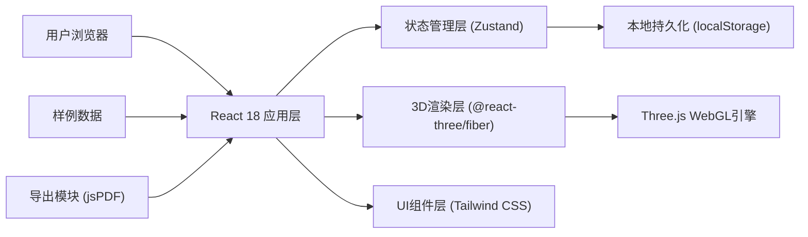
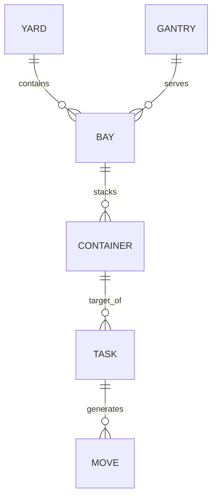

## 1. 架构设计


## 2. 技术描述
- **前端框架**: React@18 + TypeScript
- **构建工具**: Vite@5
- **3D渲染**: three@0.160, @react-three/fiber@8, @react-three/drei@9, @react-three/postprocessing@2
- **状态管理**: Zustand@4
- **样式方案**: Tailwind CSS@3
- **UI组件**: 自定义组件 + lucide-react图标
- **数据导出**: jsPDF, html2canvas
- **持久化**: localStorage 存储筛选条件和关键状态

## 3. 路由定义
| 路由 | 用途 |
|------|------|
| / | 主界面 - 3D箱堆可视化与分析 |

## 4. 数据模型

### 4.1 数据模型定义


### 4.2 核心数据结构

#### Container (集装箱)
```typescript
interface Container {
  id: string;
  bay: number;      // 箱区号
  row: number;      // 行号
  tier: number;     // 层号
  size: '20ft' | '40ft';
  weight: number;
  status: 'normal' | 'target' | 'blocking' | 'moved';
  color: string;
}
```

#### Yard (箱区)
```typescript
interface Yard {
  id: string;
  name: string;
  bays: number;     // 箱区数量
  rows: number;     // 每箱区行数
  maxTiers: number; // 最大层数
  gantryPositions: number[]; // 吊机轨道位置
}
```

#### Task (取箱任务)
```typescript
interface Task {
  id: string;
  targetContainerId: string;
  moves: Move[];
  totalRelocations: number;
  optimalSide: 'left' | 'right';
  createdAt: number;
}
```

#### Move (移动步骤)
```typescript
interface Move {
  step: number;
  type: 'relocation' | 'retrieval';
  containerId: string;
  from: { bay: number; row: number; tier: number };
  to: { bay: number; row: number; tier: number } | null;
}
```

#### AppState (应用状态)
```typescript
interface AppState {
  containers: Container[];
  yard: Yard | null;
  selectedContainerId: string | null;
  currentTask: Task | null;
  filter: {
    bay: number | null;
    search: string;
  };
  timeline: {
    currentStep: number;
    isPlaying: boolean;
    speed: number;
  };
  cameraView: 'default' | 'top' | 'side' | 'gantry';
}
```

## 5. 核心算法

### 5.1 可达性分析算法
1. 确定目标箱位置 (bay, row, tier)
2. 检查上方遮挡：遍历同bay同row中tier > targetTier的集装箱
3. 检查侧面遮挡：分析吊机从左右两侧接近的可行性
4. 计算最小倒箱数：比较左右两侧的倒箱成本
5. 生成最优取箱路径

### 5.2 路径规划算法
1. 确定需要倒箱的集装箱列表
2. 为每个倒箱寻找临时存放位置
3. 生成移动步骤序列
4. 计算总作业时间和成本
