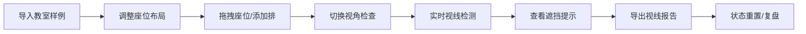

## 1. 产品概述

教室座位视线检查工具，帮助培训机构在换教室布局后快速验证后排学生视线是否被柱子和投影架遮挡，通过3D交互可视化实现操作和复盘。

- 解决问题：传统静态图无法直观验证视线遮挡，无法进行交互调整和多场景对比
- 目标用户：培训机构教务人员、场地规划师

## 2. 核心功能

### 2.1 功能模块

1. **3D教室场景**：可交互的3D教室模型，包含座位、讲台、柱子、投影幕
2. **座位管理**：座位拖拽调整、筛选、临时加排
3. **视线检测**：实时视线射线渲染、遮挡检测与提示
4. **样例导入**：预设教室布局样例快速导入
5. **时间轴/视角**：多视角切换、布局状态时间轴
6. **报告导出**：与当前状态一致的视线分析报告导出
7. **状态重置**：一键恢复初始状态

### 2.2 页面详情

| 页面名称 | 模块名称 | 功能描述 |
|----------|----------|----------|
| 主界面 | 3D视口 | Three.js渲染的3D教室场景，支持旋转、缩放、平移 |
| 主界面 | 工具栏 | 导入样例、视角切换、状态重置、导出报告按钮 |
| 主界面 | 座位控制面板 | 座位筛选、拖拽开关、临时加排功能 |
| 主界面 | 时间轴面板 | 布局状态切换、历史记录 |
| 主界面 | 信息面板 | 遮挡统计、视线分析摘要 |

## 3. 核心流程

## 4. 用户界面设计

### 4.1 设计风格

- **主色调**：深蓝色(#1a365d) + 科技蓝(#3b82f6)
- **辅助色**：遮挡红色(#ef4444)、正常绿色(#10b981)、警告橙色(#f59e0b)
- **按钮风格**：圆角(8px)、悬浮高亮、图标+文字
- **字体**：JetBrains Mono (代码/数字) + Noto Sans SC (中文)
- **布局风格**：暗黑科技风、3D视口为主、侧边控制面板
- **图标风格**：线性图标、统一24px尺寸

### 4.2 页面设计概述

| 页面名称 | 模块名称 | UI元素 |
|----------|----------|--------|
| 主界面 | 3D视口 | 全屏3D场景、网格地面、环境光、聚光灯 |
| 主界面 | 顶部工具栏 | 左侧Logo、中间功能按钮组、右侧状态指示 |
| 主界面 | 左侧控制面板 | 座位列表、筛选器、拖拽开关 |
| 主界面 | 底部时间轴 | 状态节点、播放控制、时间刻度 |
| 主界面 | 右侧信息面板 | 遮挡统计、视线高度设置、导出按钮 |

### 4.3 响应式

- Desktop-first设计，适配1920x1080及以上分辨率
- 平板：侧边面板可折叠，触控优化
- 移动端：简化功能，聚焦3D视口查看

### 4.4 3D场景指导

- **环境**：暗色调专业场景，柔和环境光+方向性主光源
- **照明**：三光源设置（主光+补光+轮廓光），突出3D物体轮廓
- **相机**：轨道控制器，默认45度俯视角，支持透视/正交切换
- **材质**：座位半透明蓝色、柱子灰色金属质感、投影幕白色漫反射
- **视线**：使用Line渲染射线，绿色=通畅、红色=遮挡、带渐变透明度
- **后处理**：轻微泛光效果，遮挡物体高亮边框
- **性能**：使用实例化渲染优化大量座位，目标60fps
