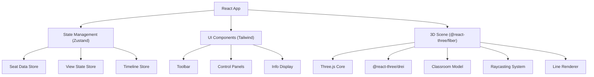

## 1. 架构设计



## 2. 技术描述

- **Frontend**: React@18 + TypeScript + Vite
- **3D Engine**: three@0.160 + @react-three/fiber@8 + @react-three/drei@9
- **State Management**: zustand@4
- **Styling**: tailwindcss@3 + postcss + autoprefixer
- **UI Icons**: lucide-react
- **Export**: html2canvas + jspdf (PDF报告)

## 3. 路由定义

| Route | Purpose |
|-------|---------|
| / | 主应用页面，3D教室视线检查器 |

## 4. 数据模型

### 4.1 核心数据类型

```typescript
// 座位
interface Seat {
  id: string;
  row: number;
  col: number;
  position: { x: number; y: number; z: number };
  isBlocked: boolean;
  isSelected: boolean;
  isVisible: boolean;
}

// 障碍物（柱子、投影架）
interface Obstacle {
  id: string;
  type: 'pillar' | 'projector' | 'screen';
  position: { x: number; y: number; z: number };
  size: { width: number; height: number; depth: number };
}

// 讲台
interface Platform {
  position: { x: number; y: number; z: number };
  size: { width: number; height: number; depth: number };
  targetPoint: { x: number; y: number; z: number }; // 视线目标点
}

// 视线检查结果
interface LineOfSightResult {
  seatId: string;
  isBlocked: boolean;
  blockingObstacleId?: string;
  hitPoint?: { x: number; y: number; z: number };
}

// 时间轴状态
interface TimelineState {
  id: string;
  name: string;
  seats: Seat[];
  timestamp: number;
}

// 教室布局
interface ClassroomLayout {
  name: string;
  seats: Seat[];
  obstacles: Obstacle[];
  platform: Platform;
  eyeHeight: number; // 座位视线高度（米）
}

// 导出报告
interface ExportReport {
  generatedAt: string;
  cameraPosition: { x: number; y: number; z: number };
  filters: { rows: number[]; blockedOnly: boolean };
  timelinePosition: number;
  totalSeats: number;
  blockedSeats: number;
  blockedSeatIds: string[];
  layoutName: string;
  screenshot?: string;
}
```

## 5. 核心功能模块

### 5.1 3D场景模块
- **Classroom**: 教室地面、墙壁渲染
- **SeatsGroup**: 座位组，使用InstancedMesh优化
- **Obstacles**: 障碍物模型（柱子、投影架）
- **Platform**: 讲台与投影幕
- **LineOfSight**: 视线射线渲染组件

### 5.2 交互模块
- **SeatDragger**: 座位拖拽控制器
- **OrbitControls**: 相机轨道控制
- **SelectionTool**: 座位选择工具

### 5.3 逻辑模块
- **useRaycaster**: 视线检测计算hook
- **useTimeline**: 时间轴状态管理
- **useExporter**: 报告导出功能

### 5.4 UI模块
- **Toolbar**: 顶部工具栏
- **LeftPanel**: 座位列表面板
- **RightPanel**: 信息与设置面板
- **Timeline**: 底部时间轴控件
