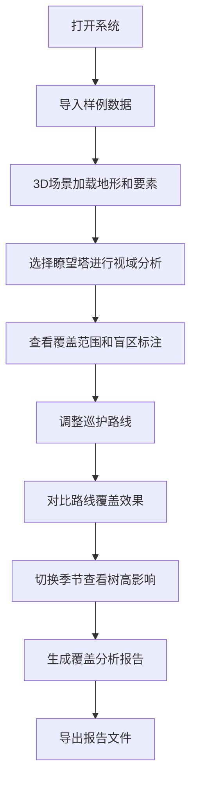

## 1. 产品概述

森林瞭望覆盖图是一个基于WebGL的3D交互可视化系统，帮助林场护林员分析瞭望塔的视域覆盖范围，识别巡护盲区，优化巡护路线。系统支持地形可视化、视域分析、盲区标注、路线对比和报告导出，确保新护林员能够直观理解森林巡护的覆盖情况。

## 2. 核心功能

### 2.1 用户角色

| 角色 | 注册方式 | 核心权限 |
|------|---------|----------|
| 护林员 | 无需注册，直接使用 | 导入样例数据、操作3D场景、分析视域覆盖、导出报告 |
| 管理员 | 系统配置 | 配置瞭望塔参数、管理路线数据 |

### 2.2 功能模块

1. **3D场景主界面**：地形展示、瞭望塔、树木、巡护路线、火点样例
2. **视域分析模块**：实时计算瞭望塔覆盖范围、标注盲区、树高影响分析
3. **巡护路线模块**：路线绘制、路线对比、重复覆盖检测
4. **时间轴控制**：季节变化（树高变化）、视角回放、状态记录
5. **数据管理**：导入样例、筛选数据、状态重置
6. **报告导出**：覆盖分析报告、PDF/JSON导出

### 2.3 页面详情

| 页面名称 | 模块名称 | 功能描述 |
|---------|---------|----------|
| 主界面 | 3D场景视图 | 可旋转、缩放、平移的3D地形场景，展示所有地理要素 |
| 主界面 | 左侧控制面板 | 数据导入、瞭望塔筛选、巡护路线管理 |
| 主界面 | 底部时间轴 | 季节切换、视角回放、状态重置按钮 |
| 主界面 | 右侧信息面板 | 覆盖统计、盲区列表、路线详情 |
| 报告预览 | 报告生成器 | 可视化报告预览、导出格式选择 |

## 3. 核心流程

用户操作流程：
1. 用户打开系统，默认加载样例数据
2. 在3D场景中浏览地形，通过鼠标拖拽旋转视角
3. 选择左侧面板的瞭望塔，系统实时计算视域覆盖
4. 点击盲区标注查看详细信息
5. 通过底部时间轴切换季节，观察树高对视域的影响
6. 调整巡护路线，对比不同路线的覆盖效果
7. 满意后导出覆盖分析报告

## 4. 用户界面设计

### 4.1 设计风格

- **主色调**：深绿色（#1B5E20）代表森林，配合土黄色（#8D6E63）代表地形
- **辅助色**：红色（#E53935）标注盲区，蓝色（#1E88E5）表示覆盖范围，绿色（#43A047）表示巡护路线
- **按钮风格**：扁平化设计，圆角4px，悬停时有轻微上浮效果
- **字体**：标题使用思源黑体Bold，正文使用思源黑体Regular
- **布局风格**：三栏布局，左侧控制面板、中央3D场景、右侧信息面板
- **图标风格**：线性图标，统一24px尺寸

### 4.2 页面设计概述

| 页面名称 | 模块名称 | UI元素 |
|---------|---------|--------|
| 主界面 | 3D场景视图 | 地形网格、瞭望塔模型、树木模型、路线线条、火点标记、覆盖半透明面、盲区红色标记 |
| 主界面 | 左侧控制面板 | 折叠面板、数据导入按钮、瞭望塔列表（可勾选）、路线列表、筛选下拉框 |
| 主界面 | 底部时间轴 | 季节切换滑块、播放/暂停按钮、上一帧/下一帧、重置按钮、时间刻度 |
| 主界面 | 右侧信息面板 | 统计卡片（覆盖率、盲区数量、路线长度）、盲区列表、路线详情 |
| 报告预览 | 报告生成器 | 报告预览区域、格式选择（PDF/JSON）、导出按钮、报告内容配置 |

### 4.3 响应式

- 桌面端优先设计，支持1920x1080及以上分辨率
- 平板端：左侧和右侧面板可折叠，最大化3D场景区域
- 不支持移动端（3D操作需要精确鼠标控制）

### 4.4 3D场景指导

- **环境**：户外自然光照，使用HDRI环境贴图模拟天空
- **光照设置**：方向光模拟太阳光（角度随季节变化），环境光提供基础照明
- **相机设置**：透视相机，初始俯视角45度，支持轨道控制
- **构图**：地形居中，瞭望塔位于关键位置，路线清晰可见
- **交互**：鼠标左键旋转、右键平移、滚轮缩放，点击要素显示详情
- **后处理**：轻微抗锯齿，景深效果突出重点区域
- **性能**：使用LOD（细节层次）优化地形渲染，树木使用实例化渲染
