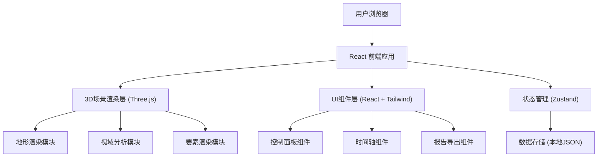

## 1. 架构设计



## 2. 技术描述

- **前端框架**: React@18 + TypeScript
- **构建工具**: Vite@5
- **样式方案**: TailwindCSS@3
- **3D渲染**: Three@0.160 + @react-three/fiber@8 + @react-three/drei@9
- **状态管理**: Zustand@4
- **图表可视化**: @react-three/postprocessing@2 (后期处理)
- **报告导出**: jsPDF (PDF导出) + 原生JSON导出
- **后端**: 无后端，纯前端应用，数据以JSON文件形式存储

## 3. 目录结构

```
src/
├── components/          # React组件
│   ├── ControlPanel/    # 左侧控制面板
│   ├── Timeline/        # 底部时间轴
│   ├── InfoPanel/       # 右侧信息面板
│   └── ReportModal/     # 报告导出弹窗
├── store/               # Zustand状态管理
│   └── useStore.ts
├── scene/               # 3D场景相关
│   ├── Terrain.tsx      # 地形组件
│   ├── Watchtower.tsx   # 瞭望塔组件
│   ├── Trees.tsx        # 树木组件
│   ├── Routes.tsx       # 巡护路线组件
│   ├── FirePoints.tsx   # 火点组件
│   ├── ViewAnalysis.tsx # 视域分析
│   └── BlindSpots.tsx   # 盲区标注
├── utils/               # 工具函数
│   ├── visibility.ts    # 视域计算算法
│   ├── terrain.ts       # 地形生成
│   └── export.ts        # 报告导出
├── data/                # 样例数据
│   ├── terrain.json
│   ├── watchtowers.json
│   ├── routes.json
│   └── firepoints.json
├── types/               # TypeScript类型定义
│   └── index.ts
├── App.tsx
├── main.tsx
└── index.css
```

## 4. 核心数据结构

### 4.1 地形数据 (Terrain)

```typescript
interface TerrainData {
  width: number;
  height: number;
  resolution: number;
  heightMap: number[][];  // 高度矩阵
  texture?: string;
}
```

### 4.2 瞭望塔 (Watchtower)

```typescript
interface Watchtower {
  id: string;
  name: string;
  position: { x: number; y: number; z: number };
  height: number;          // 塔高
  viewDistance: number;    // 可视距离
  viewAngle: number;       // 视角范围(度)
  enabled: boolean;
}
```

### 4.3 巡护路线 (PatrolRoute)

```typescript
interface PatrolRoute {
  id: string;
  name: string;
  points: { x: number; y: number; z: number }[];
  color: string;
  enabled: boolean;
  coverageScore?: number;
}
```

### 4.4 盲区 (BlindSpot)

```typescript
interface BlindSpot {
  id: string;
  position: { x: number; y: number; z: number };
  area: number;            // 面积
  severity: 'high' | 'medium' | 'low';
  reason: 'terrain' | 'trees' | 'distance';
  visibleFrom?: string[];  // 可从哪些塔看到
}
```

### 4.5 季节配置 (Season)

```typescript
interface Season {
  id: string;
  name: string;  // 春/夏/秋/冬
  treeHeightFactor: number;  // 树高系数
  foliageDensity: number;    // 树叶密度
  sunAngle: number;          // 太阳高度角
}
```

## 5. 视域分析算法

### 5.1 射线检测法
- 从瞭望塔位置向四周发射多条射线
- 检测射线与地形、树木的交点
- 记录第一个遮挡点，标记可见/不可见区域
- 使用GPU加速计算（WebGL着色器）

### 5.2 优化策略
- 分层LOD计算：远处降低采样率
- 遮挡剔除：预先计算山脊遮挡区域
- 增量更新：只重新计算变化的部分

## 6. 状态管理

```typescript
interface AppState {
  // 场景状态
  season: Season;
  cameraPosition: { x: number; y: number; z: number };
  
  // 数据状态
  watchtowers: Watchtower[];
  routes: PatrolRoute[];
  blindSpots: BlindSpot[];
  firePoints: FirePoint[];
  
  // UI状态
  selectedWatchtower: string | null;
  selectedRoute: string | null;
  showCoverage: boolean;
  showBlindSpots: boolean;
  isPlaying: boolean;
  currentTime: number;
  
  // Actions
  setSeason: (season: Season) => void;
  toggleWatchtower: (id: string) => void;
  toggleRoute: (id: string) => void;
  selectWatchtower: (id: string | null) => void;
  selectRoute: (id: string | null) => void;
  resetState: () => void;
  exportReport: () => void;
  importData: (data: any) => void;
}
```

## 7. 性能优化策略

1. **地形渲染**: 使用PlaneGeometry + 顶点着色器置换，LOD分级
2. **树木渲染**: 使用InstancedMesh批量渲染
3. **视域计算**: WebGL计算着色器并行处理
4. **路线渲染**: LineSegments + 几何实例化
5. **状态更新**: 选择性重渲染，避免全量更新
