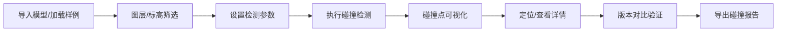

## 1. 产品概述
基于 Three.js 的机电施工碰撞检查可视化系统，用于在浏览器中对桥架、风管、消防管线进行交互式碰撞检测与复盘分析，解决标高单位混用、软碰撞漏报、修改后未复查等常见问题。
- 核心目标：提供专业的 3D 管综碰撞检查工具，支持多专业协同设计审查
- 目标用户：机电工程师、BIM 设计师、施工管理人员
- 产品价值：降低施工返工率，提升管综设计质量，简化碰撞审查流程

## 2. 核心功能

### 2.1 用户角色
| 角色 | 登录方式 | 核心权限 |
|------|----------|----------|
| 工程师 | 本地访问 | 导入模型、碰撞检测、标高筛选、版本对比、导出报告 |

### 2.2 功能模块
1. **主工作台**：3D 场景视图、侧边控制面板、底部时间轴
2. **模型管理**：样例导入、图层控制、构件筛选
3. **碰撞检测**：实时碰撞计算、碰撞高亮、碰撞列表
4. **分析工具**：标高筛选、版本对比、视角切换
5. **报告系统**：碰撞报告生成、PDF/图片导出

### 2.3 页面详情
| 页面名称 | 模块名称 | 功能描述 |
|---------|----------|----------|
| 主工作台 | 3D 视图区 | Three.js 渲染场景，支持旋转、缩放、平移、框选 |
| 主工作台 | 左侧控制面板 | 图层管理、标高筛选、构件类型筛选 |
| 主工作台 | 顶部工具栏 | 导入样例、视角预设、碰撞检测、状态重置、导出报告 |
| 主工作台 | 底部信息栏 | 时间轴、版本切换、碰撞统计、单位显示 |
| 碰撞面板 | 碰撞列表 | 碰撞点详情、定位跳转、碰撞类型标注 |
| 对比面板 | 版本对比 | 双视图对比、差异高亮、变更记录 |

## 3. 核心流程

### 3.1 碰撞检查流程
用户导入或加载样例模型 → 选择需要检查的专业类型（桥架/风管/消防管）→ 设置标高范围和检测参数 → 执行碰撞检测 → 浏览碰撞点列表并定位 → 进行版本对比验证修改 → 导出碰撞报告

### 3.2 版本对比流程
选择两个版本模型 → 双视图同步展示 → 差异自动高亮 → 查看变更记录 → 验证碰撞修复效果

## 4. 用户界面设计

### 4.1 设计风格
- **主色调**：工业蓝 (#165DFF) 作为主色，深灰背景 (#0F172A) 营造专业感
- **辅助色**：橙色 (#FF7D00) 标记碰撞，绿色 (#00B42A) 标记已修复，黄色 (#FFAA00) 标记软碰撞
- **字体**：使用 JetBrains Mono 作为代码/数字字体，Inter 作为 UI 字体
- **按钮风格**：圆角 6px，轻微悬浮效果，图标+文字组合
- **布局风格**：深色专业工具风格，三栏布局，可折叠面板
- **视觉元素**：线框+半透明实体混合渲染，网格地面，专业坐标系

### 4.2 页面设计概述
| 页面名称 | 模块名称 | UI 元素 |
|---------|----------|---------|
| 主工作台 | 3D 视图区 | 全屏 Canvas、坐标轴指示器、视角控制球、测量工具 |
| 主工作台 | 左侧面板 | 可折叠分组、多选框、滑块控件、颜色图例 |
| 主工作台 | 顶部工具栏 | 图标按钮组、下拉菜单、状态指示灯 |
| 主工作台 | 底部信息栏 | 进度条、版本标签、统计徽章、单位切换 |
| 碰撞面板 | 碰撞列表 | 卡片式列表、优先级标签、定位按钮、状态切换 |

### 4.3 响应式设计
- **桌面端 (>1200px)**：完整三栏布局，左侧面板 280px，3D 视图自适应
- **平板端 (768-1200px)**：左侧面板可折叠收起，工具栏水平排列
- **窄屏移动端 (<768px)**：底部工具栏，面板改为底部抽屉式，触控优化
- **关键约束**：所有控件绝对定位，不遮挡 3D 场景核心区域；文字使用 rem 单位自适应

### 4.4 3D 场景设计
- **环境**：深色渐变背景 + 柔和环境光，模拟专业 CAD 软件氛围
- **光照**：主方向光 + 半球光 + 点光源补光，确保管线立体感
- **相机**：透视相机，初始视角 45° 俯角，支持正交/透视切换
- **渲染管线**：抗锯齿 FXAA，半透明排序，轮廓高亮后处理
- **材质风格**：桥架-蓝色半透明、风管-青色半透明、消防管-红色半透明
- **交互**：OrbitControls 轨道控制，双击聚焦，框选多个构件
- **动画**：碰撞点脉冲动画，版本切换过渡动画，构件显隐淡入淡出
- **性能**：实例化渲染，LOD 层级，视锥体剔除
