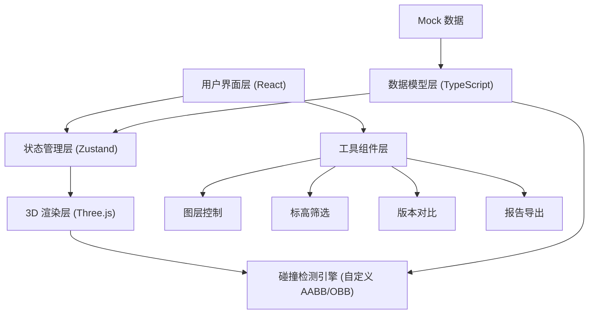

## 1. 架构设计



## 2. 技术栈描述

### 2.1 核心技术栈
- **前端框架**：React@18 + TypeScript@5
- **构建工具**：Vite@5
- **样式方案**：TailwindCSS@3 + CSS Modules
- **3D 引擎**：Three.js@0.160
- **状态管理**：Zustand@4
- **图标库**：Lucide React

### 2.2 关键依赖说明
- `three`: 3D 渲染核心引擎
- `@types/three`: Three.js 类型定义
- `zustand`: 轻量级状态管理，管理 3D 场景状态、碰撞结果、筛选条件
- `lucide-react`: 图标组件库
- `html2canvas`: 截图导出
- `jspdf`: PDF 报告生成

## 3. 目录结构

```
src/
├── components/          # React 组件
│   ├── toolbar/        # 顶部工具栏
│   ├── sidebar/        # 左侧控制面板
│   ├── collision/      # 碰撞面板
│   ├── timeline/       # 底部时间轴
│   └── common/         # 通用组件
├── store/              # Zustand 状态管理
│   ├── useSceneStore.ts
│   ├── useCollisionStore.ts
│   └── useFilterStore.ts
├── three/              # Three.js 相关
│   ├── SceneManager.ts    # 场景管理器
│   ├── ModelLoader.ts     # 模型加载器
│   ├── CollisionEngine.ts # 碰撞检测引擎
│   ├── controls/          # 控制器
│   └── materials/         # 自定义材质
├── types/              # TypeScript 类型定义
│   ├── model.ts
│   ├── collision.ts
│   └── filter.ts
├── data/               # Mock 数据
│   ├── sampleModels.ts
│   └── sampleCollisions.ts
├── utils/              # 工具函数
│   ├── export.ts
│   ├── math.ts
│   └── unit.ts
├── App.tsx
├── main.tsx
└── index.css
```

## 4. 核心数据模型

### 4.1 模型数据结构
```typescript
interface ModelElement {
  id: string;
  type: 'cable_tray' | 'duct' | 'fire_pipe';
  name: string;
  elevation: number;      // 标高 (米)
  points: Vector3[];      // 管线控制点
  radius: number;         // 半径/半宽
  version: number;        // 版本号
  visible: boolean;
  color: string;
}

interface CollisionPoint {
  id: string;
  elementA: string;       // 构件A ID
  elementB: string;       // 构件B ID
  position: Vector3;      // 碰撞位置
  type: 'hard' | 'soft';  // 硬碰撞/软碰撞
  distance: number;       // 距离（软碰撞时）
  severity: 'critical' | 'major' | 'minor';
  resolved: boolean;
  timestamp: number;
}

interface FilterState {
  types: string[];        // 选中的构件类型
  elevationRange: [number, number];  // 标高范围
  versions: number[];     // 选中的版本
  showOnlyColliding: boolean;
}
```

## 5. 核心模块设计

### 5.1 场景管理器 (SceneManager)
- 初始化 Three.js 场景、相机、渲染器
- 管理灯光、网格、坐标轴
- 处理视口大小变化
- 提供渲染循环控制

### 5.2 碰撞检测引擎 (CollisionEngine)
- AABB 包围盒粗检测
- OBB 方向包围盒精检测
- 管线段-段碰撞算法
- 软碰撞（净距检测）
- 性能优化：空间划分（BVH）

### 5.3 状态管理
- **useSceneStore**: 管理 3D 场景状态、相机位置、选中对象
- **useCollisionStore**: 存储碰撞检测结果、当前查看碰撞点
- **useFilterStore**: 管理筛选条件、标高范围、图层显隐

## 6. 性能优化策略

1. **实例化渲染**: 同类型管线使用 InstancedMesh
2. **LOD 层级**: 远距离简化模型细节
3. **视锥体剔除**: 只渲染视口内对象
4. **碰撞检测优化**: BVH 空间划分加速
5. **按需渲染**: 交互时才渲染，空闲时暂停
6. **WebWorker**: 碰撞计算放在后台线程

## 7. 响应式布局策略

| 断点 | 布局方案 |
|------|----------|
| >1200px | 左侧面板 280px 固定 + 右侧 3D 区域自适应 |
| 768-1200px | 左侧面板可折叠，折叠后 60px 图标栏 |
| <768px | 面板改为底部抽屉，工具栏移到底部，触控优化 |
