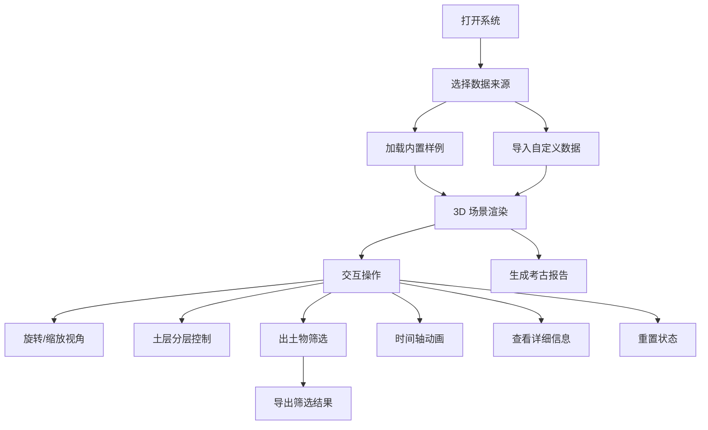

## 1. 产品概述

考古探方分层查看系统是一款基于 Three.js 的 3D 交互可视化工具，专为考古工作者设计，用于数字化管理和分析探方、土层、出土物等考古数据。解决传统纸质剖面图易丢失、难以叠加分析、数据一致性差等问题。

## 2. 核心功能

### 2.1 用户角色
| 角色 | 注册方式 | 核心权限 |
|------|----------|----------|
| 考古工作者 | 无需注册，直接使用 | 导入数据、3D 可视化、筛选分析、导出报告 |

### 2.2 功能模块
1. **主可视化页面**：3D 探方场景、分层控制、出土物标注、数据筛选
2. **数据导入模块**：内置样例加载、自定义数据导入
3. **报告导出模块**：筛选结果导出、考古报告生成

### 2.3 页面详情
| 页面名称 | 模块名称 | 功能描述 |
|---------|---------|----------|
| 主页面 | 3D 可视化区 | Three.js 渲染探方网格、土层分层、出土物点位，支持鼠标旋转/缩放/平移 |
| 主页面 | 分层控制面板 | 滑块控制显示土层深度范围，一键显示/隐藏特定土层 |
| 主页面 | 筛选工具栏 | 按出土物类型、年代、编号筛选，支持多条件组合 |
| 主页面 | 时间轴切换 | 按年代序列切换视角，动画展示地层堆积过程 |
| 主页面 | 状态管理 | 一键重置视角、筛选条件、图层状态 |
| 主页面 | 导出面板 | 导出筛选数据 CSV、生成考古分层报告 PDF/HTML |

## 3. 核心流程

## 4. 用户界面设计

### 4.1 设计风格
- **主色调**：深褐色 (#5D4037) - 体现考古、历史感
- **辅助色**：土黄色 (#D4A574)、陶土红 (#C75B39)、石青色 (#607D8B)
- **中性色**：深灰 (#212121)、米白 (#FAFAFA)
- **按钮风格**：圆角矩形，轻微阴影，hover 时有上浮效果
- **字体**：标题使用 Lora（衬线字体，学术感），正文使用 Noto Sans SC
- **布局风格**：左侧工具栏 + 中央 3D 场景 + 右侧信息面板，深色沉浸式背景
- **图标风格**：线性图标，与考古主题契合

### 4.2 页面设计概述
| 页面名称 | 模块名称 | UI 元素 |
|---------|---------|---------|
| 主页面 | 顶部导航栏 | 系统标题、样例选择下拉、导入按钮、导出按钮、重置按钮 |
| 主页面 | 左侧工具栏 | 土层分层滑块、显示/隐藏切换、出土物类型筛选 |
| 主页面 | 中央 3D 区域 | Three.js 画布、操作提示、加载动画 |
| 主页面 | 底部时间轴 | 年代刻度、播放/暂停按钮、进度条 |
| 主页面 | 右侧信息面板 | 选中出土物详情、土层信息、统计数据 |
| 主页面 | 冲突提示层 | 红色警示图标，标注重复编号、深度冲突位置 |

### 4.3 响应式
- 桌面端优先设计，支持 1920×1080 及以上分辨率
- 平板设备自适应布局，工具栏可折叠
- 触摸屏优化手势操作（双指缩放、单指旋转）

### 4.4 3D 场景指引
- **环境**：深色渐变背景，模拟地下勘探氛围，柔和环境光
- **光照设置**：主方向光 + 环境光 + 点光源照亮出土物
- **相机设置**：PerspectiveCamera，初始 45° 俯视角度，支持 OrbitControls
- **构图**：探方居中央，土层半透明叠加，出土物用发光材质突出
- **交互**：点击出土物显示信息面板，悬停高亮，双击聚焦
- **动画**：土层渐显渐隐，时间轴播放时土层从下往上堆叠动画
- **后期处理**：轻微 Bloom 效果突出出土物，FXAA 抗锯齿
- **性能预算**：保持 60fps，单场景面数控制在 50k 以内
