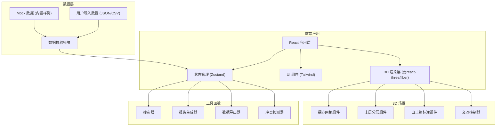
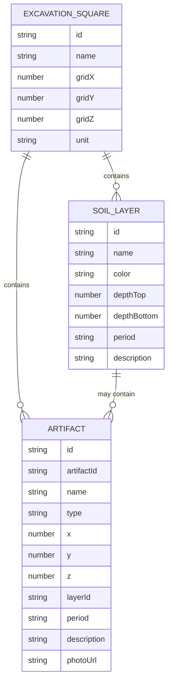

## 1. 架构设计



## 2. 技术描述

- **前端框架**：React@18 + TypeScript
- **构建工具**：Vite@5
- **样式方案**：TailwindCSS@3
- **3D 渲染**：Three.js@0.160 + @react-three/fiber@8 + @react-three/drei@9
- **状态管理**：Zustand@4
- **动画库**：framer-motion@10 + @react-three/postprocessing@2
- **数据处理**：内置 Mock 数据，支持 JSON/CSV 导入
- **报告生成**：客户端 HTML/PDF 导出

## 3. 目录结构

| 路径 | 用途 |
|------|------|
| `/src` | 源代码根目录 |
| `/src/components` | React UI 组件 |
| `/src/components/three` | Three.js 3D 组件 |
| `/src/store` | Zustand 状态管理 |
| `/src/data` | 内置样例数据 |
| `/src/utils` | 工具函数 (筛选、导出、报告) |
| `/src/types` | TypeScript 类型定义 |
| `/src/hooks` | 自定义 Hooks |
| `/public` | 静态资源 |

## 4. 路由定义

| Route | 用途 |
|-------|------|
| `/` | 主可视化页面 |

## 5. 数据模型

### 5.1 数据模型定义



### 5.2 类型定义

```typescript
interface ExcavationSquare {
  id: string;
  name: string;
  gridSize: { x: number; y: number; z: number };
  unit: 'cm' | 'm';
  layers: SoilLayer[];
  artifacts: Artifact[];
}

interface SoilLayer {
  id: string;
  name: string;
  color: string;
  depthTop: number;
  depthBottom: number;
  period: string;
  description: string;
  visible: boolean;
}

interface Artifact {
  id: string;
  artifactId: string;
  name: string;
  type: 'pottery' | 'stone' | 'bone' | 'metal' | 'other';
  position: { x: number; y: number; z: number };
  layerId: string;
  period: string;
  description: string;
  photoUrl?: string;
  selected: boolean;
}

interface FilterState {
  types: string[];
  periods: string[];
  depthRange: [number, number];
  layerIds: string[];
}

interface ValidationError {
  type: 'duplicate_id' | 'depth_conflict' | 'invalid_position';
  artifactId?: string;
  layerId?: string;
  message: string;
}
```

## 6. 核心模块设计

### 6.1 3D 场景组件
- `ExcavationScene.tsx` - 主场景容器
- `Grid3D.tsx` - 探方网格渲染
- `SoilLayer3D.tsx` - 土层半透明立方体
- `Artifact3D.tsx` - 出土物标注点/模型
- `SceneControls.tsx` - 相机控制、光照设置

### 6.2 UI 控制组件
- `LayerSlider.tsx` - 土层深度滑块
- `FilterPanel.tsx` - 筛选条件面板
- `Timeline.tsx` - 年代时间轴
- `InfoPanel.tsx` - 出土物详情面板
- `SampleSelector.tsx` - 内置样例选择

### 6.3 工具函数
- `dataValidator.ts` - 数据冲突检测
- `filterEngine.ts` - 多条件筛选
- `reportGenerator.ts` - 考古报告生成
- `exporter.ts` - CSV/JSON 导出

## 7. 内置样例数据

| 样例名称 | 描述 | 特点 |
|---------|------|------|
| 正常探方 | 标准考古发掘数据 | 5 层土，15 件出土物，无冲突 |
| 冲突探方 | 含数据错误的样例 | 重复编号、深度冲突 |
| 稀疏探方 | 出土物稀少的样例 | 3 层土，2 件出土物 |
| 复杂探方 | 大型复杂发掘 | 8 层土，50 件出土物 |
