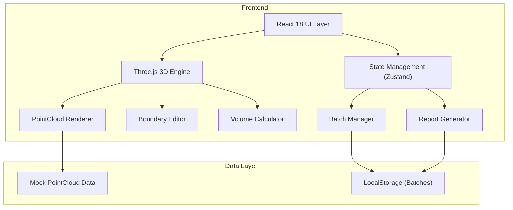
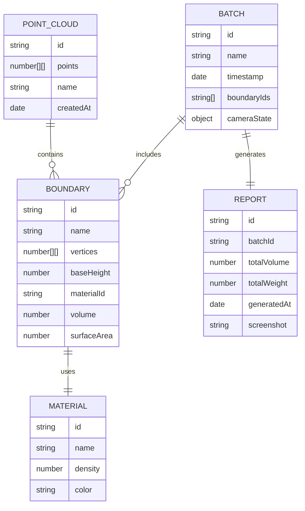

## 1. Architecture Design



## 2. Technology Description

- **Frontend**: React@18 + TypeScript + Vite@5
- **3D Engine**: three@0.160 + @react-three/fiber@8 + @react-three/drei@9
- **State Management**: zustand@4
- **Styling**: tailwindcss@3 + @tailwindcss/vite
- **PDF Export**: jspdf + html2canvas
- **Icons**: lucide-react
- **Backend**: None (纯前端应用)
- **Database**: LocalStorage + Mock Data

## 3. Route Definitions

| Route | Purpose |
|-------|---------|
| / | 主工作台 - 3D可视化 + 边界编辑 + 批次管理 |

## 4. Data Model

### 4.1 Data Model Definition



### 4.2 TypeScript Interfaces

```typescript
// Point Cloud
interface Point3D {
  x: number;
  y: number;
  z: number;
  color?: number;
}

interface PointCloudData {
  id: string;
  name: string;
  points: Point3D[];
  createdAt: Date;
}

// Boundary
interface BoundaryVertex {
  x: number;
  z: number;
}

interface Boundary {
  id: string;
  name: string;
  vertices: BoundaryVertex[];
  baseHeight: number;
  materialId: string;
  volume?: number;
  surfaceArea?: number;
}

// Material
interface Material {
  id: string;
  name: string;
  density: number;
  color: string;
}

// Batch
interface CameraState {
  position: [number, number, number];
  target: [number, number, number];
}

interface Batch {
  id: string;
  name: string;
  timestamp: Date;
  boundaries: Boundary[];
  cameraState: CameraState;
}

// Report
interface ReportData {
  id: string;
  batchId: string;
  batchName: string;
  generatedAt: Date;
  totalVolume: number;
  totalWeight: number;
  boundaries: {
    name: string;
    volume: number;
    weight: number;
    material: string;
  }[];
  screenshot?: string;
}

// App State
interface AppState {
  pointCloud: PointCloudData | null;
  boundaries: Boundary[];
  selectedBoundaryId: string | null;
  activeBatchId: string | null;
  batches: Batch[];
  materials: Material[];
  isDrawing: boolean;
  baseHeight: number;
  cameraState: CameraState;
}
```

## 5. Core Algorithms

### 5.1 Volume Calculation
- 方法：基于边界多边形的凸包体积计算
- 原理：将点云投影到XY平面，筛选边界内的点，使用梯形法计算与基准面之间的体积
- 公式：Volume = Σ (point.height - baseHeight) × gridArea

### 5.2 Point-in-Polygon Test
- 使用射线法判断点是否在边界多边形内
- 优化：空间网格索引加速点筛选

## 6. Project Structure

```
src/
├── components/
│   ├── Viewer/           # 3D视口组件
│   ├── Toolbar/          # 顶部工具栏
│   ├── LeftPanel/        # 左侧批次面板
│   ├── RightPanel/       # 右侧属性面板
│   ├── BoundaryEditor/   # 边界编辑器
│   └── ReportModal/      # 报告导出弹窗
├── store/
│   └── useStore.ts       # Zustand状态管理
├── utils/
│   ├── volume.ts         # 体积计算算法
│   ├── pointCloud.ts     # 点云处理工具
│   └── export.ts         # 导出工具
├── data/
│   ├── mockData.ts       # 模拟点云数据
│   └── materials.ts      # 物料类型数据
├── types/
│   └── index.ts          # 类型定义
└── App.tsx
```
