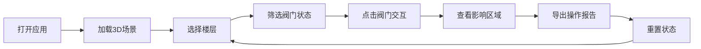

## 1. 产品概述
医院氧气管线楼层图WebGL交互系统，帮助总务科新同事快速定位和理解氧气阀门位置、管线关系及检修状态。通过3D可视化降低支路阀门误关、楼层切换错误、检修状态过期等操作风险。

- 核心目标：降低新员工培训成本，减少氧气管线操作失误
- 目标用户：医院总务科新员工、运维管理人员
- 产品价值：交互式3D培训工具，可在浏览器中操作和复盘

## 2. 核心功能

### 2.1 用户角色
| 角色 | 注册方式 | 核心权限 |
|------|----------|----------|
| 培训学员 | 无需注册 | 浏览3D场景、操作阀门、查看报告 |
| 管理员 | 无需注册 | 导入样例、导出报告、重置状态 |

### 2.2 功能模块
1. **3D场景页面**：楼层模型、氧气管线、阀门交互、病区显示
2. **控制面板**：楼层切换、状态筛选、时间轴、视角切换
3. **报告系统**：管线状态报告生成与导出

### 2.3 页面详情
| 页面名称 | 模块名称 | 功能描述 |
|----------|----------|----------|
| 3D场景主页面 | 3D渲染区域 | WebGL渲染楼层模型、管线、阀门，支持鼠标拖拽旋转、缩放 |
| 3D场景主页面 | 左侧工具栏 | 楼层选择器、阀门筛选、时间轴控件、视角预设 |
| 3D场景主页面 | 右侧信息面板 | 阀门详情、病区信息、检修状态、操作历史 |
| 3D场景主页面 | 底部控制栏 | 导入样例、状态重置、导出报告、帮助按钮 |

## 3. 核心流程

用户打开应用 → 加载默认3D场景 → 选择楼层/病区 → 筛选阀门状态 → 点击阀门查看详情/操作开关 → 查看影响区域 → 导出操作报告 → 重置状态继续培训

## 4. 用户界面设计

### 4.1 设计风格
- **主色调**：医疗蓝 (#165DFF) 作为主色，代表专业和信任
- **辅助色**：警示红 (#F53F3F) 表示关闭/危险，成功绿 (#00B42A) 表示开启/正常
- **中性色**：深灰 (#1D2129) 文字，浅灰 (#F2F3F5) 背景
- **按钮风格**：圆角8px，悬停有阴影和缩放效果
- **字体**：使用现代无衬线字体，标题加粗，正文清晰易读
- **布局风格**：三栏式布局，左侧工具、中间3D、右侧信息，固定底部控制栏
- **图标风格**：线性图标，简洁明了，使用lucide-react图标库

### 4.2 页面设计概述
| 页面名称 | 模块名称 | UI元素 |
|----------|----------|--------|
| 主页面 | 3D场景区域 | 全屏WebGL画布，鼠标交互提示，加载动画 |
| 主页面 | 左侧工具栏 | 折叠面板，楼层列表，筛选复选框，时间轴滑块，视角按钮组 |
| 主页面 | 右侧信息面板 | 卡片式布局，阀门详情表单，状态标签，影响区域高亮 |
| 主页面 | 底部控制栏 | 固定定位，按钮组，进度指示器 |

### 4.3 响应式
- **桌面端**：三栏完整布局，左侧240px，右侧280px，中间自适应
- **平板端**：左右面板可折叠，使用抽屉式交互
- **移动端**：上下布局，3D场景在上，控制区在下，支持触摸手势
- **触摸优化**：增大点击区域，支持双指缩放、单指旋转

### 4.4 3D场景指引
- **环境**：简洁的医院楼层内部环境，避免杂乱
- **光照**：柔和的环境光 + 定向光，突出管线和阀门的立体感
- **相机设置**：初始视角为45度俯视角，可自由旋转、平移、缩放
- **交互动画**：阀门开关有平滑旋转动画，管线有流动光效表示氧气流向
- **后期效果**：轻微抗锯齿，选中物体有发光轮廓效果
- **性能优化**：使用实例化渲染管线，LOD优化，保持60fps
