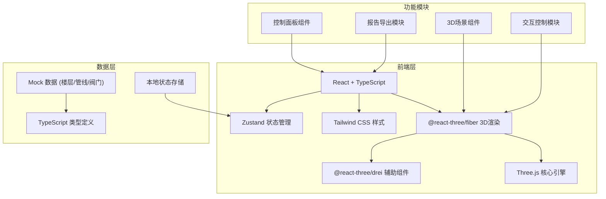

## 1. 架构设计



## 2. 技术描述
- **前端框架**: React@18 + TypeScript + Vite
- **3D引擎**: Three.js + @react-three/fiber + @react-three/drei
- **状态管理**: Zustand
- **样式方案**: Tailwind CSS@3
- **图标库**: lucide-react
- **后端**: 无后端，纯前端应用，使用Mock数据
- **导出功能**: html2canvas + jsPDF 或 纯前端生成JSON/HTML报告

## 3. 路由定义
| 路由 | 用途 |
|------|------|
| / | 主页面 - 3D场景和控制面板 |

## 4. 数据模型

### 4.1 类型定义

```typescript
// 楼层信息
interface Floor {
  id: string;
  name: string;
  level: number;
  wards: Ward[];
}

// 病区
interface Ward {
  id: string;
  name: string;
  floorId: string;
  position: { x: number; y: number; z: number };
  size: { width: number; height: number; depth: number };
}

// 氧气管线
interface Pipeline {
  id: string;
  name: string;
  floorId: string;
  startPoint: { x: number; y: number; z: number };
  endPoint: { x: number; y: number; z: number };
  path: { x: number; y: number; z: number }[];
  status: 'normal' | 'maintenance' | 'fault';
  connectedValves: string[];
}

// 阀门
interface Valve {
  id: string;
  name: string;
  floorId: string;
  pipelineId: string;
  position: { x: number; y: number; z: number };
  isOpen: boolean;
  status: 'normal' | 'maintenance' | 'expired';
  maintenanceDate?: string;
  expiryDate?: string;
  affectedWards: string[];
}

// 时间轴状态
interface TimelineState {
  currentTime: Date;
  speed: number;
  isPlaying: boolean;
}

// 应用状态
interface AppState {
  floors: Floor[];
  pipelines: Pipeline[];
  valves: Valve[];
  selectedFloorId: string | null;
  selectedValveId: string | null;
  filterStatus: ('normal' | 'maintenance' | 'fault' | 'expired')[];
  cameraView: 'perspective' | 'top' | 'front' | 'side';
  timeline: TimelineState;
}
```

### 4.2 数据结构说明
- **楼层(Floor)**: 包含基本信息和所属病区列表
- **病区(Ward)**: 表示楼层中的区域，有位置和大小信息
- **管线(Pipeline)**: 表示氧气管道，包含路径点、状态和连接的阀门
- **阀门(Valve)**: 核心交互对象，包含开关状态、检修状态、影响的病区等
- **时间轴(TimelineState)**: 控制检修状态的时间维度展示

## 5. 组件结构

```
src/
├── components/
│   ├── Scene3D/              # 3D场景组件
│   │   ├── index.tsx         # 主3D场景容器
│   │   ├── Floor.tsx         # 楼层模型
│   │   ├── Pipeline.tsx      # 管线渲染
│   │   ├── Valve.tsx         # 阀门组件（可交互）
│   │   ├── Ward.tsx          # 病区显示
│   │   └── CameraControls.tsx # 相机控制
│   ├── ControlPanel/         # 控制面板
│   │   ├── FloorSelector.tsx # 楼层选择器
│   │   ├── StatusFilter.tsx  # 状态筛选
│   │   ├── Timeline.tsx      # 时间轴控件
│   │   └── ViewPresets.tsx   # 视角预设
│   ├── InfoPanel/            # 信息面板
│   │   ├── ValveDetail.tsx   # 阀门详情
│   │   ├── WardInfo.tsx      # 病区信息
│   │   └── OperationLog.tsx  # 操作日志
│   └── BottomBar/            # 底部控制栏
│       ├── ImportButton.tsx  # 导入样例
│       ├── ResetButton.tsx   # 状态重置
│       └── ExportReport.tsx  # 导出报告
├── store/
│   └── useAppStore.ts        # Zustand状态管理
├── data/
│   └── mockData.ts           # Mock数据
├── types/
│   └── index.ts              # 类型定义
├── utils/
│   ├── reportGenerator.ts    # 报告生成工具
│   └── sceneUtils.ts         # 3D场景工具函数
└── App.tsx                   # 主应用组件
```

## 6. 核心技术实现要点

### 6.1 3D渲染
- 使用@react-three/fiber的Canvas组件作为3D渲染容器
- 使用OrbitControls实现鼠标交互（旋转、缩放、平移）
- 使用TubeGeometry渲染管线，支持弯曲路径
- 使用MeshStandardMaterial实现真实感材质

### 6.2 交互实现
- 阀门点击检测：使用Three.js的Raycaster
- 状态变更动画：使用useFrame实现平滑过渡
- 影响区域高亮：修改病区材质的emissive属性

### 6.3 响应式布局
- 使用Tailwind的响应式断点：sm、md、lg、xl
- 左右面板在小屏幕转为抽屉模式
- 3D场景始终保持合适的视口

### 6.4 报告导出
- 收集当前场景的所有状态数据
- 生成HTML格式报告，可打印或保存为PDF
- 报告内容与可视化场景保持一致
