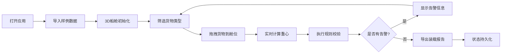

## 1. 产品概述

船舱装载平衡模拟器是一款基于3D可视化的货代作业辅助工具，帮助装船前规划重货、冷藏箱和危险品在舱位中的分布，避免依赖经验排货导致的安全隐患。

- **核心问题**：重心偏移、危险品相邻违规、冷藏插座不足
- **目标用户**：货代公司、船舶配载员、港口操作团队
- **产品价值**：降低装船风险、提高配载效率、减少作业返工

## 2. 核心功能

### 2.1 用户角色

| 角色 | 注册方式 | 核心权限 |
|------|----------|----------|
| 配载员 | 本地使用 | 3D操作、装载规划、规则校验、报告导出 |

### 2.2 功能模块

1. **主界面**：3D船舱视窗、货物清单、操作控制面板
2. **装载模拟**：拖拽货物到舱位、实时状态反馈
3. **重心计算**：实时显示船舶重心位置、偏移告警
4. **规则校验**：危险品隔离检查、冷藏插座分配检查
5. **时间轴/视角**：装载步骤回放、多视角切换
6. **数据管理**：样例导入、状态持久化、报告导出

### 2.3 页面详情

| 页面名称 | 模块名称 | 功能描述 |
|----------|----------|----------|
| 主界面 | 3D船舱视窗 | Three.js渲染船舱模型，支持旋转、缩放、平移 |
| 主界面 | 货物清单面板 | 按类型筛选（重货/冷藏/危险品），显示货物参数 |
| 主界面 | 操作控制面板 | 导入样例、重置状态、导出报告、视角切换 |
| 主界面 | 状态信息栏 | 实时显示重心坐标、装载率、告警信息 |
| 主界面 | 时间轴组件 | 装载步骤记录、回放、跳转 |

## 3. 核心流程

用户打开应用 → 导入样例数据 → 3D船舱初始化 → 筛选/拖拽货物 → 装载到舱位 → 实时计算重心 → 规则校验 → 告警提示 → 调整方案 → 导出装载报告 → 状态持久化

## 4. 用户界面设计

### 4.1 设计风格

- **主色调**：深蓝色 (#0A2463) - 专业、航海主题
- **辅助色**：亮青色 (#3E92CC) - 交互元素
- **告警色**：红色 (#D8315B)、橙色 (#FF9F1C) - 危险/警告
- **成功色**：绿色 (#2EC4B6) - 正常状态
- **按钮风格**：方形微圆角，hover有轻微上浮效果
- **字体**：JetBrains Mono (代码/数据) + Noto Sans SC (中文)
- **布局风格**：左侧面板 + 中央3D视窗 + 右侧信息栏
- **视觉风格**：工业科技风，深色主题，线条清晰

### 4.2 页面设计概述

| 页面名称 | 模块名称 | UI元素 |
|----------|----------|--------|
| 主界面 | 3D船舱视窗 | 金属质感船舱、半透明舱位、彩色货物块、坐标轴指示 |
| 主界面 | 货物清单面板 | 卡片式货物项、类型标签、重量图标、拖拽手柄 |
| 主界面 | 控制面板 | 图标按钮组、下拉菜单、开关切换、进度条 |
| 主界面 | 状态信息栏 | 数据仪表、告警徽章、重心指示器 |
| 主界面 | 时间轴 | 步骤节点、播放控制、进度滑块 |

### 4.3 响应性

- 桌面端优先设计，最小支持1280px宽度
- 3D视窗自适应中央区域大小
- 面板可折叠，优化屏幕空间利用

### 4.4 3D场景指导

- **环境**：深色空间背景，微弱环境光，聚光灯聚焦船舱
- **光照**：主方向光 + 环境光 + 舱内点光源，突出金属质感
- **相机**：默认透视相机，支持轨道控制，预设多个视角按钮
- **交互**：货物高亮、拖拽预览、选中边框、告警闪烁
- **动画**：货物装载平滑过渡、告警脉冲、视角切换缓动
- **性能**：货物使用实例化渲染，LOD优化，目标60fps
