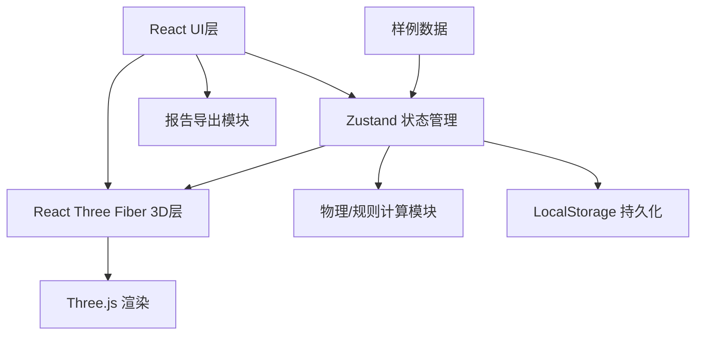

## 1. 架构设计



## 2. 技术描述

- **前端框架**：React@18 + TypeScript
- **构建工具**：Vite@5
- **样式方案**：TailwindCSS@3
- **3D引擎**：Three@0.160 + @react-three/fiber@8 + @react-three/drei@9
- **状态管理**：Zustand@4 (支持持久化中间件)
- **图标库**：Lucide React
- **后端**：无 (纯前端应用)
- **数据存储**：LocalStorage (浏览器本地持久化)

## 3. 路由定义

| 路由 | 用途 |
|------|------|
| / | 主应用页面 (单页应用) |

## 4. 数据模型

### 4.1 数据类型定义

```typescript
// 货物类型
type CargoType = 'heavy' | 'reefer' | 'dangerous';

// 危险等级
type DangerLevel = 'class1' | 'class2' | 'class3' | 'class4';

// 货物
interface Cargo {
  id: string;
  name: string;
  type: CargoType;
  weight: number; // 吨
  size: { x: number; y: number; z: number }; // 标准箱尺寸
  dangerLevel?: DangerLevel;
  requiresPower?: boolean; // 是否需要冷藏插座
}

// 舱位
interface Bay {
  id: string;
  position: { row: number; tier: number; stack: number };
  size: { x: number; y: number; z: number };
  maxWeight: number;
  hasPower: boolean; // 是否有冷藏插座
  occupiedBy?: string; // 货物ID
}

// 装载记录
interface LoadRecord {
  timestamp: number;
  cargoId: string;
  bayId: string;
  action: 'load' | 'unload';
}

// 重心
interface CenterOfGravity {
  x: number;
  y: number;
  z: number;
  isWarning: boolean;
  offset: number;
}

// 告警
interface Alert {
  id: string;
  type: 'gravity' | 'danger' | 'power' | 'weight';
  message: string;
  severity: 'warning' | 'error';
  relatedItems: string[];
}

// 应用状态
interface AppState {
  cargoList: Cargo[];
  bays: Bay[];
  loadHistory: LoadRecord[];
  currentStep: number;
  centerOfGravity: CenterOfGravity;
  alerts: Alert[];
  selectedCargo: string | null;
  selectedBay: string | null;
  filterType: CargoType | 'all';
  cameraView: 'overview' | 'bow' | 'stern' | 'side';
}
```

### 4.2 核心计算模块

1. **重心计算引擎**
   - 输入：已装载货物列表 + 舱位坐标
   - 输出：重心坐标 + 偏移量 + 告警状态
   - 算法：加权平均位置计算

2. **规则校验引擎**
   - 危险品相邻检查：不同等级危险品隔离规则
   - 冷藏插座检查：冷藏箱必须分配到带电源舱位
   - 重量限制检查：舱位最大承重限制
   - 重心偏移检查：超出安全阈值告警

3. **时间轴控制**
   - 记录每一步装载/卸载操作
   - 支持跳转到任意历史步骤
   - 支持播放/暂停回放

## 5. 项目结构

```
src/
├── components/
│   ├── ui/                 # UI组件
│   │   ├── CargoList.tsx   # 货物清单
│   │   ├── ControlPanel.tsx # 控制面板
│   │   ├── StatusBar.tsx   # 状态信息栏
│   │   └── Timeline.tsx    # 时间轴
│   └── three/              # 3D组件
│       ├── Ship.tsx        # 船舱模型
│       ├── Cargo3D.tsx     # 货物3D
│       ├── Bay3D.tsx       # 舱位3D
│       └── Scene.tsx       # 场景
├── store/
│   └── useStore.ts         # Zustand状态管理
├── utils/
│   ├── gravity.ts          # 重心计算
│   ├── rules.ts            # 规则校验
│   ├── export.ts           # 报告导出
│   └── sampleData.ts       # 样例数据
├── types/
│   └── index.ts            # 类型定义
├── App.tsx
├── main.tsx
└── index.css
```
