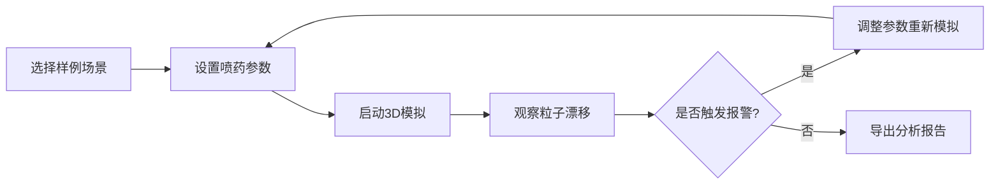

## 1. 产品概述

果园喷药漂移预演系统是一款基于WebGL的3D交互可视化工具，帮助果园合作社在喷药前模拟药雾漂移情况，提前预判药雾是否会飘到邻田或水渠，避免农药污染纠纷。

- **核心目标**：通过3D可视化模拟，直观展示药雾漂移轨迹，辅助农户做出安全的喷药决策
- **目标用户**：果园合作社农户、农业技术员、环保监管人员
- **市场价值**：降低农业面源污染风险，减少邻里纠纷，提升精准施药水平

## 2. 核心功能

### 2.1 用户角色

| 角色 | 注册方式 | 核心权限 |
|------|----------|----------|
| 普通用户 | 无需注册 | 使用所有模拟功能，查看和导出报告 |

### 2.2 功能模块

1. **3D场景主界面**：果园地块3D模型、粒子漂移模拟、视角控制
2. **参数控制面板**：风向风速调节、药剂类型选择、喷头参数设置
3. **样例管理模块**：内置样例导入、自定义场景保存
4. **时间轴控制**：模拟进度控制、关键帧预览
5. **报警系统**：邻田缓冲区报警、水渠污染预警
6. **报告导出**：漂移分析报告生成与下载

### 2.3 页面详情

| 页面名称 | 模块名称 | 功能描述 |
|----------|----------|----------|
| 主界面 | 3D场景区域 | 展示果园地块、喷头、水渠、邻田的3D模型，实时渲染药雾粒子漂移 |
| 主界面 | 左侧控制面板 | 参数滑块（风速、风向、药剂类型）、缓冲区报警阈值设置 |
| 主界面 | 顶部工具栏 | 样例选择下拉、视角切换按钮、重置按钮、导出报告按钮 |
| 主界面 | 底部时间轴 | 模拟播放/暂停、进度拖拽、时间显示 |
| 主界面 | 报警提示区 | 实时显示缓冲区侵入警告、药剂浓度超标提示 |

## 3. 核心流程

用户选择或导入场景样例 → 调节风向风速等参数 → 启动模拟观察药雾漂移 → 查看缓冲区报警状态 → 导出漂移分析报告

## 4. 用户界面设计

### 4.1 设计风格

- **主色调**：深绿色(#1a4d2e)代表农业，搭配天蓝色(#4da6ff)代表天空和水
- **辅助色**：橙色(#ff8c00)表示警告，红色(#dc2626)表示危险报警
- **按钮样式**：圆角矩形，轻微阴影，hover时有缩放效果
- **字体**：标题使用Noto Sans SC Bold，正文使用Noto Sans SC Regular
- **布局风格**：暗色系背景突出3D场景，控制面板采用半透明玻璃态效果
- **图标风格**：线性简约图标，与农业、环境主题相关

### 4.2 页面设计概述

| 页面名称 | 模块名称 | UI元素 |
|----------|----------|--------|
| 主界面 | 3D场景区 | 全屏WebGL画布，支持鼠标拖拽旋转、滚轮缩放、右键平移 |
| 主界面 | 左侧面板 | 半透明毛玻璃背景，分组滑块，实时数值显示 |
| 主界面 | 顶部栏 | 深色导航栏，下拉选择器，功能按钮组 |
| 主界面 | 底部时间轴 | 进度条拖拽，播放控制按钮，时间刻度 |
| 主界面 | 报警浮层 | 右下角浮动卡片，颜色随报警等级变化，可点击查看详情 |

### 4.3 响应式设计

- 桌面端优先，支持1920×1080及以上分辨率
- 平板端自适应布局，控制面板可折叠
- 移动端提供基础浏览功能，复杂操作建议使用桌面端

### 4.4 3D场景指导

- **环境**：户外日景，HDRI环境贴图模拟真实光照
- **光照**：主方向光模拟太阳光，配合环境光和柔和阴影
- **摄像机**：默认45度俯视角，支持轨道控制，可切换鸟瞰/正视/侧视预设视角
- **场景元素**：
  - 果园地块：绿色网格地面，行间距清晰的果树模型
  - 喷头：悬浮的机械臂模型，带喷射动画
  - 水渠：蓝色反光水面，带流动效果
  - 邻田：不同颜色区分的地块
  - 粒子系统：半透明绿色/白色粒子，模拟药雾飘散
- **后处理**：轻微泛光效果，色彩校正，提升视觉质感
- **性能**：粒子数量控制在2000以内，确保60fps流畅运行