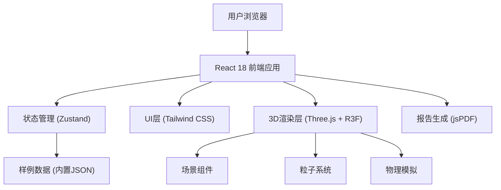

## 1. 架构设计



## 2. 技术描述

- **前端框架**：React@18 + TypeScript
- **构建工具**：Vite@5
- **样式方案**：TailwindCSS@3
- **3D引擎**：Three.js + @react-three/fiber + @react-three/drei
- **状态管理**：Zustand (轻量级状态管理)
- **物理模拟**：自定义粒子物理系统
- **报告导出**：jsPDF + html2canvas
- **后端**：无后端，纯前端应用
- **数据库**：内置JSON样例数据，支持本地存储

## 3. 路由定义

| 路由 | 用途 |
|------|------|
| / | 主应用界面（单页应用） |

## 4. 数据模型

### 4.1 场景数据模型

```typescript
interface OrchardScene {
  id: string;
  name: string;
  description: string;
  type: 'normal' | 'conflict' | 'empty';
  orchard: {
    position: [number, number, number];
    size: [number, number];
    treeRows: number;
    treesPerRow: number;
  };
  sprinklers: {
    id: string;
    position: [number, number, number];
    sprayRate: number;
    dropletSize: number;
  }[];
  canal: {
    position: [number, number, number];
    size: [number, number];
    flowDirection: number;
  };
  adjacentFields: {
    id: string;
    name: string;
    position: [number, number, number];
    size: [number, number];
    bufferZone: number;
  }[];
}
```

### 4.2 模拟参数模型

```typescript
interface SimulationParams {
  windSpeed: number;
  windDirection: number;
  pesticideType: PesticideType;
  bufferThreshold: number;
  simulationSpeed: number;
}

type PesticideType = 'herbicide' | 'insecticide' | 'fungicide' | 'organic';

interface PesticideInfo {
  id: PesticideType;
  name: string;
  toxicity: 'low' | 'medium' | 'high';
  driftRisk: number;
  maxAllowedConcentration: number;
}
```

### 4.3 报警模型

```typescript
interface Alert {
  id: string;
  type: 'buffer' | 'canal' | 'concentration';
  severity: 'warning' | 'danger';
  message: string;
  location?: [number, number, number];
  timestamp: number;
}

interface DriftReport {
  sceneId: string;
  sceneName: string;
  simulationTime: number;
  params: SimulationParams;
  alerts: Alert[];
  maxDriftDistance: number;
  affectedAreas: string[];
  conclusion: 'safe' | 'warning' | 'unsafe';
  recommendations: string[];
}
```

## 5. 核心模块

### 5.1 3D场景模块

- `Scene.tsx`：主场景容器，包含光照、摄像机控制
- `Orchard.tsx`：果园地块组件
- `Sprinkler.tsx`：喷头组件
- `Canal.tsx`：水渠组件
- `AdjacentField.tsx`：邻田组件
- `ParticleSystem.tsx`：药雾粒子系统

### 5.2 控制模块

- `ControlPanel.tsx`：左侧参数控制面板
- `Timeline.tsx`：底部时间轴控制
- `TopBar.tsx`：顶部工具栏
- `AlertPanel.tsx`：报警提示面板

### 5.3 状态管理

- `useSimulationStore.ts`：模拟状态管理
- `useSceneStore.ts`：场景数据管理

### 5.4 工具模块

- `physics.ts`：粒子物理计算
- `reportGenerator.ts`：报告生成逻辑
- `sampleData.ts`：内置样例数据

## 6. 样例数据

内置3组样例场景：

1. **正常场景**：微风，风向背离邻田和水渠，无报警
2. **冲突场景**：强风，风向指向邻田和水渠，触发多重报警
3. **空结果场景**：无风或极微风，药雾仅在地块内沉降