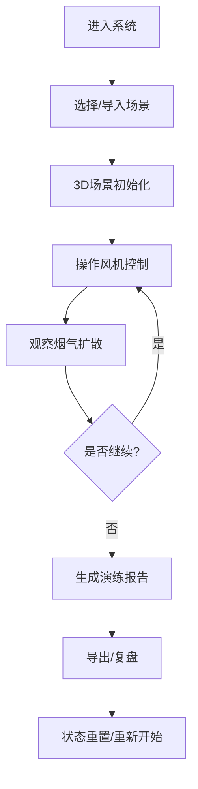

## 1. 产品概述

隧道通风烟气演示系统是一个基于Web的3D交互式培训工具，用于隧道运维演练火情场景，展示风机开关组合对烟气走向的影响。通过可视化操作和复盘，帮助运维人员掌握正确的风机控制策略，避免常见错误。

- **核心目标**：提供直观的3D可视化交互，让用户理解风机方向、逃生通道安全、时间步统计等关键概念
- **目标用户**：隧道运维人员、安全培训讲师、应急演练团队
- **市场价值**：提升隧道火灾应急响应能力，降低演练成本，提高培训效果

## 2. 核心功能

### 2.1 用户角色

| 角色 | 注册方式 | 核心权限 |
|------|----------|----------|
| 培训讲师 | 无需注册 | 导入样例、配置场景、导出报告、控制演示 |
| 参训人员 | 无需注册 | 查看演示、操作风机、切换视角、复盘过程 |

### 2.2 功能模块

1. **主演示页面**：3D隧道场景、控制面板、时间轴、状态信息
2. **场景配置**：导入样例、风机配置、烟气源设置、逃生通道标记
3. **演示控制**：播放/暂停、时间步控制、视角切换、状态重置
4. **报告导出**：生成演练报告、包含操作记录、烟气扩散数据、错误统计

### 2.3 页面详情

| 页面名称 | 模块名称 | 功能描述 |
|-----------|-------------|---------------------|
| 主演示页 | 3D隧道场景 | 展示隧道结构、风机、烟气粒子、车流方向、逃生通道 |
| 主演示页 | 控制面板 | 风机开关控制、方向切换、参数调节 |
| 主演示页 | 时间轴组件 | 播放控制、时间步跳转、关键帧标记 |
| 主演示页 | 视角切换 | 预设视角（俯视、侧视、车内、逃生通道）、自由视角 |
| 主演示页 | 状态面板 | 实时显示风机状态、烟气覆盖区域、时间步统计 |
| 主演示页 | 报告预览 | 演练过程记录、错误提示、导出按钮 |
| 配置弹窗 | 场景导入 | 选择预设演练场景、自定义参数 |
| 配置弹窗 | 风机筛选 | 按区域/类型筛选风机、批量操作 |

## 3. 核心流程

用户进入系统后，首先选择演练场景（或导入自定义场景），然后通过控制面板操作风机，观察烟气扩散情况，系统自动记录操作过程和关键时间点。演练结束后可生成报告，复盘整个过程。

## 4. 用户界面设计

### 4.1 设计风格

- **主色调**：深灰蓝色 (#1a365d) - 专业、安全的感觉
- **辅助色**：警示橙 (#f97316) - 用于风机状态、烟气警告
- **成功色**：翠绿 (#10b981) - 安全状态、正确操作
- **危险色**：红色 (#ef4444) - 错误提示、危险区域
- **字体**：使用现代无衬线字体，标题使用 Roboto，正文使用系统字体
- **布局风格**：模块化卡片布局，清晰的功能分区
- **图标风格**：线性图标，简洁明了，使用 lucide-react

### 4.2 页面设计概述

| 页面名称 | 模块名称 | UI Elements |
|-----------|-------------|-------------|
| 主演示页 | 3D场景区 | 占主要空间，Canvas渲染，支持鼠标交互 |
| 主演示页 | 左侧控制面板 | 固定宽度，风机开关组，滑动条，状态指示灯 |
| 主演示页 | 底部时间轴 | 全宽，进度条，播放控制按钮，时间标记 |
| 主演示页 | 右上角状态面板 | 悬浮卡片，半透明背景，实时数据显示 |
| 主演示页 | 右下角视角控制 | 圆形按钮组，视角预设选项 |

### 4.3 响应式设计

- **桌面端**：左侧控制面板 + 主3D区域 + 底部时间轴 + 右上角状态
- **平板/窄屏**：控制面板折叠为侧边栏，3D区域全屏，时间轴自适应宽度
- **触屏优化**：增大按钮尺寸，支持手势缩放旋转，避免元素重叠

### 4.4 3D场景指导

- **环境**：工业风格，隧道内部灯光，烟雾效果，营造真实感
- **光照**：隧道灯点状光源，环境光柔和，风机区域有动态光晕
- **相机**：默认透视相机，支持轨道控制，预设多个视角快速切换
- **核心元素**：
  - 隧道：长条形管道结构，内壁有纹理
  - 风机：圆柱形，带旋转叶片动画
  - 烟气：粒子系统，半透明，根据风向流动
  - 逃生通道：绿色发光指示，门状结构
  - 车流：简化车辆模型，显示方向箭头
- **动画**：风机旋转、烟气流动、时间步推进时的过渡效果
- **性能**：粒子数量控制在合理范围，使用实例化渲染优化
