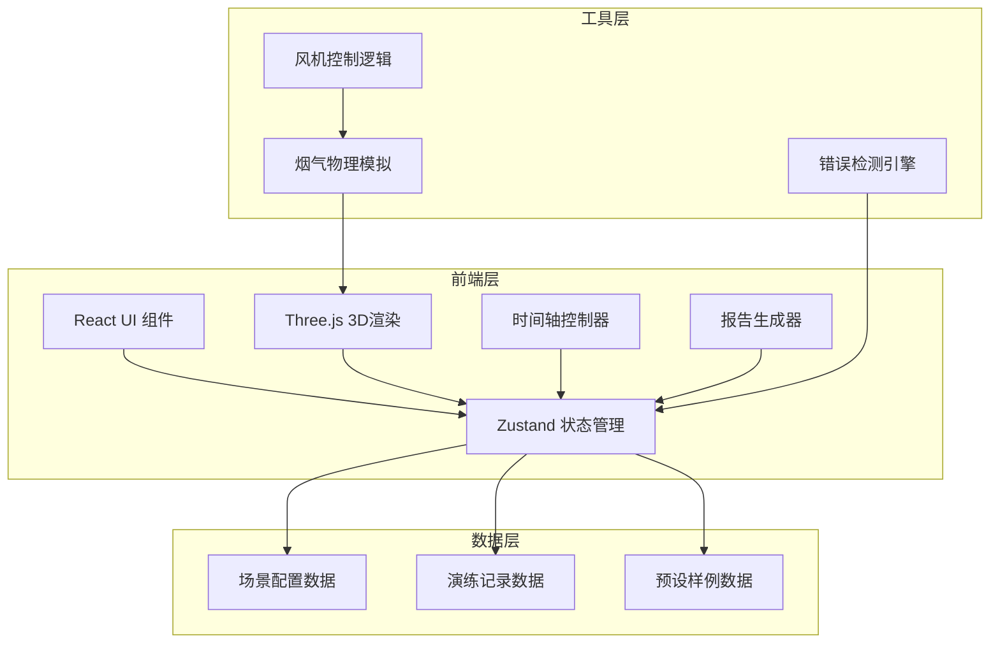

## 1. 架构设计



## 2. 技术描述

- **前端框架**：React@18 + TypeScript
- **构建工具**：Vite@5
- **样式方案**：TailwindCSS@3
- **状态管理**：Zustand
- **3D渲染**：Three.js + @react-three/fiber + @react-three/drei
- **图标库**：lucide-react
- **后端**：无（纯前端应用）
- **数据库**：LocalStorage 存储演练记录

## 3. 目录结构

```
src/
├── components/           # React 组件
│   ├── ControlPanel/    # 控制面板
│   ├── Timeline/        # 时间轴
│   ├── StatusPanel/     # 状态面板
│   ├── ViewControls/    # 视角控制
│   ├── SceneSelector/   # 场景选择
│   └── ReportModal/     # 报告弹窗
├── three/               # Three.js 相关
│   ├── TunnelScene.tsx  # 隧道场景
│   ├── Fan.tsx          # 风机组件
│   ├── SmokeParticles.tsx # 烟气粒子
│   ├── EscapeRoute.tsx  # 逃生通道
│   └── Traffic.tsx      # 车流
├── store/               # Zustand 状态
│   └── useSimulationStore.ts
├── hooks/               # 自定义 Hooks
│   ├── useSimulation.ts
│   └── useSmokePhysics.ts
├── utils/               # 工具函数
│   ├── smokePhysics.ts
│   ├── errorDetector.ts
│   └── reportGenerator.ts
├── data/                # 预设数据
│   └── sampleScenes.ts
├── types/               # TypeScript 类型
│   └── index.ts
└── pages/
    └── Index.tsx        # 主页面
```

## 4. 核心数据模型

### 4.1 风机状态

```typescript
interface Fan {
  id: string;
  name: string;
  position: { x: number; y: number; z: number };
  direction: 'forward' | 'backward'; // 风向
  isOn: boolean;
  power: number; // 0-100 功率百分比
  zone: 'inlet' | 'middle' | 'outlet'; // 区域
}
```

### 4.2 烟气粒子

```typescript
interface SmokeParticle {
  id: string;
  position: { x: number; y: number; z: number };
  velocity: { x: number; y: number; z: number };
  density: number; // 0-1 浓度
  life: number; // 0-1 生命周期
}
```

### 4.3 演练记录

```typescript
interface SimulationRecord {
  id: string;
  sceneName: string;
  startTime: Date;
  endTime: Date;
  timeSteps: TimeStep[];
  fanOperations: FanOperation[];
  errors: SimulationError[];
  finalScore: number;
}

interface TimeStep {
  step: number;
  timestamp: number;
  fanStates: Fan[];
  smokeCoverage: number; // 烟气覆盖百分比
  escapeRoutesBlocked: string[];
}
```

### 4.4 演练错误类型

```typescript
interface SimulationError {
  id: string;
  type: 'fan_wrong_direction' | 'escape_blocked' | 'timestep_error';
  severity: 'warning' | 'critical';
  timestamp: number;
  description: string;
  step: number;
}
```

## 5. 核心算法

### 5.1 烟气物理模拟

```typescript
// 简化的流体力学模拟
function updateSmokePhysics(
  particles: SmokeParticle[],
  fans: Fan[],
  deltaTime: number
): SmokeParticle[] {
  // 1. 计算每个风机产生的气流场
  // 2. 更新粒子速度（基于气流场 + 浮力 + 扩散）
  // 3. 检测边界碰撞（隧道墙壁、地面）
  // 4. 检测逃生通道覆盖
  // 5. 粒子生命周期管理
}
```

### 5.2 错误检测引擎

```typescript
function detectErrors(
  currentState: SimulationState,
  previousState: SimulationState
): SimulationError[] {
  const errors: SimulationError[] = [];
  
  // 检测风机方向反转
  // 检测逃生通道被烟气覆盖
  // 检测时间步异常
  
  return errors;
}
```

### 5.3 报告生成

```typescript
function generateReport(record: SimulationRecord): ReportData {
  return {
    summary: {
      totalTime: record.endTime - record.startTime,
      totalSteps: record.timeSteps.length,
      errorCount: record.errors.length,
      score: record.finalScore
    },
    timeline: record.timeSteps,
    operations: record.fanOperations,
    errors: groupErrorsByType(record.errors),
    recommendations: generateRecommendations(record)
  };
}
```

## 6. 性能优化策略

1. **粒子系统优化**：使用 BufferGeometry 批量渲染，限制最大粒子数（2000-5000）
2. **空间分区**：将隧道划分为多个区域，只更新视口内的粒子
3. **LOD 策略**：远距离风机使用简化模型
4. **状态批处理**：每帧批量更新状态，避免频繁重渲染
5. **Web Workers**：烟气物理计算移至 Worker 线程

## 7. 响应式布局策略

- 使用 Tailwind 的 responsive utilities (sm, md, lg)
- 控制面板在小屏幕上折叠为 Drawer
- 3D Canvas 使用百分比布局，自动适应容器
- 触摸设备上增大可点击区域 (min-height: 44px)
