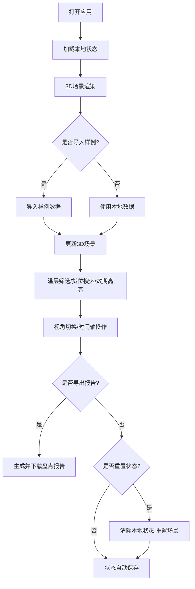

## 1. 产品概述

冷库货位温层可视化系统是一款面向冷库管理人员的3D交互式可视化工具，旨在解决传统表格盘点方式的局限性，通过直观的WebGL 3D场景展示货位分布、温层管理和临期货状态。

- 核心目标：帮助冷库主管快速发现温层错放、临期货遮挡、货位重复占用等问题
- 目标用户：冷库主管、仓库管理人员、盘点人员
- 产品价值：提升盘点效率、减少错误、支持操作复盘

## 2. 核心功能

### 2.1 用户角色

| 角色 | 注册方式 | 核心权限 |
|------|----------|----------|
| 冷库主管 | 本地应用 | 3D场景操作、数据导入、筛选搜索、报告导出、状态管理 |

### 2.2 功能模块

1. **3D冷库场景**：交互式WebGL冷库模型，支持旋转、缩放、平移
2. **数据管理**：样例数据导入、数据状态持久化
3. **筛选与搜索**：温层筛选、货位搜索、效期高亮
4. **时间与视角**：时间轴切换、预设视角切换
5. **报告系统**：盘点报告导出、可视化与报告数据一致性
6. **状态管理**：状态重置、刷新状态保留

### 2.3 页面详情

| 页面名称 | 模块名称 | 功能描述 |
|---------|----------|----------|
| 主界面 | 3D场景区 | 展示冷库货位、温层、SKU的3D可视化，支持鼠标交互 |
| 主界面 | 左侧控制面板 | 温层筛选、效期筛选、时间轴控制、视角切换 |
| 主界面 | 顶部工具栏 | 样例导入、搜索框、导出报告、重置按钮 |
| 主界面 | 右侧信息面板 | 选中货位详情、SKU信息、效期提醒 |
| 主界面 | 底部状态栏 | 当前温层统计、临期货数量、货位占用率 |

## 3. 核心流程

## 4. 用户界面设计

### 4.1 设计风格

- 主色调：冷色系蓝青渐变，体现冷库专业感
- 辅色调：红色（临期警告）、黄色（温层错放）、绿色（正常）
- 按钮风格：圆角矩形，微立体效果，悬停时有颜色过渡
- 字体：Roboto Mono（数据展示）+ Inter（界面文字）
- 布局风格：暗色调工业风，深色背景突出3D场景
- 图标风格：线性图标，科技感设计

### 4.2 页面设计概述

| 页面名称 | 模块名称 | UI元素 |
|---------|----------|--------|
| 主界面 | 3D场景区 | 全画布WebGL渲染，货位立方体，温层半透明平面，SKU标签 |
| 主界面 | 左侧控制面板 | 折叠式面板，温层多选按钮组，效期滑块，视角预设按钮 |
| 主界面 | 顶部工具栏 | 搜索框（带自动补全），导入按钮，导出按钮，重置按钮 |
| 主界面 | 右侧信息面板 | 货位卡片，SKU详情列表，效期进度条 |
| 主界面 | 底部状态栏 | 统计数字卡片，状态指示灯 |

### 4.3 响应性

- 桌面端优先设计，自适应窗口大小
- 左侧/右侧面板可折叠，最大化3D场景可视区域
- 触控设备支持手势缩放和旋转

### 4.4 3D场景设计

- **环境**：深色空间背景，模拟冷库环境，顶部有微弱冷光
- **灯光**：主光源冷白色，辅助光源蓝青色，货位自发光材质
- **相机**：PerspectiveCamera，初始角度45度俯视，支持OrbitControls
- **交互**：鼠标悬停高亮，点击选中显示详情，双击聚焦
- **动画**：货位选中时轻微上浮，临期货红色脉冲闪烁
- **后处理**：轻微Bloom效果增强科技感，FXAA抗锯齿
