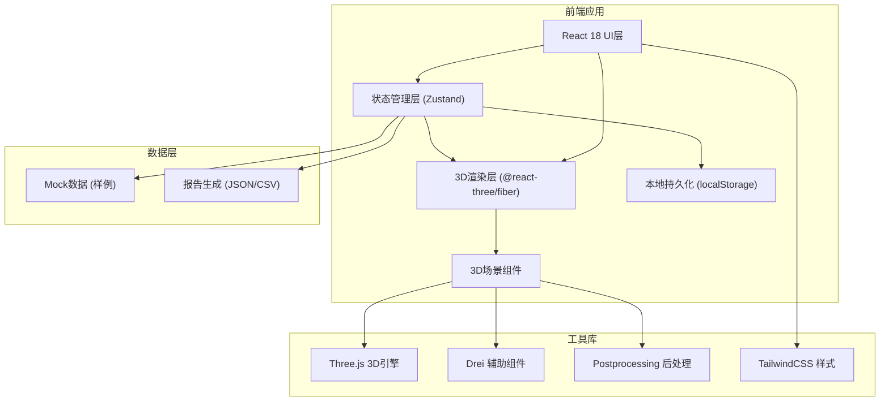
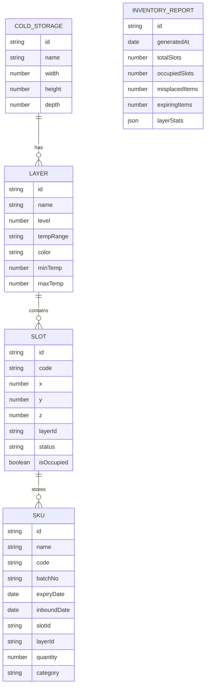

## 1. 架构设计



## 2. 技术描述

- 前端框架：React 18 + TypeScript
- 构建工具：Vite 5
- 3D引擎：Three.js + @react-three/fiber + @react-three/drei
- 状态管理：Zustand（支持中间件持久化）
- 样式方案：TailwindCSS 3
- 后处理：@react-three/postprocessing
- 报告导出：jsPDF + PapaParse
- 数据持久化：localStorage + Zustand persist middleware

## 3. 路由定义

| 路由 | 用途 |
|------|------|
| / | 主应用页面 - 3D场景与控制面板 |

## 4. 数据模型

### 4.1 数据模型定义



### 4.2 TypeScript 类型定义

```typescript
interface ColdStorage {
  id: string;
  name: string;
  dimensions: { width: number; height: number; depth: number };
}

interface Layer {
  id: string;
  name: string;
  level: number;
  tempRange: string;
  color: string;
  minTemp: number;
  maxTemp: number;
}

interface Slot {
  id: string;
  code: string;
  position: { x: number; y: number; z: number };
  layerId: string;
  status: 'normal' | 'misplaced' | 'conflict';
  isOccupied: boolean;
}

interface SKU {
  id: string;
  name: string;
  code: string;
  batchNo: string;
  expiryDate: string;
  inboundDate: string;
  slotId: string;
  layerId: string;
  quantity: number;
  category: string;
}

interface AppState {
  coldStorage: ColdStorage;
  layers: Layer[];
  slots: Slot[];
  skus: SKU[];
  selectedLayerIds: string[];
  selectedSlotId: string | null;
  searchQuery: string;
  expiryFilterDays: number;
  cameraView: CameraView;
  timestamp: number;
}

type CameraView = 'overview' | 'front' | 'side' | 'top' | 'free';
```

## 5. 核心模块结构

```
src/
├── components/
│   ├── scene/
│   │   ├── ColdStorageScene.tsx    # 3D冷库主场景
│   │   ├── SlotMesh.tsx            # 货位网格
│   │   ├── LayerPlane.tsx          # 温层平面
│   │   └── SKULabel.tsx            # SKU标签
│   ├── ui/
│   │   ├── ControlPanel.tsx        # 左侧控制面板
│   │   ├── Toolbar.tsx             # 顶部工具栏
│   │   ├── InfoPanel.tsx           # 右侧信息面板
│   │   └── StatusBar.tsx           # 底部状态栏
│   └── common/
│       ├── SearchBar.tsx
│       ├── FilterButtons.tsx
│       └── ExportDialog.tsx
├── store/
│   └── useStore.ts                 # Zustand状态管理
├── data/
│   └── mockData.ts                 # 样例数据
├── utils/
│   ├── reportGenerator.ts          # 报告生成
│   ├── expiryChecker.ts            # 效期检查
│   └── cameraPresets.ts            # 相机预设
├── types/
│   └── index.ts                    # 类型定义
├── App.tsx
├── main.tsx
└── index.css
```
