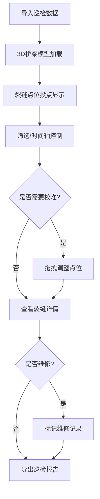

## 1. 产品概述

桥梁裂缝巡检对齐系统是一款基于Three.js的交互式3D可视化工具，帮助桥检队在浏览器中直观查看桥梁模型上的裂缝位置、追踪历次巡检变化、对比维修效果。系统解决传统巡检中点位偏移、裂缝合并误判、维修后未复查等核心痛点，实现3D可视化与巡检报告的数据一致性。

## 2. 核心功能

### 2.1 功能模块

1. **3D桥梁可视化**: 交互式3D桥梁模型展示、多视角切换、裂缝点位投点
2. **巡检数据管理**: 巡检批次筛选、时间轴控制、裂缝历史对比
3. **维修记录追踪**: 维修状态标记、维修前后对比、复查提醒
4. **报告导出**: 基于当前视角和筛选条件的PDF报告导出、数据一致性保证
5. **点位校准**: 拖拽调整裂缝点位、点位偏移检测与修正

### 2.2 页面详情

| 页面名称 | 模块名称 | 功能描述 |
|---------|---------|---------|
| 主工作区 | 3D场景容器 | Three.js渲染桥梁模型、裂缝点位投点、拖拽交互、视角控制 |
| 左侧面板 | 数据筛选 | 巡检批次选择、裂缝状态筛选、照片点位列表 |
| 底部面板 | 时间轴 | 巡检历史时间轴、播放控制、批次切换 |
| 右侧面板 | 详情面板 | 裂缝详情、维修记录、照片预览、问题标注 |
| 顶部工具栏 | 操作栏 | 导入样例、状态重置、视角切换、报告导出按钮 |

## 3. 核心流程

用户导入样例数据后，在3D场景中查看桥梁整体裂缝分布。通过时间轴切换不同巡检批次，观察裂缝发展趋势和维修效果。发现点位偏移时可拖拽调整裂缝位置。筛选特定状态裂缝后，导出包含当前视角、筛选条件和时间轴位置的一致性报告。

## 4. 用户界面设计

### 4.1 设计风格

- **主色调**: 深蓝科技感 (#165DFF)，配合工业灰(#2A2A3A)背景
- **辅助色**: 危险红(#FF4D4F)表示严重裂缝、成功绿(#52C41A)表示已维修、警告黄(#FAAD14)表示待复查
- **布局**: 深色工业风，左中右三栏布局，3D场景居中为主视觉焦点
- **字体**: JetBrains Mono + Noto Sans SC，技术感与可读性平衡
- **交互**: 悬停高亮、选中放大、平滑过渡动画

### 4.2 页面设计概述

| 页面名称 | 模块名称 | UI元素 |
|---------|---------|--------|
| 主工作区 | 3D场景 | 半透明桥梁模型、发光裂缝标记线、可交互点位、网格辅助线、坐标轴指示器 |
| 左侧面板 | 筛选面板 | 折叠式筛选组、复选框列表、批次下拉选择、搜索框 |
| 底部面板 | 时间轴 | 刻度条、播放按钮、进度滑块、批次标签、维修标记点 |
| 右侧面板 | 详情面板 | 卡片式信息展示、照片缩略图、维修时间线、状态标签 |
| 顶部工具栏 | 操作栏 | 圆角按钮组、图标+文字、下拉菜单、状态指示器 |

### 4.3 响应性

桌面端优先设计，保证3D场景足够展示空间；支持窗口自适应，面板可折叠收起；触控设备支持双指缩放和单点拖拽。

### 4.4 3D场景设计

- **环境**: 深色背景配合蓝色点光，营造专业检测氛围
- **光照**: 主方向光+环境光，保证模型细节可见，裂缝部位添加高亮效果
- **相机**: 轨道控制器，支持自由旋转、缩放、平移；预设俯视、主视、侧视三个快捷视角
- **交互**: 点击裂缝显示详情，拖拽调整点位，悬停显示信息浮窗
- **动画**: 裂缝生长动画、批次切换过渡效果、维修状态变化动画
- **性能**: 使用BufferGeometry优化模型渲染，PointsBatch处理大量点位
