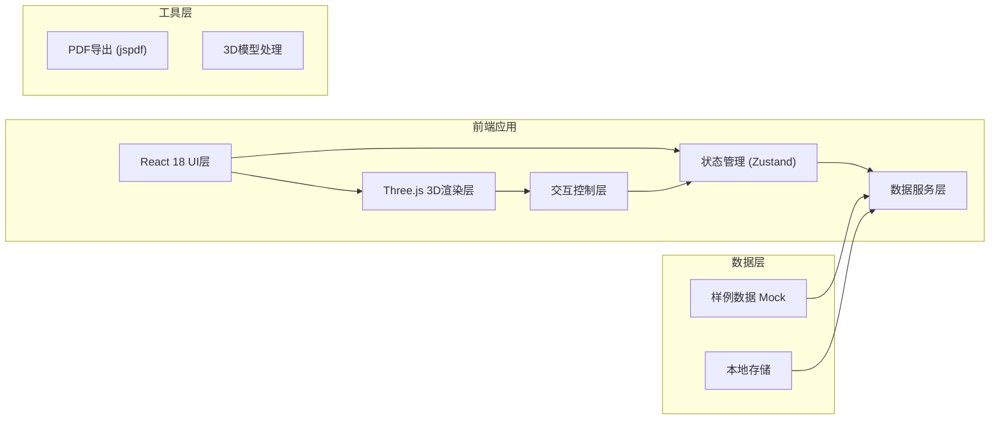

## 1. 架构设计



## 2. 技术描述

- **前端框架**: React@18 + TypeScript
- **构建工具**: Vite@5
- **样式方案**: TailwindCSS@3 + PostCSS
- **3D渲染**: Three.js@0.160, @react-three/fiber@8, @react-three/drei@9
- **状态管理**: Zustand@4
- **图表可视化**: recharts@2
- **PDF导出**: jspdf@2 + html2canvas
- **图标**: lucide-react

## 3. 目录结构

```
src/
├── components/
│   ├── BridgeScene/        # 3D桥梁场景组件
│   ├── ControlPanel/       # 控制面板
│   ├── Timeline/           # 时间轴组件
│   ├── DetailPanel/        # 详情面板
│   └── Toolbar/            # 顶部工具栏
├── store/
│   └── inspectionStore.ts  # 巡检数据状态管理
├── data/
│   └── sampleData.ts       # 样例数据
├── types/
│   └── index.ts            # 类型定义
├── utils/
│   ├── pdfExport.ts        # PDF导出工具
│   └── threeHelpers.ts     # Three.js辅助函数
├── App.tsx
└── main.tsx
```

## 4. 核心数据模型

### 4.1 类型定义

```typescript
// 裂缝状态
type CrackStatus = 'new' | 'developing' | 'stable' | 'repaired' | 'pending_review';

// 裂缝点位
interface CrackPoint {
  id: string;
  position: { x: number; y: number; z: number };
  length: number;
  width: number;
  description: string;
  status: CrackStatus;
  photos: Photo[];
  history: InspectionRecord[];
}

// 巡检记录
interface InspectionRecord {
  id: string;
  batchId: string;
  date: string;
  length: number;
  width: number;
  status: CrackStatus;
  photoId?: string;
  notes?: string;
}

// 巡检批次
interface InspectionBatch {
  id: string;
  name: string;
  date: string;
  inspector: string;
  notes?: string;
}

// 维修记录
interface RepairRecord {
  id: string;
  crackId: string;
  date: string;
  method: string;
  description: string;
  beforePhotoId?: string;
  afterPhotoId?: string;
  nextReviewDate?: string;
}

// 照片点位
interface Photo {
  id: string;
  url: string;
  position: { x: number; y: number; z: number };
  batchId: string;
  crackId?: string;
  annotation?: string;
}

// 应用状态
interface AppState {
  currentBatchId: string;
  selectedCrackId: string | null;
  cameraPosition: THREE.Vector3;
  filters: {
    status: CrackStatus[];
    dateRange: [string, string];
  };
  isPlaying: boolean;
  playSpeed: number;
}
```

## 5. 核心组件设计

| 组件 | 职责 | 关键属性 |
|------|------|----------|
| BridgeScene | 3D场景渲染、桥梁模型、裂缝投点、交互控制 | cameraPosition, selectedCrackId, onCrackSelect |
| CrackPoints | 裂缝点位渲染、状态着色、悬停效果 | points, filters, selectedId |
| Timeline | 时间轴控制、批次切换、播放控制 | batches, currentBatchId, onBatchChange |
| FilterPanel | 状态筛选、搜索、列表展示 | filters, onFilterChange, cracks |
| DetailPanel | 裂缝详情、历史记录、维修记录 | crackId, crackData |
| ExportButton | 导出报告、截图、数据一致性检查 | currentState, sceneRef |

## 6. 报告导出机制

报告导出时捕获以下状态确保一致性：
1. 当前3D场景截图（与用户视角一致）
2. 当前选中的巡检批次
3. 应用的筛选条件
4. 时间轴位置
5. 裂缝统计数据

导出流程：
```
获取当前应用状态 → 生成3D场景截图 → 组装报告数据 → 生成PDF → 下载文件
```
