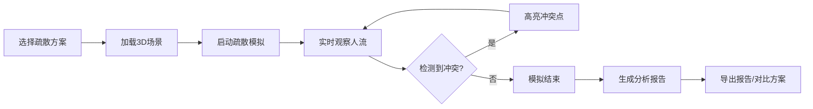

## 1. 产品概述

校园消防疏散模拟演练系统，基于Three.js 3D可视化技术，帮助学校评估不同楼梯开放方案的疏散效率。

- **核心目标**：直观展示班级下楼是否互相堵住，辅助消防演练方案决策
- **目标用户**：学校安全管理人员、消防演练组织者、教育培训机构
- **产品价值**：通过动态可视化提前发现疏散瓶颈，降低实际演练风险

## 2. 核心功能

### 2.1 用户角色
| 角色 | 登录方式 | 核心权限 |
|------|----------|----------|
| 管理员 | 本地访问 | 方案创建、模拟演练、报告导出 |

### 2.2 功能模块
1. **3D教学楼场景**：多层教学楼模型、楼梯、教室、集合点可视化
2. **疏散模拟**：班级人流动态模拟、时间轴控制、冲突检测
3. **方案管理**：内置样例方案、方案对比、方案保存/导入
4. **分析报告**：疏散数据统计、瓶颈点分析、报告导出

### 2.3 页面详情
| 页面名称 | 模块名称 | 功能描述 |
|----------|----------|----------|
| 主界面 | 3D视口 | 教学楼3D可视化、班级流线动画、视角切换 |
| 主界面 | 控制面板 | 时间轴播放/暂停、速度调节、状态重置 |
| 主界面 | 方案选择器 | 内置样例加载、方案筛选、方案对比 |
| 主界面 | 数据面板 | 实时疏散数据、楼梯容量监控、冲突告警 |
| 主界面 | 报告模块 | 疏散报告生成、PDF导出、数据导出 |

## 3. 核心流程

用户选择疏散方案 → 系统加载3D场景和班级数据 → 用户启动疏散模拟 → 实时观察班级流线和楼梯拥堵情况 → 系统检测冲突点并高亮显示 → 模拟结束生成分析报告 → 用户可导出报告或对比其他方案

## 4. 用户界面设计

### 4.1 设计风格
- **主色调**：深蓝色(#1e3a5f)作为主色，代表安全和专业
- **强调色**：红色(#e74c3c)表示冲突告警，绿色(#27ae60)表示正常状态，黄色(#f39c12)表示警告
- **按钮风格**：圆角矩形，微阴影，hover状态有轻微放大效果
- **字体**：使用Google Fonts的'Noto Sans SC'，清晰易读
- **布局风格**：左侧3D主视口，右侧控制面板，底部时间轴
- **图标风格**：线性图标，简洁现代

### 4.2 页面设计概述
| 页面名称 | 模块名称 | UI元素 |
|----------|----------|--------|
| 主界面 | 3D视口 | 全场景3D渲染、可旋转缩放、楼层透明切换、班级流线路径 |
| 主界面 | 顶部导航 | 方案选择下拉框、视角切换按钮、设置图标 |
| 主界面 | 右侧面板 | 班级列表、楼梯状态、集合点容量、实时统计 |
| 主界面 | 底部时间轴 | 播放控制、进度条、速度调节、当前时间显示 |
| 主界面 | 冲突弹窗 | 冲突位置高亮、原因说明、建议方案 |

### 4.3 响应式设计
- **桌面端优先**：针对1920x1080及以上分辨率优化
- **平板适配**：右侧面板可折叠，时间轴自适应宽度
- **触控优化**：支持双指缩放、单指旋转3D场景

### 4.4 3D场景指引
- **环境**：简洁的灰色地面，柔和的环境光，突出教学楼主体
- **光照**：主光源+环境光，确保各楼层清晰可见，无过暗区域
- **相机设置**：初始视角为45度俯视，可自由旋转、缩放、平移
- **组成元素**：
  - 教学楼：半透明墙体，便于观察内部
  - 教室：不同颜色区分年级，显示班级编号
  - 楼梯：高亮显示容量状态（绿/黄/红）
  - 人流：粒子或小立方体表示学生，沿路径移动
- **动画**：班级疏散流畅动画，冲突点脉冲闪烁效果
- **性能**：控制粒子数量，确保60fps流畅运行
