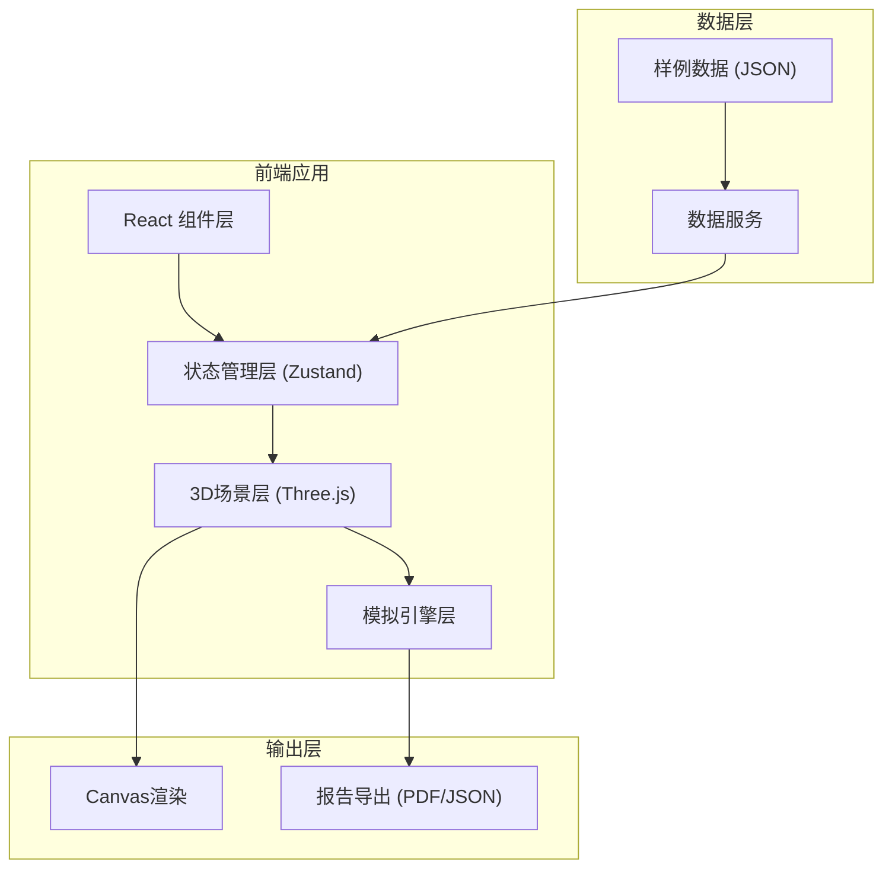

## 1. 架构设计



## 2. 技术描述

- **前端框架**：React@18 + TypeScript
- **构建工具**：Vite@5
- **样式方案**：TailwindCSS@3
- **3D渲染**：Three.js + @react-three/fiber + @react-three/drei
- **状态管理**：Zustand
- **UI组件**：Ant Design
- **图表可视化**：ECharts
- **报告导出**：html2canvas + jspdf

## 3. 目录结构

```
src/
├── components/          # React组件
│   ├── Layout/         # 布局组件
│   ├── ControlPanel/   # 控制面板
│   ├── Timeline/       # 时间轴
│   ├── DataPanel/      # 数据面板
│   └── ReportModal/    # 报告弹窗
├── store/              # Zustand状态管理
│   └── simulationStore.ts
├── scenes/             # 3D场景
│   ├── Building3D.tsx  # 教学楼模型
│   ├── Classroom3D.tsx # 教室
│   ├── Stair3D.tsx     # 楼梯
│   ├── Student3D.tsx   # 学生粒子
│   └── index.tsx
├── engine/             # 模拟引擎
│   ├── types.ts        # 类型定义
│   ├── simulator.ts    # 疏散模拟器
│   └── collision.ts    # 冲突检测
├── data/               # 样例数据
│   ├── normal.json     # 正常方案
│   ├── conflict.json   # 冲突方案
│   └── empty.json      # 空方案
├── utils/              # 工具函数
│   ├── exporter.ts     # 报告导出
│   └── helpers.ts
├── App.tsx
└── main.tsx
```

## 4. 数据模型

### 4.1 核心类型定义

```typescript
interface Classroom {
  id: string;
  name: string;
  floor: number;
  grade: number;
  studentCount: number;
  position: { x: number; y: number; z: number };
  exitOrder: number;
}

interface Stair {
  id: string;
  name: string;
  floors: number[];
  capacity: number;
  currentCount: number;
  position: { x: number; y: number; z: number };
  isClosed: boolean;
}

interface AssemblyPoint {
  id: string;
  name: string;
  capacity: number;
  currentCount: number;
  position: { x: number; y: number; z: number };
}

interface Student {
  id: string;
  classroomId: string;
  status: 'waiting' | 'moving' | 'inStair' | 'arrived';
  position: { x: number; y: number; z: number };
  path: { x: number; y: number; z: number }[];
  currentPathIndex: number;
}

interface EvacuationPlan {
  id: string;
  name: string;
  description: string;
  building: BuildingConfig;
  classrooms: Classroom[];
  stairs: Stair[];
  assemblyPoints: AssemblyPoint[];
  closedAreas: string[];
}

interface SimulationState {
  isPlaying: boolean;
  currentTime: number;
  speed: number;
  totalTime: number;
  students: Student[];
  conflicts: Conflict[];
  statistics: Statistics;
}

interface Conflict {
  id: string;
  type: 'order' | 'stairCapacity' | 'assemblyCapacity';
  time: number;
  location: string;
  description: string;
  severity: 'warning' | 'critical';
}

interface Statistics {
  totalStudents: number;
  evacuatedStudents: number;
  avgEvacuationTime: number;
  maxStairUsage: number;
  conflictCount: number;
}
```

## 5. 核心模块设计

### 5.1 疏散模拟器 (Simulator)

```typescript
class EvacuationSimulator {
  private plan: EvacuationPlan;
  private state: SimulationState;
  
  constructor(plan: EvacuationPlan);
  start(): void;
  pause(): void;
  reset(): void;
  setSpeed(speed: number): void;
  update(deltaTime: number): void;
  private detectConflicts(): Conflict[];
  private moveStudents(deltaTime: number): void;
  private updateStatistics(): void;
}
```

### 5.2 冲突检测器

```typescript
class ConflictDetector {
  static checkClassOrder(students: Student[], time: number): Conflict[];
  static checkStairCapacity(stairs: Stair[], students: Student[]): Conflict[];
  static checkAssemblyCapacity(points: AssemblyPoint[], students: Student[]): Conflict[];
}
```

## 6. 样例数据

### 6.1 正常方案 (normal.json)
- 4层教学楼，每层6个班级
- 2个主楼梯，容量各50人
- 低年级优先疏散，无冲突
- 集合点容量充足

### 6.2 冲突方案 (conflict.json)
- 多个班级同时使用同一楼梯
- 楼梯容量不足导致拥堵
- 高年级与低年级顺序冲突
- 集合点容量不足

### 6.3 空方案 (empty.json)
- 基础教学楼结构
- 无班级配置
- 供用户自定义方案
