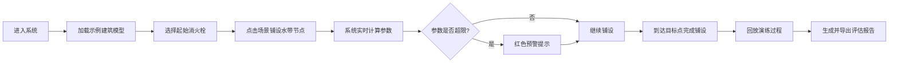

## 1. 产品概述

消防水带铺设演练系统是一款基于WebGL/Three.js的交互式3D训练平台，专为消防站新队员培训设计。系统通过可视化建筑模型模拟真实火场环境，让学员在浏览器中进行水带铺设操作练习，实时计算水带长度、转角数量和压力损失，降低训练成本并提升培训效率。

- 核心目标：解决传统水带训练场地受限、成本高、难以量化评估的问题
- 目标用户：消防指战员、新入队消防员、训练教官
- 产品价值：沉浸式3D交互训练、实时参数计算、可回放可导出的演练报告

## 2. 核心功能

### 2.1 用户角色

| 角色 | 登录方式 | 核心权限 |
|------|----------|----------|
| 学员 | 无需登录（本地模式） | 进行水带铺设演练、查看实时参数、回放演练过程 |
| 教官 | 无需登录（本地模式） | 导入建筑模型、编辑训练场景、导出演练评估报告 |

### 2.2 功能模块

1. **主演练界面**：3D建筑场景、水带路径编辑、实时参数面板
2. **场景管理**：样例导入、建筑元素筛选、场景重置
3. **演练控制**：时间轴播放、步骤回放、多视角切换
4. **报告系统**：压力损失分析、错误预警、PDF/JSON导出

### 2.3 页面详情

| 页面名称 | 模块名称 | 功能描述 |
|-----------|-------------|---------------------|
| 主演练页 | 3D场景视图 | Three.js渲染建筑模型、楼梯、消火栓、水带路径可视化 |
| 主演练页 | 路径编辑工具 | 点击添加/删除节点、拖拽调整路径、自动吸附楼梯和消火栓 |
| 主演练页 | 参数面板 | 实时显示水带总长度、转角数量、预估压力损失、错误预警 |
| 主演练页 | 演练控制栏 | 开始/暂停、时间轴拖动、步骤回放、视角切换（俯视/第一人称/自由） |
| 主演练页 | 场景工具栏 | 导入样例建筑、筛选显示元素（隐藏/显示楼梯、消火栓等）、场景重置 |
| 报告弹窗 | 演练报告 | 完整演练数据统计、错误点标记、压力曲线图、导出按钮 |

## 3. 核心流程

用户进入系统后默认加载示例建筑模型，可通过点击3D场景中的位置点来铺设水带路径。系统实时计算并显示水带参数。演练完成后可回放整个过程并导出评估报告。

## 4. 用户界面设计

### 4.1 设计风格

- **主色调**：消防红（#E53935）作为强调色，深灰蓝（#1E293B）作为主背景，营造专业严肃的训练氛围
- **辅助色**：安全绿（#10B981）表示正常状态，警示黄（#F59E0B）表示警告，危险红（#EF4444）表示错误
- **按钮风格**：直角矩形、粗边框、高对比度，工业风设计
- **字体**：标题使用"Noto Sans SC Bold"，正文使用"Noto Sans SC Regular"，数字使用等宽字体"JetBrains Mono"
- **布局风格**：左右分栏，左侧控制面板+右侧3D场景，响应式适配移动端
- **图标风格**：线性图标，统一2px描边，消防主题元素

### 4.2 页面设计概述

| 页面名称 | 模块名称 | UI元素 |
|-----------|-------------|----------|
| 主演练页 | 顶部标题栏 | 系统标题、当前场景名称、帮助按钮、全屏按钮 |
| 主演练页 | 左侧控制面板 | 场景选择下拉框、元素筛选复选框、参数显示卡片、演练控制按钮组、时间轴滑块 |
| 主演练页 | 3D场景区域 | 全屏Three.js画布、操作提示浮层、视角切换快捷按钮、鼠标位置坐标 |
| 主演练页 | 底部状态栏 | 当前模式（编辑/回放）、鼠标操作提示、实时FPS显示 |
| 报告弹窗 | 报告内容区 | 演练基本信息卡片、参数统计图表、错误列表、导出按钮组 |

### 4.3 响应式设计

- **桌面端（>1024px）**：左侧固定宽度320px控制面板，右侧自适应3D场景
- **平板端（768px-1024px）**：左侧面板宽度280px，部分控件折叠为图标
- **移动端（<768px）**：底部抽屉式控制面板，3D场景全屏显示，关键参数悬浮显示在顶部
- **触控优化**：所有按钮最小尺寸48x48px，支持双指缩放旋转3D场景

### 4.4 3D场景设计指导

- **环境与氛围**：室内应急照明效果，聚光灯模拟火场光源，轻微雾效增加空间感
- **光照设置**：主方向光+环境光，消火栓和水带路径使用自发光材质突出显示
- **相机设置**：默认45度俯视视角，支持轨道控制器缩放旋转，可切换第一人称行走模式
- **构图焦点**：水带路径使用高亮管线渲染，节点使用球体标记，转角处使用颜色渐变提示压力变化
- **交互动画**：路径节点拖拽时的吸附效果、转角处的动态高亮、压力超限时的脉冲闪烁
- **后处理效果**：轻微泛光效果突出高亮元素，回放模式下增加轻微胶片颗粒感
- **性能控制**：建筑模型使用低面数几何体，实例化渲染重复元素，保持60FPS目标帧率
