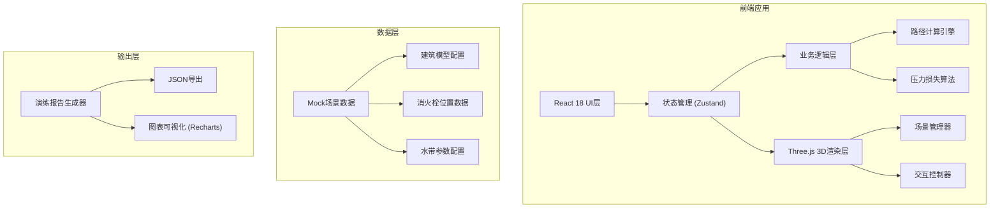

## 1. 架构设计



## 2. 技术描述

- **前端框架**: React@18 + TypeScript@5
- **构建工具**: Vite@5
- **样式方案**: TailwindCSS@3 + PostCSS
- **3D渲染**: Three@0.160 + @react-three/fiber@8 + @react-three/drei@9
- **状态管理**: Zustand@4
- **图表可视化**: Recharts@2
- **UI组件**: HeadlessUI + Heroicons
- **后端**: 无（纯前端应用，数据本地存储）
- **数据库**: LocalStorage 持久化演练记录

## 3. 路由定义

| 路由 | 页面组件 | 功能描述 |
|-------|---------|----------|
| `/` | TrainingArena | 主演练页面，包含3D场景和控制面板 |

## 4. 核心数据模型

### 4.1 数据结构定义

```typescript
// 3D坐标点
interface Point3D {
  x: number;
  y: number;
  z: number;
}

// 水带路径节点
interface PathNode {
  id: string;
  position: Point3D;
  type: 'start' | 'corner' | 'stairs' | 'end';
  timestamp: number;
}

// 消火栓
interface Hydrant {
  id: string;
  position: Point3D;
  name: string;
  pressure: number; // 初始压力 MPa
}

// 楼梯
interface Staircase {
  id: string;
  startPoint: Point3D;
  endPoint: Point3D;
  floors: number;
  stepsPerFloor: number;
}

// 建筑模型
interface BuildingModel {
  id: string;
  name: string;
  floors: number;
  walls: Wall[];
  hydrants: Hydrant[];
  staircases: Staircase[];
}

// 演练参数
interface TrainingParams {
  hoseDiameter: number; // 水带直径 mm
  maxHoseLength: number; // 最大水带长度 m
  maxCorners: number; // 最大转角数
  minPressure: number; // 最小允许压力 MPa
}

// 计算结果
interface CalculationResult {
  totalLength: number; // 总长度 m
  cornerCount: number; // 转角数量
  stairCount: number; // 楼梯数量
  pressureLoss: number; // 压力损失 MPa
  remainingPressure: number; // 剩余压力 MPa
  warnings: Warning[];
  isValid: boolean;
}

// 警告信息
interface Warning {
  type: 'length' | 'corners' | 'pressure';
  severity: 'warning' | 'error';
  message: string;
  position?: Point3D;
}

// 演练记录
interface TrainingSession {
  id: string;
  startTime: number;
  endTime: number;
  buildingId: string;
  path: PathNode[];
  params: TrainingParams;
  result: CalculationResult;
}
```

### 4.2 压力损失计算公式

```
压力损失公式:
Pf = λ * (L/D) * (v²/(2g)) * ρ

其中:
- λ: 摩擦系数 (0.025-0.03)
- L: 水带长度 (m)
- D: 水带直径 (m)
- v: 水流速度 (m/s)
- g: 重力加速度 (9.81 m/s²)
- ρ: 水的密度 (1000 kg/m³)

简化经验公式:
每10米水带损失约 0.01-0.02 MPa
每个90度转角损失约 0.02-0.03 MPa
每层楼垂直高度损失约 0.01 MPa
```

## 5. 核心组件结构

```
src/
├── components/
│   ├── arena/
│   │   ├── ThreeScene.tsx        # Three.js场景容器
│   │   ├── Building.tsx          # 建筑模型渲染
│   │   ├── HosePath.tsx          # 水带路径渲染
│   │   ├── Hydrant.tsx           # 消火栓组件
│   │   └── Staircase.tsx         # 楼梯组件
│   ├── controls/
│   │   ├── ControlPanel.tsx      # 左侧控制面板
│   │   ├── ParamsDisplay.tsx     # 参数显示卡片
│   │   ├── Timeline.tsx          # 时间轴控制器
│   │   └── ViewSwitcher.tsx      # 视角切换器
│   └── report/
│       ├── ReportModal.tsx       # 报告弹窗
│       ├── PressureChart.tsx     # 压力曲线图
│       └── ExportButtons.tsx     # 导出按钮组
├── store/
│   ├── useTrainingStore.ts       # 演练状态管理
│   └── useSceneStore.ts          # 3D场景状态
├── utils/
│   ├── pathCalculator.ts         # 路径计算引擎
│   ├── pressureCalculator.ts     # 压力损失计算
│   └── reportGenerator.ts        # 报告生成器
├── data/
│   ├── buildings.ts              # 示例建筑数据
│   └── defaultParams.ts          # 默认参数配置
└── types/
    └── index.ts                  # 类型定义
```

## 6. 技术实现要点

### 6.1 3D交互实现
- 使用 `@react-three/drei` 的 `OrbitControls` 实现场景旋转缩放
- 射线检测 (`Raycaster`) 实现点击添加路径节点
- 实现拖拽节点时的碰撞检测和位置吸附
- 使用 `TubeGeometry` 或 `Line2` 渲染水带路径

### 6.2 响应式布局
- CSS Grid + Flexbox 实现响应式面板布局
- Tailwind `md:`, `lg:` 断点适配不同屏幕
- 移动端使用 `react-spring` 实现抽屉面板动画
- 3D画布使用 `useThree` 的视口自适应

### 6.3 性能优化
- 建筑墙体使用 `InstancedMesh` 批量渲染
- 路径节点使用对象池复用
- 计算密集型任务使用 Web Worker 异步处理
- 使用 `drei/PerformanceMonitor` 动态调整渲染质量
