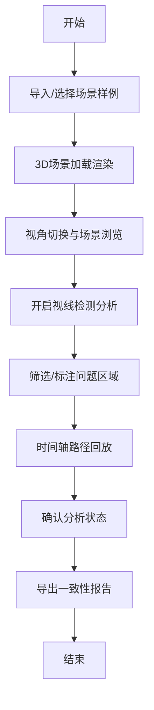

## 1. 产品概述

地下商街导视盲区分析系统 - 基于WebGL的3D交互式导视评估平台，帮助商管公司、招商团队和安保人员分析游客从地铁口进入地下商街时的导视盲区问题。

- **核心价值**：可视化导视牌遮挡、路径分叉缺失、临时围挡等问题，提供数据驱动的导视优化方案
- **目标用户**：商管运营团队、招商部门、安保部门、导视设计服务商

## 2. 核心功能

### 2.1 用户角色

| 角色 | 使用场景 | 核心需求 |
|------|----------|----------|
| 商管运营 | 导视牌调整评估 | 盲区分析、报告导出、多方案对比 |
| 招商团队 | 店铺位置分析 | 人流路径回放、店铺可见性分析 |
| 安保部门 | 游客迷路预防 | 关键节点监控、时间轴回放 |

### 2.2 功能模块

1. **3D场景主界面**：地下商街全景、实时视角操控、场景元素交互
2. **样例管理**：预设场景导入、自定义场景保存
3. **视线分析模块**：导视牌可见性检测、遮挡柱分析、盲区标注
4. **路径回放系统**：人流模拟、时间轴控制、多路径对比
5. **筛选与标注**：元素筛选、问题标注、分类管理
6. **报告导出**：PDF报告生成、数据快照、一致性校验

### 2.3 页面详情

| 页面名称 | 模块名称 | 功能描述 |
|-----------|-------------|---------------------|
| 主场景页面 | 3D视口 | WebGL渲染地下商街、鼠标/键盘视角控制、第一人称/第三人称切换 |
| 主场景页面 | 左侧工具栏 | 样例导入、场景重置、视角预设、元素筛选 |
| 主场景页面 | 底部时间轴 | 路径回放控制、时间点标记、播放速度调节 |
| 主场景页面 | 右侧面板 | 盲区列表、视线检测结果、问题详情、标注编辑 |
| 主场景页面 | 顶部操作栏 | 报告导出、状态保存、设置选项 |
| 报告预览页 | 报告生成器 | 整合当前视角、筛选条件、时间轴位置的一体化报告 |

## 3. 核心流程

用户导入样例场景 → 切换视角浏览商街 → 开启视线检测识别盲区 → 拖拽/筛选关注元素 → 时间轴回放人流路径 → 标注重点问题区域 → 导出包含当前状态的分析报告

## 4. 用户界面设计

### 4.1 设计风格

- **主色调**：深蓝科技感 (#1a237e) 搭配 警示橙 (#ff6f00) 标注盲区
- **辅助色**：青色 (#00bcd4) 表示可见路径、灰色系 (#455a64) 表示建筑结构
- **按钮风格**：圆角矩形、悬浮发光效果、点击反馈动画
- **字体**：标题使用 Orbitron（科技感）、正文使用 Roboto Mono（数据清晰）
- **布局风格**：深色沉浸式界面、模块化面板、玻璃态半透明效果
- **图标风格**：线性简约图标、状态色区分、hover动效

### 4.2 页面设计概述

| 页面名称 | 模块名称 | UI元素 |
|-----------|-------------|-------------|
| 主场景页面 | 3D视口 | 全屏WebGL画布、指南针、视角指示器、帧率显示 |
| 主场景页面 | 左侧工具栏 | 垂直图标栏、展开式菜单、工具提示、快捷键提示 |
| 主场景页面 | 底部时间轴 | 线性时间条、关键帧标记、播放控制按钮、速度滑块 |
| 主场景页面 | 右侧面板 | 可折叠面板组、列表项高亮、问题严重度标签、操作按钮 |
| 主场景页面 | 顶部操作栏 | Logo、场景名称、导出按钮、用户菜单 |

### 4.3 响应性

- Desktop-first 设计，支持 1920×1080 及以上分辨率
- 面板可拖拽调整大小、支持停靠/浮动模式
- 快捷键支持：WASD移动、数字键切换工具、空格暂停/播放
- 适配触控板手势缩放旋转

### 4.4 3D场景指引

- **环境**：地下商街封闭空间、人造光源、金属/瓷砖材质
- **光照**：顶部筒灯阵列、店铺招牌自发光、导视牌背光效果
- **相机**：默认俯视视角、支持第一人称漫游、焦距/FOV可调
- **交互**：鼠标左键旋转、右键平移、滚轮缩放、双击聚焦
- **后处理**：轻微泛光、屏幕空间反射、边缘检测轮廓线
- **性能预算**：场景三角形数 < 50万、Draw Call < 200、目标帧率 60fps
