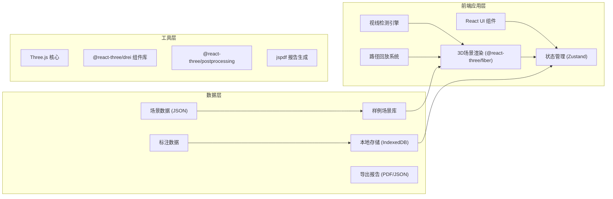

## 1. 架构设计



## 2. 技术描述

- **前端框架**: React@18 + TypeScript@5 + Vite@5
- **3D引擎**: Three.js@0.160 + @react-three/fiber@8 + @react-three/drei@9
- **后处理**: @react-three/postprocessing@2
- **状态管理**: Zustand@4
- **样式方案**: TailwindCSS@3 + SCSS
- **UI组件**: Headless UI + Heroicons
- **报告导出**: jspdf + html2canvas
- **图标**: Lucide React

## 3. 目录结构

```
src/
├── components/          # UI组件
│   ├── layout/         # 布局组件
│   ├── toolbar/        # 工具栏
│   ├── timeline/       # 时间轴
│   ├── panel/          # 右侧面板
│   └── common/         # 通用组件
├── store/              # 状态管理
│   ├── sceneStore.ts   # 场景状态
│   ├── analysisStore.ts# 分析状态
│   └── uiStore.ts      # UI状态
├── scenes/             # 3D场景
│   ├── MallScene.tsx   # 主场景
│   ├── elements/       # 场景元素
│   │   ├── Column.tsx
│   │   ├── Signage.tsx
│   │   ├── Store.tsx
│   │   ├── Path.tsx
│   │   └── Barrier.tsx
│   └── effects/        # 特效组件
├── hooks/              # 自定义hooks
│   ├── useRaycast.ts   # 射线检测
│   ├── usePathPlayback.ts
│   └── useVisibilityCheck.ts
├── utils/              # 工具函数
│   ├── reportExport.ts # 报告导出
│   ├── sceneParser.ts  # 场景解析
│   └── math.ts         # 数学计算
├── data/               # 样例数据
│   ├── sampleScenes.ts
│   └── pathData.ts
├── types/              # 类型定义
│   └── index.ts
└── App.tsx
```

## 4. 路由定义

| 路由 | 用途 |
|-------|---------|
| / | 主场景页面（包含所有功能模块） |

## 5. 核心数据模型

```typescript
// 场景元素基础类型
interface SceneElement {
  id: string;
  type: 'column' | 'signage' | 'store' | 'path' | 'barrier';
  position: [number, number, number];
  rotation?: [number, number, number];
  scale?: [number, number, number];
  name: string;
  visible: boolean;
}

// 导视牌
interface Signage extends SceneElement {
  type: 'signage';
  direction: 'left' | 'right' | 'forward' | 'back';
  targetArea: string;
  text: string;
}

// 遮挡柱
interface Column extends SceneElement {
  type: 'column';
  radius: number;
  height: number;
}

// 店铺
interface Store extends SceneElement {
  type: 'store';
  storeName: string;
  category: string;
}

// 盲区标注
interface BlindSpot {
  id: string;
  position: [number, number, number];
  type: 'occlusion' | 'missing_sign' | 'temporary_barrier';
  severity: 'low' | 'medium' | 'high';
  description: string;
  relatedElements: string[];
  timestamp?: number;
}

// 路径数据
interface PathData {
  id: string;
  name: string;
  points: [number, number, number][];
  timestamps: number[];
  color: string;
}

// 导出报告快照
interface ReportSnapshot {
  timestamp: string;
  cameraPosition: [number, number, number];
  cameraRotation: [number, number, number];
  activeFilters: string[];
  timelinePosition: number;
  blindSpots: BlindSpot[];
  visibleElements: string[];
  sceneName: string;
}
```

## 6. 状态管理设计

### 6.1 场景状态 (sceneStore)
```typescript
{
  currentScene: SceneData | null;
  elements: SceneElement[];
  selectedElement: string | null;
  cameraMode: 'orbit' | 'firstPerson';
  cameraPosition: [number, number, number];
  isPlaying: boolean;
  playbackSpeed: number;
  currentTime: number;
}
```

### 6.2 分析状态 (analysisStore)
```typescript
{
  blindSpots: BlindSpot[];
  activeBlindSpot: string | null;
  visibilityCheckEnabled: boolean;
  filters: {
    columns: boolean;
    signages: boolean;
    stores: boolean;
    barriers: boolean;
    paths: boolean;
  };
  paths: PathData[];
  activePath: string | null;
}
```

### 6.3 UI状态 (uiStore)
```typescript
{
  leftPanelOpen: boolean;
  rightPanelOpen: boolean;
  timelineExpanded: boolean;
  activeTool: 'select' | 'measure' | 'annotate';
  showStats: boolean;
  theme: 'dark';
}
```

## 7. 关键技术实现

### 7.1 视线检测算法
- 使用 Three.js Raycaster 进行射线检测
- 从游客视角向导视牌发射射线，检测中间是否有遮挡物
- 计算可见角度阈值，判断是否在有效视野范围内

### 7.2 路径回放系统
- 使用 CatmullRomCurve3 进行路径平滑插值
- 基于时间戳计算位置，支持变速播放
- 相机可锁定跟随路径移动

### 7.3 报告一致性保证
- 导出时快照所有状态：相机位置、筛选条件、时间轴位置、盲区数据
- 报告中嵌入场景截图，使用 html2canvas 捕获当前视口
- JSON 格式保存完整数据，支持后续导入还原
