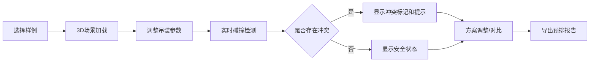

## 1. 产品概述
船厂分段吊装预排3D交互可视化系统，用于在总装前模拟大型分段吊装过程，提前检测吊点方向、支墩挡路、龙门吊越界等冲突问题。目标用户为船厂工程师，核心价值是降低吊装风险、提高预排效率。

## 2. 核心功能

### 2.1 用户角色
| 角色 | 注册方式 | 核心权限 |
|------|----------|----------|
| 船厂工程师 | 无需注册 | 导入样例、操作3D场景、调整参数、导出报告 |

### 2.2 功能模块
1. **主界面**：3D场景渲染区、控制面板、时间轴、状态显示
2. **场景管理**：导入样例、场景重置、视角切换
3. **交互操作**：分段拖拽、元素筛选、参数调整
4. **碰撞检测**：实时检测支墩挡路、轨道越界、吊点冲突
5. **时间轴动画**：吊装过程回放、进度控制
6. **方案对比**：多方案并排显示对比
7. **报告导出**：生成包含可视化结果的预排报告

### 2.3 页面详情
| 页面名称 | 模块名称 | 功能描述 |
|-----------|-------------|---------------------|
| 主界面 | 3D场景区 | 渲染船厂环境、船体分段、龙门吊、支墩、通道等元素 |
| 主界面 | 左侧控制面板 | 样例选择、元素筛选、参数设置、方案对比开关 |
| 主界面 | 底部时间轴 | 吊装进度控制、播放/暂停、步骤跳转 |
| 主界面 | 顶部工具栏 | 视角切换、场景重置、导出报告、帮助 |
| 主界面 | 右侧状态栏 | 冲突提示、实时数据、状态信息 |

## 3. 核心流程
用户选择内置样例 → 3D场景加载显示 → 通过时间轴或拖拽调整吊装位置 → 系统实时检测碰撞冲突 → 对比不同方案 → 导出预排报告

## 4. 用户界面设计

### 4.1 设计风格
- **主色调**：工业蓝 (#165DFF) 搭配深灰背景，体现专业工程感
- **辅助色**：安全绿 (#00B42A)、警告橙 (#FF7D00)、危险红 (#F53F3F)
- **按钮风格**：直角边框、简洁图标、明确的状态反馈
- **字体**：使用思源黑体，清晰易读，标题加粗
- **布局风格**：功能分区明确，3D场景为主区域，控制面板环绕四周
- **图标风格**：线性图标，简洁专业，符合工程软件习惯

### 4.2 页面设计概述
| 页面名称 | 模块名称 | UI元素 |
|-----------|-------------|-------------|
| 主界面 | 3D场景区 | 网格地面、船厂建筑、龙门吊轨道、船体分段、支墩、通道、冲突标记 |
| 主界面 | 控制面板 | 下拉选择器、复选框组、滑块、数字输入、颜色图例 |
| 主界面 | 时间轴 | 进度条、播放按钮、步骤点、时间刻度 |
| 主界面 | 工具栏 | 图标按钮、下拉菜单、状态指示器 |
| 主界面 | 状态栏 | 冲突列表、数据卡片、提示气泡 |

### 4.3 响应性
- 桌面端优先，3D场景自适应窗口大小
- 控制面板可折叠，最大化场景显示区域
- 支持触摸板和鼠标滚轮缩放操作

### 4.4 3D场景指导
- **环境**：工业船厂风格，晴朗天空，简洁的地面网格
- **光照**：主方向光 + 环境光，确保模型清晰可见，阴影增强空间感
- **相机**：透视相机，支持轨道控制、缩放、平移，预设多个视角
- **组成**：船体分段为主体，龙门吊和支墩为关键元素，冲突区域高亮显示
- **交互**：鼠标悬停高亮，点击选中，拖拽移动，动画流畅
- **后期效果**：简洁的抗锯齿，不过度使用特效，保证性能
- **资源**：使用Three.js内置几何体创建模型，不依赖外部资源文件

