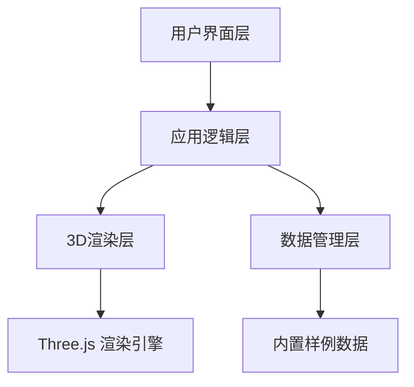

## 1. 架构设计



## 2. 技术描述
- **前端框架**：React@18 + TypeScript
- **构建工具**：Vite
- **3D引擎**：Three.js + @react-three/fiber + @react-three/drei
- **样式方案**：TailwindCSS@3
- **状态管理**：Zustand
- **导出功能**：html2canvas + jsPDF

## 3. 目录结构
```
src/
├── components/
│   ├── Scene3D/          # 3D场景组件
│   ├── ControlPanel/     # 左侧控制面板
│   ├── Timeline/         # 底部时间轴
│   ├── Toolbar/          # 顶部工具栏
│   └── StatusBar/        # 右侧状态栏
├── store/                # Zustand状态管理
├── data/                 # 内置样例数据
├── types/                # TypeScript类型定义
└── utils/                # 工具函数（碰撞检测等）
```

## 4. 核心数据模型

### 4.1 船体分段 (Block)
```typescript
interface Block {
  id: string;
  name: string;
  position: { x: number; y: number; z: number };
  rotation: { x: number; y: number; z: number };
  dimensions: { width: number; height: number; depth: number };
  liftingPoints: LiftingPoint[];
  color: string;
}
```

### 4.2 吊点 (LiftingPoint)
```typescript
interface LiftingPoint {
  id: string;
  position: { x: number; y: number; z: number };
  direction: { x: number; y: number; z: number };
  isValid: boolean;
}
```

### 4.3 临时支墩 (Pier)
```typescript
interface Pier {
  id: string;
  name: string;
  position: { x: number; y: number; z: number };
  dimensions: { width: number; height: number; depth: number };
}
```

### 4.4 龙门吊轨道 (GantryRail)
```typescript
interface GantryRail {
  id: string;
  start: { x: number; y: number; z: number };
  end: { x: number; y: number; z: number };
  width: number;
}
```

### 4.5 吊装路径 (LiftingPath)
```typescript
interface LiftingPath {
  id: string;
  blockId: string;
  waypoints: { x: number; y: number; z: number }[];
  duration: number;
}
```

### 4.6 冲突检测结果 (CollisionResult)
```typescript
interface CollisionResult {
  type: 'pier' | 'rail' | 'liftingPoint';
  severity: 'warning' | 'error';
  message: string;
  position?: { x: number; y: number; z: number };
}
```

## 5. 核心算法

### 5.1 AABB碰撞检测
```
检测两个物体的轴对齐包围盒是否相交，用于快速碰撞预检。
```

### 5.2 线段与平面相交检测
```
检测吊装路径是否与支墩或轨道相交。
```

### 5.3 点在多边形内检测
```
检测吊点位置是否在有效区域内。
```

## 6. 内置样例数据

### 6.1 正常吊装样例
- 包含2个船体分段
- 吊点位置正确
- 无支墩冲突
- 龙门吊轨道内作业

### 6.2 冲突吊装样例
- 包含3个船体分段
- 吊点方向错误
- 支墩挡路
- 龙门吊越界

### 6.3 空结果样例
- 空场景
- 仅显示轨道和地面
- 用于自定义创建

