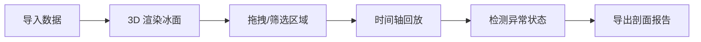

## 1. 产品概述

冰场制冰厚度剖面可视化系统，为冰场运维人员提供交互式 3D 可视化工具，实时监控冰层厚度、温度分布及修补状态，替代传统点检表，提升赛前检查效率和准确性。

- **目标用户**：冰场运维工程师、赛事保障人员
- **核心价值**：降低采样点缺失、厚度不达标、修补未复测等风险

## 2. 核心功能

### 2.1 用户角色

| 角色 | 权限 |
|------|------|
| 运维工程师 | 导入数据、3D 可视化操作、导出报告 |

### 2.2 功能模块

1. **3D 冰面剖面视图**：冰面网格、厚度采样、温度探头、修补区域可视化
2. **时间轴控制**：赛事时段切换、历史数据回放、多时间点对比
3. **数据交互**：拖拽筛选、采样点详情、阈值告警标注
4. **报告系统**：可视化数据一致的报告导出

### 2.3 页面详情

| 页面名称 | 模块名称 | 功能描述 |
|----------|----------|----------|
| 主面板 | 3D 场景区 | Three.js 渲染冰面剖面，支持旋转、缩放、剖切 |
| 主面板 | 时间轴控制 | 滑动条切换时间点，播放/暂停回放 |
| 主面板 | 侧边栏 | 数据导入、筛选条件、视角预设 |
| 主面板 | 底部状态栏 | 告警统计、当前时间点信息 |

## 3. 核心流程

用户导入样例数据 → 3D 场景渲染冰面剖面 → 拖拽/筛选关注区域 → 时间轴回放历史变化 → 发现厚度/温度异常 → 导出包含可视化的剖面报告

## 4. 用户界面设计

### 4.1 设计风格

- **主色调**：冷色系 - 冰蓝色 (#0EA5E9)、深青 (#0891B2)，体现冰场专业感
- **告警色**：厚度异常用红色 (#EF4444)，温度异常用橙色 (#F59E0B)
- **字体**：Geist Mono (等宽) + Inter (正文)，专业工程风格
- **布局**：深色科技风，左侧边栏 + 中央 3D 场景 + 底部时间轴
- **动效**：简洁专业，告警点脉冲动画，时间轴过渡平滑

### 4.2 页面设计概述

| 页面区域 | UI 元素 |
|----------|---------|
| 3D 场景 | 半透明冰面、热力色厚度层、采样点标记、修补区域高亮 |
| 侧边栏 | 数据导入按钮、筛选复选框、视角预设下拉、图例说明 |
| 时间轴 | 滑块、播放控制、时间点标记、赛事时段标注 |
| 状态栏 | 告警计数、当前厚度均值、采样完成率 |

### 4.3 响应式

桌面端优先，侧边栏可折叠，3D 场景自适应窗口大小。

### 4.4 3D 场景指导

- **环境**：深色背景，冷色调环境光
- **光照**：主光 + 补光，冰面有适度反光效果
- **相机**：透视相机，支持轨道控制、预设视角切换
- **交互**：鼠标拖拽旋转，滚轮缩放，点击采样点显示详情
- **后处理**：Bloom 效果增强告警点视觉
