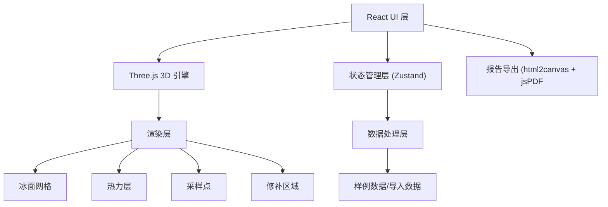
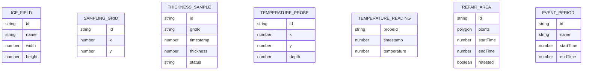

## 1. 架构设计



## 2. 技术描述

- **前端框架**：React@18 + TypeScript + Vite
- **3D 引擎**：three@0.160 + @react-three/fiber + @react-three/drei
- **状态管理**：zustand
- **样式**：tailwindcss@3
- **导出**：html2canvas + jspdf
- **无后端**：纯前端应用，数据本地处理

## 3. 路由定义

| 路由 | 用途 |
|------|------|
| / | 主应用入口 |

## 4. 数据模型

### 4.1 数据结构定义



### 4.2 TypeScript 类型定义

```typescript
// 冰场配置
interface IceRink {
  id: string;
  name: string;
  width: number;  // 米
  height: number; // 米
  gridSize: number; // 网格间距
  thicknessThreshold: number; // 厚度阈值 mm
}

// 网格采样点
interface GridPoint {
  id: string;
  x: number;
  y: number;
}

// 厚度采样数据
interface ThicknessSample {
  gridId: string;
  timestamp: number;
  thickness: number; // mm
  status: 'normal' | 'warning' | 'critical' | 'missing';
}

// 温度探头
interface TemperatureProbe {
  id: string;
  x: number;
  y: number;
  depth: number;
}

// 温度读数
interface TemperatureReading {
  probeId: string;
  timestamp: number;
  temperature: number; // °C
}

// 修补区域
interface RepairArea {
  id: string;
  points: { x: number; y: number }[];
  startTime: number;
  endTime: number;
  retested: boolean;
}

// 赛事时段
interface EventPeriod {
  id: string;
  name: string;
  startTime: number;
  endTime: number;
  type: 'training' | 'competition' | 'maintenance';
}

// 时间点数据快照
interface DataSnapshot {
  timestamp: number;
  thicknessSamples: ThicknessSample[];
  temperatureReadings: TemperatureReading[];
}
```

## 5. 核心模块设计

### 5.1 3D 场景模块
- **IceSurface**：冰面主体网格，根据厚度数据动态调整高度
- **HeatmapLayer**：热力图层，颜色映射厚度/温度值
- **SamplingPoints**：采样点标记，支持点击交互
- **RepairRegions**：修补区域高亮显示
- **ThresholdPlane**：阈值参考平面

### 5.2 交互控制模块
- **TimelineControl**：时间轴滑块 + 播放控制
- **ViewPresets**：预设视角切换
- **SelectionTool**：框选筛选工具
- **ResetControl**：状态重置功能

### 5.3 报告导出模块
- 捕获当前 3D 场景快照
- 生成包含统计数据
- 输出 PDF 报告
