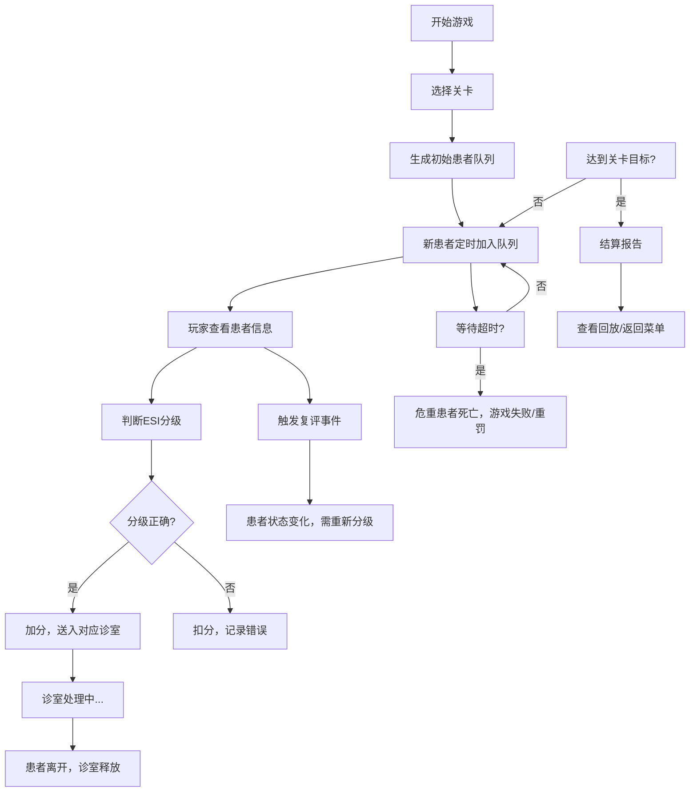

## 1. 产品概述
急诊分诊排队游戏是一款面向医学生的训练模拟器，通过真实的分诊规则让玩家在不断涌入的患者中做出正确的优先级判断。
- 目标用户：医学院学生、急诊医护培训人员
- 核心价值：通过游戏化方式掌握急诊分诊（ESI分级）的实际应用，避免危重患者漏分、候诊超时等常见错误

## 2. 核心功能

### 2.1 用户角色
| 角色 | 注册方式 | 核心权限 |
|------|----------|----------|
| 玩家 | 无需注册 | 游戏游玩、查看成绩、回放历史 |

### 2.2 功能模块
1. **主菜单页面**：关卡选择、游戏说明、历史记录
2. **游戏界面**：患者队列、诊室资源、患者详情、操作面板
3. **结算报告页面**：得分详情、失败原因分析、可回放的操作历史
4. **回放界面**：步骤回放、关键事件标记

### 2.3 页面详情
| 页面名称 | 模块名称 | 功能描述 |
|----------|----------|----------|
| 主菜单 | 关卡选择 | 3个难度关卡（入门/进阶/挑战），显示已通关状态 |
| 主菜单 | 游戏说明 | 分诊规则、操作指南、边界案例说明 |
| 主菜单 | 历史记录 | 最近10局游戏的成绩和回放入口 |
| 游戏界面 | 患者队列 | 显示等待患者卡片，包含ESI分级、症状、等待时间、倒计时 |
| 游戏界面 | 诊室资源 | 显示可用/占用诊室数量，每个诊室的处理进度 |
| 游戏界面 | 患者详情 | 点击患者查看完整症状、生命体征、分诊建议 |
| 游戏界面 | 操作面板 | 分诊（ESI I-V）、送入诊室、重新评估按钮 |
| 游戏界面 | 状态栏 | 当前分数、已处理患者数、超时警告、暂停/重开按钮 |
| 结算报告 | 得分详情 | 正确分诊数、错误数、超时处罚、复评加分 |
| 结算报告 | 失败原因 | 逐条列出失败事件（危重漏分、超时死亡、资源浪费） |
| 结算报告 | 回放功能 | 可跳转查看每一步操作和对应结果 |

## 3. 核心流程
玩家进入游戏选择关卡后，患者按时间间隔进入队列，玩家需要根据ESI分诊标准（5级）判断优先级，分配到对应诊室处理，同时监控候诊时间和处理复评事件。

## 4. 用户界面设计

### 4.1 设计风格
- **主色调**：医疗蓝（#165DFF）作为主色，红色（#F53F3F）表示危重，橙色（#FF7D00）表示紧急，绿色（#00B42A）表示非紧急
- **按钮风格**：圆角矩形，带有轻微阴影，悬停有缩放效果
- **字体**：标题使用 Noto Sans SC Bold，正文使用 Noto Sans SC Regular
- **布局风格**：卡片式布局，患者卡片带有轻微浮动效果，队列横向排列
- **图标**：使用医疗相关emoji（🚑、💊、🩺、❤️、⚠️）增强视觉识别

### 4.2 页面设计概述
| 页面名称 | 模块名称 | UI元素 |
|----------|----------|--------|
| 主菜单 | 关卡卡片 | 渐变色卡片，悬停上浮效果，显示关卡名和难度 |
| 游戏界面 | 患者卡片 | 横向排列，颜色按ESI分级区分，显示倒计时和状态徽章 |
| 游戏界面 | 诊室面板 | 网格布局，显示诊室状态（空闲/占用/处理中） |
| 游戏界面 | 操作按钮 | 大尺寸分级按钮（ESI I-V），颜色对应优先级 |
| 结算报告 | 统计面板 | 环形进度图显示正确率，列表展示失败事件 |
| 结算报告 | 时间线 | 垂直时间线展示关键事件，可点击回放 |

### 4.3 响应式
- 桌面端：横向队列布局，诊室网格3列
- 平板端：队列可横向滚动，诊室网格2列
- 移动端：纵向队列布局，诊室单列

### 4.4 2D回合制设计
- 患者卡片采用圆角矩形，带有边框颜色指示ESI等级
- 诊室状态用图标和进度条表示处理进度
- 复评事件用闪烁动画和音效提示
- 超时警告用红色脉冲动画提示
