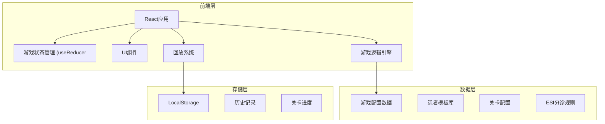

## 1. 架构设计



## 2. 技术描述
- **前端框架**: React@18 + TypeScript + Vite
- **样式方案**: TailwindCSS@3
- **状态管理**: React useReducer (游戏状态) + Context API
- **动画**: CSS transitions + Framer Motion
- **数据持久化**: LocalStorage
- **图标**: Lucide React

## 3. 路由定义
| 路由 | 页面组件 | 用途 |
|------|----------|------|
| / | MainMenu | 主菜单 - 关卡选择、游戏说明、历史记录 |
| /game/:levelId | GameScreen | 游戏界面 - 患者队列、诊室管理、操作面板 |
| /result/:gameId | ResultScreen | 结算报告 - 得分详情、失败分析、回放入口 |
| /replay/:gameId | ReplayScreen | 回放界面 - 步骤回放、事件标记 |

## 4. 数据模型

### 4.1 核心类型定义

```typescript
// ESI 分诊等级
type EsiLevel = 1 | 2 | 3 | 4 | 5;

// 患者状态
type PatientStatus = 'waiting' | 'processing' | 'discharged' | 'deceased' | 'reassess';

// 诊室状态
type RoomStatus = 'idle' | 'occupied' | 'cleaning';

// 患者数据
interface Patient {
  id: string;
  name: string;
  age: number;
  gender: 'male' | 'female';
  chiefComplaint: string;
  symptoms: string[];
  vitalSigns: {
    heartRate: number;
    bloodPressure: string;
    temperature: number;
    respiratoryRate: number;
    oxygenSaturation: number;
  };
  correctEsi: EsiLevel;
  currentEsi: EsiLevel;
  arrivalTime: number;
  maxWaitTime: number; // 最大等待时间(秒)
  processingTime: number; // 处理所需时间(秒)
  status: PatientStatus;
  reassessEvents: ReassessEvent[];
  assignedRoomId?: string;
}

// 复评事件
interface ReassessEvent {
  triggerTime: number; // 触发时间(游戏时间秒数)
  newSymptoms: string[];
  newVitalSigns: Partial<Patient['vitalSigns']>;
  newCorrectEsi: EsiLevel;
  triggered: boolean;
}

// 诊室
interface Room {
  id: string;
  name: string;
  status: RoomStatus;
  patientId?: string;
  processingProgress: number; // 0-100
  canHandleEsi: EsiLevel[]; // 可处理的ESI等级
}

// 游戏状态
interface GameState {
  id: string;
  levelId: string;
  status: 'playing' | 'paused' | 'won' | 'lost';
  score: number;
  timeElapsed: number;
  patients: Patient[];
  rooms: Room[];
  actionHistory: GameAction[];
  failReasons: FailReason[];
  patientsProcessed: number;
  targetPatients: number;
}

// 游戏动作
interface GameAction {
  timestamp: number;
  type: 'triage' | 'assign_room' | 'reassess' | 'patient_arrive' | 'patient_discharge' | 'patient_death';
  patientId: string;
  details: Record<string, any>;
}

// 失败原因
interface FailReason {
  timestamp: number;
  type: 'missed_critical' | 'wait_timeout' | 'wrong_triage' | 'resource_waste';
  patientId: string;
  description: string;
  penalty: number;
}

// 关卡配置
interface LevelConfig {
  id: string;
  name: string;
  description: string;
  difficulty: 'easy' | 'medium' | 'hard';
  patientSpawnRate: number; // 患者生成间隔(秒)
  targetPatients: number; // 目标处理患者数
  rooms: RoomConfig[];
  patientPool: string[]; // 患者模板ID池
  initialPatients: number; // 初始患者数
}
```

## 5. 游戏引擎核心逻辑

### 5.1 游戏循环
```typescript
// 游戏主循环 (每秒执行)
function gameLoop(dispatch: Dispatch, state: GameState) {
  // 1. 增加游戏时间
  dispatch({ type: 'INCREMENT_TIME' });
  
  // 2. 检查是否生成新患者
  if (shouldSpawnPatient(state)) {
    dispatch({ type: 'SPAWN_PATIENT' });
  }
  
  // 3. 更新诊室处理进度
  dispatch({ type: 'UPDATE_ROOM_PROGRESS' });
  
  // 4. 检查患者等待超时
  dispatch({ type: 'CHECK_TIMEOUTS' });
  
  // 5. 检查复评事件
  dispatch({ type: 'CHECK_REASSESS_EVENTS' });
  
  // 6. 检查胜利/失败条件
  checkGameEnd(state);
}
```

### 5.2 计分规则
- 正确分诊 ESI I: +50分
- 正确分诊 ESI II: +40分  
- 正确分诊 ESI III: +30分
- 正确分诊 ESI IV: +20分
- 正确分诊 ESI V: +10分
- 分诊错误: -20分，记录失败原因
- 危重患者(ESI I/II)超时: -100分，游戏失败
- 非危重患者超时: -30分
- 成功处理复评事件: +30分
- 诊室资源浪费(高等级诊室处理低等级患者): -10分

## 6. 边界案例设计

1. **案例1: 隐匿性危重患者
   - 初始表现为ESI III，但生命体征异常，触发复评后恶化为ESI I
   - 考验: 玩家是否注意到异常生命体征并提前处理

2. **案例2: 批量患者涌入
   - 短时间内多个患者同时到达
   - 考验: 快速分诊和资源分配能力

3. **案例3: 复评连环事件**
   - 一个患者多次触发复评，分级不断变化
   - 考验: 持续监测和调整能力

4. **案例4: 资源紧张局面**
   - 所有诊室占用，危重患者到达
   - 考验: 是否果断决策（提前结束低优先级患者处理）

5. **案例5: 假阳性危重**
   - 表现类似ESI I，但实际是ESI III
   - 考验: 准确判断避免资源浪费
