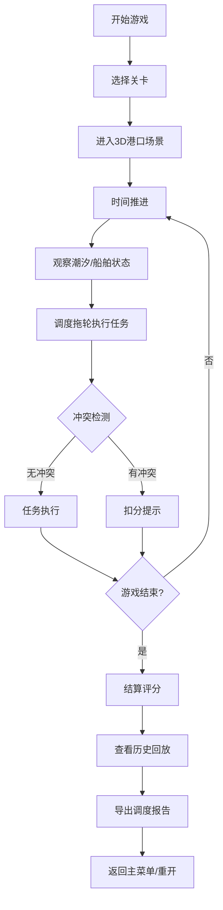

## 1. 产品概述
港口拖轮调度模拟器是一款面向港口新人培训的轻3D浏览器游戏，模拟真实港口拖轮调度场景，训练玩家处理船舶进出港、潮汐窗口、泊位分配、燃油管理等核心调度技能。
- 解决港口调度新人培训成本高、实操机会少的问题，提供低风险、可重复的训练环境
- 目标用户为港口调度培训学员、海事相关专业学生

## 2. 核心功能

### 2.1 用户角色
| 角色 | 注册方式 | 核心权限 |
|------|----------|----------|
| 学员玩家 | 无需注册 | 进行游戏、查看分数、导出报告 |

### 2.2 功能模块
1. **主菜单页面**: 游戏开始、关卡选择、游戏说明
2. **游戏主界面**: 3D港口场景、调度面板、实时信息
3. **结算界面**: 分数统计、失败原因、操作回放
4. **报告导出**: 调度报告PDF/文本导出

### 2.3 页面详情
| 页面名称 | 模块名称 | 功能描述 |
|---------|---------|----------|
| 主菜单 | 关卡选择 | 3个难度递增的关卡，包含不同数量的船舶和复杂条件 |
| 主菜单 | 游戏说明 | 潮汐、泊位、燃油、拖轮冲突等核心规则说明 |
| 游戏主界面 | 3D港口场景 | 轻3D俯视视角，可拖拽旋转，显示船舶、拖轮、泊位、潮汐水位 |
| 游戏主界面 | 调度控制面板 | 选择拖轮、指派任务、调整路径、时间控制 |
| 游戏主界面 | 实时信息面板 | 潮汐时间窗口、燃油余量、船舶状态、倒计时 |
| 游戏主界面 | 时间控制 | 暂停/继续、1x/2x/4x加速、重置 |
| 结算界面 | 分数统计 | 按时完成奖励、燃油消耗、安全扣分、总分计算 |
| 结算界面 | 失败原因 | 潮汐错过、拖轮冲突、燃油耗尽、泊位超时等具体原因 |
| 结算界面 | 历史回放 | 时间轴回放、关键节点标记、倍速控制 |
| 结算界面 | 报告导出 | 导出包含调度过程、评分详情的文本报告 |

## 3. 核心流程
玩家从主菜单选择关卡进入游戏，在时间推进过程中观察潮汐窗口和船舶动态，调度拖轮协助大船靠泊/离泊，监控燃油消耗和潜在冲突。游戏结束后查看分数和回放，可导出调度报告。

## 4. 用户界面设计

### 4.1 设计风格
- 主色调: 深海蓝(#0A2463) + 警示橙(#F77F00) + 港口灰(#3E5C76)
- 按钮风格: 工业风矩形按钮，轻微立体感，状态色区分(正常/警告/危险)
- 字体: 标题用Oswald粗体(工业感)，正文用Roboto Mono(等宽数字清晰)
- 布局风格: 信息密度较高的仪表盘式布局，左侧3D场景，右侧控制面板
- 图标风格: 线性图标，船锚、拖轮、时钟、油桶等海事主题

### 4.2 页面设计概述
| 页面名称 | 模块名称 | UI元素 |
|---------|---------|--------|
| 主菜单 | 关卡卡片 | 渐变蓝色卡片，悬浮放大动画，难度标记 |
| 游戏主界面 | 3D场景 | 俯视45°视角，鼠标拖拽旋转，滚轮缩放 |
| 游戏主界面 | 信息面板 | 半透明深色背景，等宽字体显示实时数据，状态颜色编码 |
| 游戏主界面 | 调度按钮组 | 固定底部，醒目的橙色行动按钮 |
| 结算界面 | 分数圆环 | 环形进度条展示完成度，渐变颜色指示评级 |
| 结算界面 | 时间轴回放 | 线性时间轴，可拖动滑块，关键事件标记 |

### 4.3 响应性
- 桌面端优先设计，最低支持1366×768分辨率
- 侧边栏在小屏幕可折叠，3D场景自适应容器大小
- 触控设备支持手势缩放旋转场景

### 4.4 3D场景指导
- **环境**: 简约港口风格，深蓝水面，灰色码头，避免过度装饰
- **光照**: 方向光+环境光，模拟日间港口光线，阴影柔和
- **摄像机**: 初始俯视45°角，位置可调整，目标点锁定港口中心
- **构图**: 港口在中心，船舶进出航道清晰，UI元素不遮挡关键区域
- **交互**: 点击船舶/拖轮显示详情，路径预览用半透明线条
- **后处理**: 轻微泛光效果，水面波纹动画，无过度特效
- **性能**: 低多边形模型，总面数控制在5000面以内
