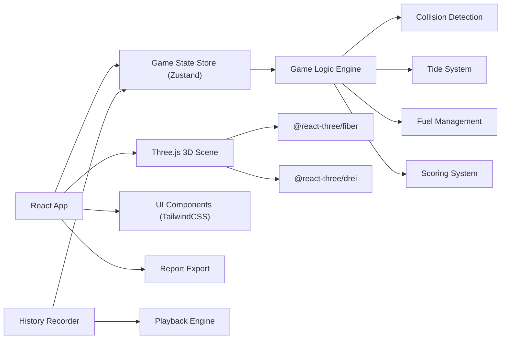

## 1. 架构设计



## 2. 技术描述
- **前端框架**: React@18 + TypeScript + Vite
- **3D渲染**: three.js + @react-three/fiber + @react-three/drei
- **状态管理**: Zustand (轻量型游戏状态管理)
- **样式**: TailwindCSS@3
- **路由**: React Router DOM
- **动画**: Framer Motion (UI动画)
- **构建工具**: Vite@5

## 3. 目录结构
```
src/
├── components/
│   ├── ui/              # 通用UI组件
│   ├── game/            # 游戏相关组件
│   ├── menu/            # 菜单组件
│   └── playback/        # 回放组件
├── store/               # Zustand状态管理
│   └── gameStore.ts
├── engine/              # 游戏核心逻辑
│   ├── GameEngine.ts
│   ├── TideSystem.ts
│   ├── CollisionSystem.ts
│   ├── FuelSystem.ts
│   └── ScoringSystem.ts
├── types/               # TypeScript类型定义
│   └── index.ts
├── data/                # 关卡数据
│   └── levels.ts
├── hooks/               # 自定义Hooks
├── utils/               # 工具函数
├── scenes/              # 3D场景组件
├── App.tsx
└── main.tsx
```

## 4. 路由定义
| 路由 | 页面组件 | 功能 |
|------|---------|------|
| `/` | MainMenu | 主菜单，关卡选择 |
| `/game/:levelId` | GameScene | 游戏主场景 |
| `/result/:sessionId` | ResultScreen | 结算界面与回放 |

## 5. 核心数据模型

### 5.1 类型定义

```typescript
// 船舶类型
interface Ship {
  id: string;
  name: string;
  type: 'cargo' | 'container' | 'tanker';
  position: Vector3;
  rotation: number;
  targetBerth?: string;
  status: 'approaching' | 'waiting' | 'docking' | 'docked' | 'undocking' | 'departing';
  requiredTugs: number;
  draft: number;
  arrivalTime: number;
  departureTime: number;
}

// 拖轮类型
interface Tug {
  id: string;
  name: string;
  position: Vector3;
  status: 'idle' | 'moving' | 'towing' | 'returning';
  fuel: number;
  maxFuel: number;
  assignedShipId?: string;
  speed: number;
}

// 泊位类型
interface Berth {
  id: string;
  name: string;
  position: Vector3;
  occupied: boolean;
  occupiedShipId?: string;
  maxDraft: number;
}

// 潮汐系统
interface Tide {
  currentLevel: number;
  minLevel: number;
  maxLevel: number;
  cycleTime: number;
  nextHighTime: number;
  nextLowTime: number;
}

// 游戏状态
interface GameState {
  phase: 'setup' | 'playing' | 'paused' | 'ended';
  time: number;
  timeSpeed: number;
  maxTime: number;
  score: Score;
  ships: Ship[];
  tugs: Tug[];
  berths: Berth[];
  tide: Tide;
  events: GameEvent[];
  collisionWarnings: CollisionWarning[];
  history: HistoryFrame[];
}

// 分数系统
interface Score {
  onTimeCompletions: number;
  fuelEfficiency: number;
  safetyScore: number;
  penalties: number;
  total: number;
  grade: 'S' | 'A' | 'B' | 'C' | 'D' | 'F';
}

// 历史记录帧
interface HistoryFrame {
  time: number;
  ships: Ship[];
  tugs: Tug[];
  tide: Tide;
  events: string[];
}
```

## 6. 游戏核心规则

### 6.1 潮汐规则
- 潮汐按正弦曲线周期变化
- 大船吃水超过当前水位时无法进出港
- 错过潮汐窗口导致严重扣分

### 6.2 拖轮调度规则
- 每艘大船靠泊/离泊需要指定数量拖轮
- 拖轮燃油随时间消耗
- 拖轮之间距离过近触发碰撞警告
- 碰撞事故导致游戏失败或大量扣分

### 6.3 计分规则
| 项目 | 分值 |
|------|------|
| 按时完成靠泊 | +100分/艘 |
| 按时完成离泊 | +80分/艘 |
| 燃油效率奖励 | +1-50分 |
| 无事故安全奖励 | +100分 |
| 错过潮汐窗口 | -150分/次 |
| 碰撞警告 | -30分/次 |
| 实际碰撞 | -300分/次 |
| 燃油耗尽 | -200分/艘 |

## 7. 状态管理设计

```typescript
// Zustand Store 核心方法
interface GameStore {
  state: GameState;
  actions: {
    startGame: (levelId: string) => void;
    pauseGame: () => void;
    resumeGame: () => void;
    resetGame: () => void;
    setTimeSpeed: (speed: number) => void;
    assignTug: (tugId: string, shipId: string) => void;
    recallTug: (tugId: string) => void;
    endGame: () => void;
    exportReport: () => string;
  };
}
```
