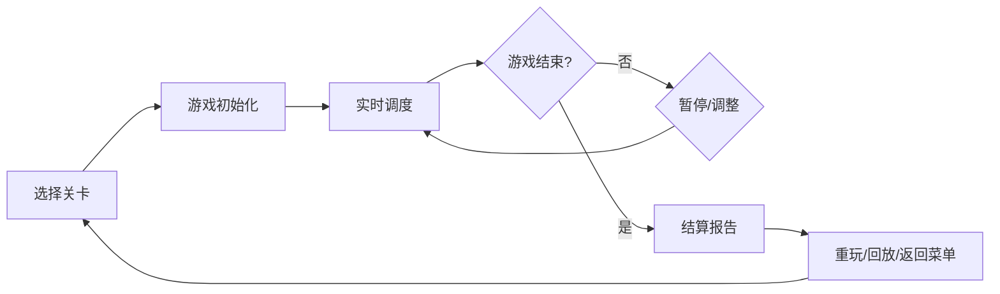

## 1. 产品概述

铁路信号调度游戏是一款基于真实铁路规则的Canvas策略小游戏，玩家扮演调度员处理列车运行、信号切换、晚点事件和检修窗口，避免区间冲突并完成运输任务。目标是为铁路爱好者提供真实可玩的调度体验，通过策略思考和反应能力挑战不同难度关卡。

## 2. 核心功能

### 2.1 用户角色
| 角色 | 注册方式 | 核心权限 |
|------|---------|---------|
| 玩家 | 无需注册 | 游戏游玩、关卡选择、历史回放 |

### 2.2 功能模块
1. **游戏主界面**：2D网格铁路图、实时状态面板、时间轴控制
2. **关卡选择**：3个难度关卡、关卡说明、规则预览
3. **游戏结算**：计分统计、失败原因、详细报告
4. **历史回放**：对局记录、时间轴回放、操作回顾

### 2.3 页面详情
| 页面名称 | 模块名称 | 功能描述 |
|---------|---------|---------|
| 主菜单 | 关卡选择 | 显示3个关卡卡片，点击进入对应关卡 |
| 游戏界面 | 铁路网格 | Canvas渲染2D铁路、列车、信号灯，支持点击切换信号 |
| 游戏界面 | 控制面板 | 暂停/继续、重开、速度调节、时间轴滑块 |
| 游戏界面 | 状态面板 | 显示当前分数、晚点列车、列车列表 |
| 结算界面 | 报告面板 | 显示最终得分、冲突事件、晚点统计、完成度 |
| 回放界面 | 回放控制 | 加载历史对局、时间轴拖拽、播放/暂停 |

## 3. 核心流程

玩家选择关卡 → 进入游戏查看初始状态 → 控制信号灯分配区间 → 处理晚点事件和检修窗口 → 避免冲突保障运行 → 关卡结束查看结算报告 → 可选择重玩或回放

## 4. 用户界面设计

### 4.1 设计风格
- **主色调**：工业蓝 (#1e3a5f)、信号红 (#dc2626)、信号绿 (#16a34a)、警示黄 (#eab308)
- **辅助色**：铁路灰 (#475569)、轨道棕 (#78350f)
- **按钮风格**：方正硬朗、轻微立体阴影，工业控制台风格
- **字体**：使用 'JetBrains Mono' 等宽字体 + 'Noto Sans SC' 中文，体现专业感
- **布局**：左侧铁路图为主区域，右侧控制面板，底部时间轴
- **图标风格**：简洁线性图标，信号灯使用经典圆形三色设计

### 4.2 页面设计概述
| 页面名称 | 模块名称 | UI元素 |
|---------|---------|--------|
| 主菜单 | 关卡卡片 | 深色卡片、关卡名称、难度标签、规则摘要、悬停动画 |
| 游戏界面 | 铁路网格 | Canvas渲染、轨道线路、站点标记、列车动画、信号灯点击区域 |
| 游戏界面 | 控制面板 | 深色侧边栏、按钮组、进度条、数据表格 |
| 结算界面 | 报告面板 | 渐变标题、统计数据卡片、事件列表、操作按钮 |
| 回放界面 | 时间轴 | 拖拽滑块、播放控制、关键事件标记 |

### 4.3 响应式
- 桌面端优先，保证1280px以上分辨率完整体验
- 平板端自适应，右侧面板可折叠
- 移动端简化控制，保证核心可玩

### 4.4 视觉动效
- 信号灯切换有颜色过渡动画
- 列车移动平滑插值
- 冲突发生时有闪烁警告效果
- 按钮点击有按压反馈
- 页面切换有淡入过渡
