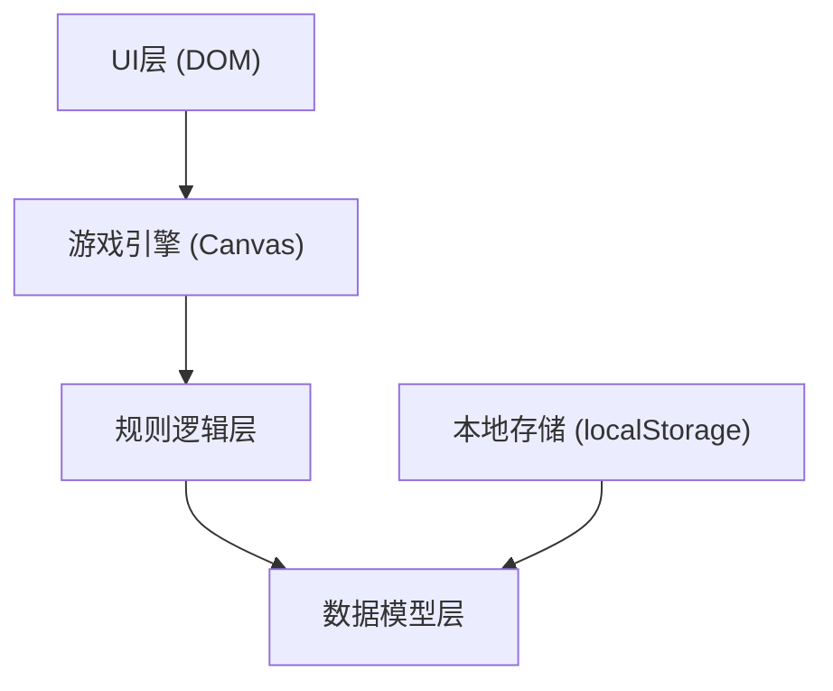
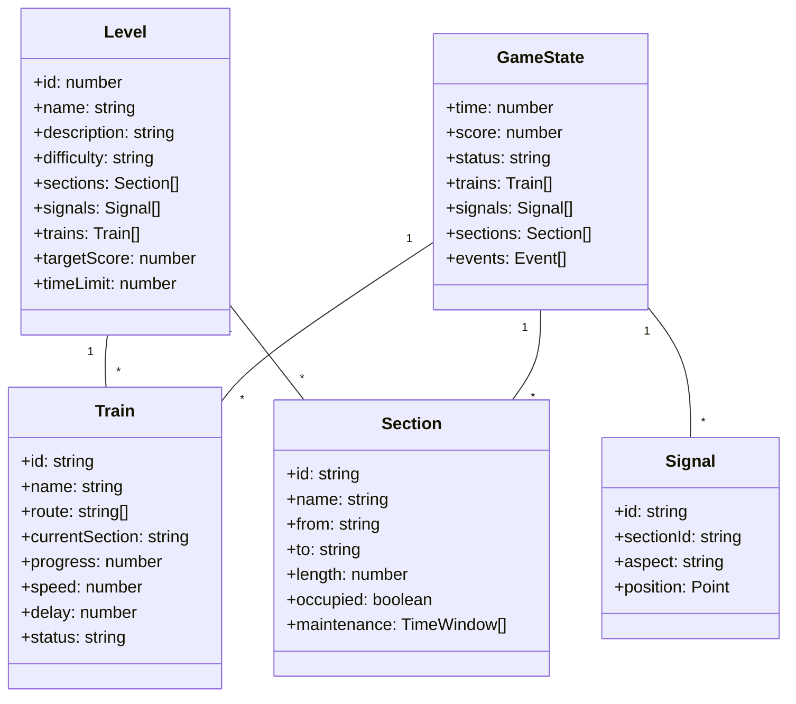

## 1. 架构设计



## 2. 技术描述
- **前端技术栈**：原生 HTML5 + Canvas 2D + JavaScript ES6+ + Tailwind CSS 3
- **构建工具**：无构建工具，直接使用浏览器原生支持
- **样式方案**：Tailwind CSS 3 CDN
- **数据存储**：localStorage 存储游戏记录和回放数据
- **图标方案**：SVG 内联图标

## 3. 核心模块设计

| 模块 | 文件名 | 职责 |
|------|--------|------|
| 游戏引擎 | gameEngine.js | Canvas渲染、主循环、时间控制 |
| 数据模型 | models.js | 列车、区间、信号、关卡数据结构 |
| 规则逻辑 | rules.js | 冲突检测、晚点计算、胜负判定 |
| 关卡配置 | levels.js | 3个关卡的具体配置数据 |
| UI控制 | ui.js | DOM交互、按钮事件、面板更新 |
| 回放系统 | replay.js | 记录存储、回放控制、时间轴 |

## 4. 核心数据模型

### 4.1 数据关系图



### 4.2 核心常量定义

```javascript
// 信号机显示
const SIGNAL_ASPECTS = {
  RED: 'red',      // 停车
  YELLOW: 'yellow', // 减速
  GREEN: 'green'   // 通过
};

// 列车状态
const TRAIN_STATUSES = {
  WAITING: 'waiting',
  RUNNING: 'running',
  STOPPED: 'stopped',
  COMPLETED: 'completed',
  DELAYED: 'delayed'
};

// 游戏状态
const GAME_STATUSES = {
  READY: 'ready',
  RUNNING: 'running',
  PAUSED: 'paused',
  WON: 'won',
  LOST: 'lost'
};
```

## 5. 关卡设计

### 关卡1：新手入门（单线基础）
- **特点**：单线铁路，2列列车，简单会让
- **规则变化**：无检修窗口，晚点事件少，信号切换容错率高
- **目标**：完成所有列车运行，无冲突

### 关卡2：复线挑战（会让与越行）
- **特点**：复线区间，4列列车，需要处理会让和越行
- **规则变化**：引入检修窗口，部分时段区间不可用
- **目标**：在检修限制下完成运行，晚点率<10%

### 关卡3：枢纽调度（复杂联锁）
- **特点**：多站多线，6列列车，交路复杂
- **规则变化**：密集晚点事件，连锁反应处理，多检修窗口
- **目标**：综合调度能力测试，高分数要求

## 6. 冲突判定规则

1. **区间占用冲突**：同一时间同一区间有超过1列列车
2. **信号违规**：列车在红灯信号下进入区间
3. **检修冲突**：列车在检修窗口期间占用区间
4. **超速冲突**：黄灯信号下列车未减速
5. **超时失败**：超过时间限制未完成

## 7. 计分规则

- 正点到达：+100分
- 晚点<5分钟：+50分
- 晚点5-15分钟：+20分
- 晚点>15分钟：0分
- 避免冲突奖励：+50分/次
- 冲突处罚：-200分/次 + 游戏结束
